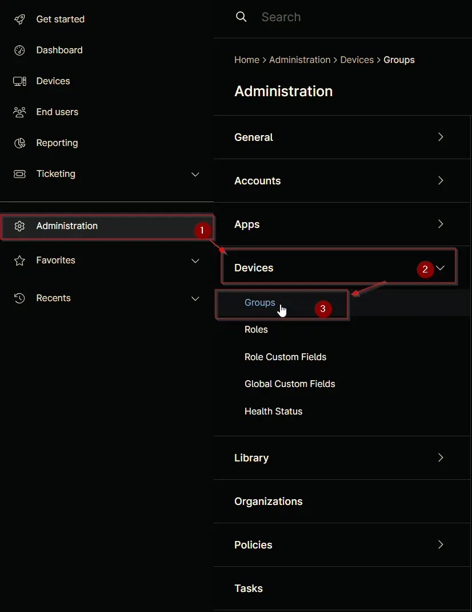

## Summary

## Dependencies

## Details

| Name       | Description |
| ---------- | ----------- |

## Group Creation

### Step 1

Navigate to `Administration` > `Devices` > `Groups`  

### Step 2

Locate the `Create New Group` button on the right-hand side of the screen, click on it.  

## Completed Group