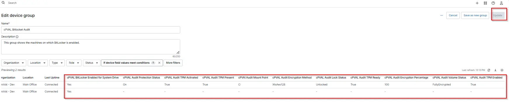

## Summary

This Group shows the machines on which bitlocker is enabled.

## Dependencies

- [Automation: BitLocker and TPM Audit](/docs/2d104874-ec69-4d95-b912-7fcd240bf592)
- [Custom Field: cPVAL BitLocker Enabled for System Drive](/docs/5f6128a5-4fc8-44b2-adb2-40c2ac92edc5)
- [Custom Field: cPVAL Audit Encryption Percentage](/docs/1c59227a-466d-4f42-a06f-0c2c0950d07e)
- [Custom Field: cPVAL Audit Encryption Method](/docs/66adc025-26ec-43f9-ae1e-330c422c799c)
- [Custom Field: cPVAl Audit Mount Point](/docs/ced74400-a022-4fa2-9b72-4c10e92e36ab)
- [Custom Field: cPVAL Audit Lock Status](/docs/52ff36d4-e554-4741-aae1-4bd1a50165ee)
- [Custom Field: cPVAL Audit Protection Status](/docs/dbf6abbd-fff0-4e1f-a6a7-b87994df64ca)
- [Custom Field: cPVAL Audit Volume Status](/docs/916d0353-8a35-4690-8d40-04b2a95112e1)
- [Custom Field: cPVAL Audit TPM Activated](/docs/d7079417-ab2f-460a-ab63-6ec1f7b986ca)
- [Custom Field: cPVAL Audit TPM Enabled](/docs/20f300a5-65f7-443b-aeeb-16ee9e7dc923)
- [Custom Field: cPVAL Audit TPM Present](/docs/5014cdab-65a5-45d9-9587-70d354cbe89b)
- [Custom Field: cPVAL Audit TPM Ready](/docs/878b60d8-f498-4479-85db-43252189026e)
- [Custom Field: cPVAL BitLocker Info](/docs/fd545101-1cd5-4d9f-8df7-57c4df1616b9)
- [Custom Field: cPVAL TPM Info](/docs/68c098e2-54f1-40f8-9574-f70f1948e4ba)
- [Solution: BitLocker and TPM Audit](/docs/57c787ad-8d22-4ae4-b5e5-dac34fc600fc)

## Group Creation

[Group Configuration](https://github.com/ProVal-Tech/ninjarmm/blob/main/groups/cpval-bitlocker-audit.toml)

### Group View

Please follow the steps below to add the necessary custom fields or additional columns to the view.

- Create the group and ensure it is saved successfully.
- Open the newly created group for editing.
- Navigate to the Table Settings option.
- Update the table layout to include the required custom fields or additional columns.
- Save the changes to apply the updated group view.

### URL TO THE GUIDE

- [How-to Guide URL](/docs/97dea67a-ad36-4c95-be4a-aa155f3ad1fe)

Add the below custom fields or additional columns under the Group View:
 
- Custom Field: cPVAL Audit Encryption Percentage
- Custom Field: cPVAL Audit Encryption Method
- Custom Field: cPVAl Audit Mount Point
- Custom Field: cPVAL Audit Lock Status
- Custom Field: cPVAL Audit Protection Status
- Custom Field: cPVAL Audit Volume Status
- cPVAL BitLocker Enabled for System Drive

- Custom Field: cPVAL Audit TPM Activated
- Custom Field: cPVAL Audit TPM Enabled
- Custom Field: cPVAL Audit TPM Present
- Custom Field: cPVAL Audit TPM Ready

### Group Screenshot

This is how the group should looks like after adding the custom fields:

## Changelog

### 2026-04-14

- Initial Version of document.