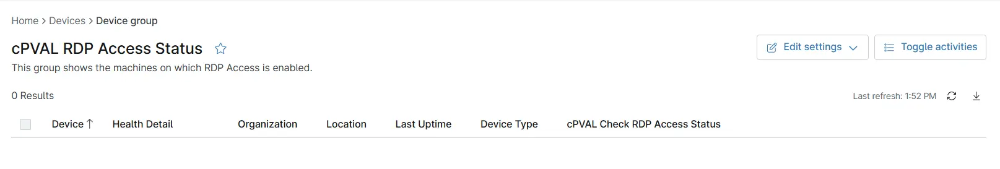

## Summary

This group shows the machines on which RDP Access is enabled.

## Dependencies

- [Automation - RDP Access Check](/docs/4d9087cb-0cf3-4ade-863f-3a14c9b73d5e)
- [Solution - RDP Access Check](/docs/98bae338-07b5-482a-81e1-1b19582122c8)
- [Custom Field - cPVAL Check RDP Access Status](/docs/0cdc9db3-26ba-40e3-ae2a-cbc75d5c92a1)

## Group Creation

[Group Configuration](https://github.com/ProVal-Tech/ninjarmm/blob/main/groups/cpval-rdp-access-status.toml)

### Group View

Please follow the steps below to add the necessary custom fields or additional columns to the view.

- Create the group and ensure it is saved successfully.
- Open the newly created group for editing.
- Navigate to the Table Settings option.
- Update the table layout to include the required custom fields or additional columns.
- Save the changes to apply the updated group view.

### URL TO THE GUIDE

- [How-to Guide URL](/docs/71f3f71d-d6d1-4563-8476-92bbe9df55fa)

Add the below custom fields or additional columns under the Group View:
 
1. `cPVAL Check RDP Access Status`

### Group Screenshot

This is how the group should looks like after adding the custom fields:

## Changelog

### 2026-07-21

- Initial version of the document