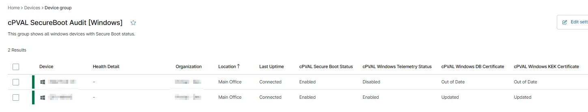

## Summary

This group shows all windows devices with Secure Boot status.

## Details

| Name | Description |
| ---------- | ----------- |
| cPVAL SecureBoot Audit `[Windows]` | This group shows all windows devices with Secure Boot status. |

## Dependencies

- [Custom Field - cPVAL Secure Boot Status](/docs/1d87004f-2ab3-4dd3-9f62-472172678982)
- [Custom Field - cPVAL Windows Telemetry Status](/docs/e000a063-1286-41e1-a6f5-54afab3939a0)
- [Custom Field - cPVAL Windows KEK Certificate](/docs/d131c730-502b-4f00-8461-ecef6766c161)
- [Custom Field - cPVAL Windows DB Certificate](/docs/1eaeb929-0df9-4482-be5c-f78c6f993487)
- [Solution - Secure Boot Compliance Audit](/docs/b037020a-1af5-4ecb-bb6b-62d59c123937)

## Group Creation

[Group Configuration](https://github.com/ProVal-Tech/ninjarmm/blob/main/groups/cpval-secureboot-audit.toml)

### Group View

Please follow the steps below to add the necessary custom fields to the view.

- Create the group and ensure it is saved successfully.
- Open the newly created group for editing.
- Navigate to the Table Settings option.
- Update the table layout to include the required custom fields.
- Save the changes to apply the updated group view.

### URL TO THE GUIDE

- [How-to Guide URL](/docs/71f3f71d-d6d1-4563-8476-92bbe9df55fa)

Below are the custom fields that needs to be added under the Group View:
 
 1. `cPVAL Secure Boot Status`
 2. `cPVAL Windows Telemetry Status`
 3. `cPVAL Windows KEK Certificate`
 4. `Secure Boot Compliance Audit`

### Group Screenshot

This is how the group should looks like after adding the custom fields:

## Changelog

### 2026-03-17

- Initial version of the document
