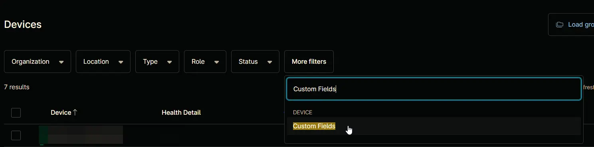
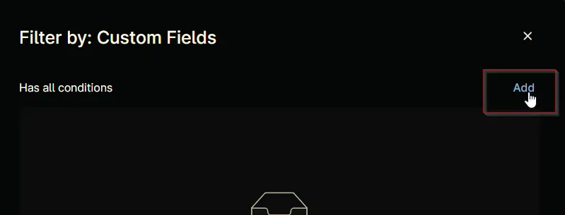
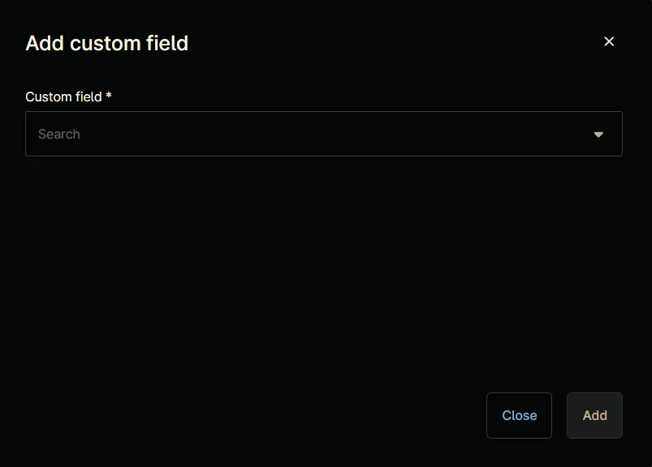
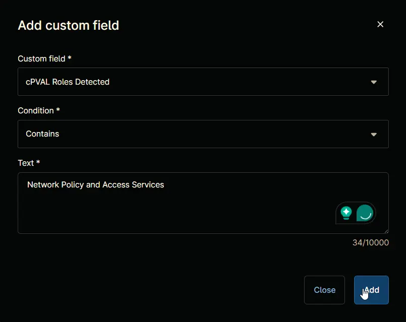
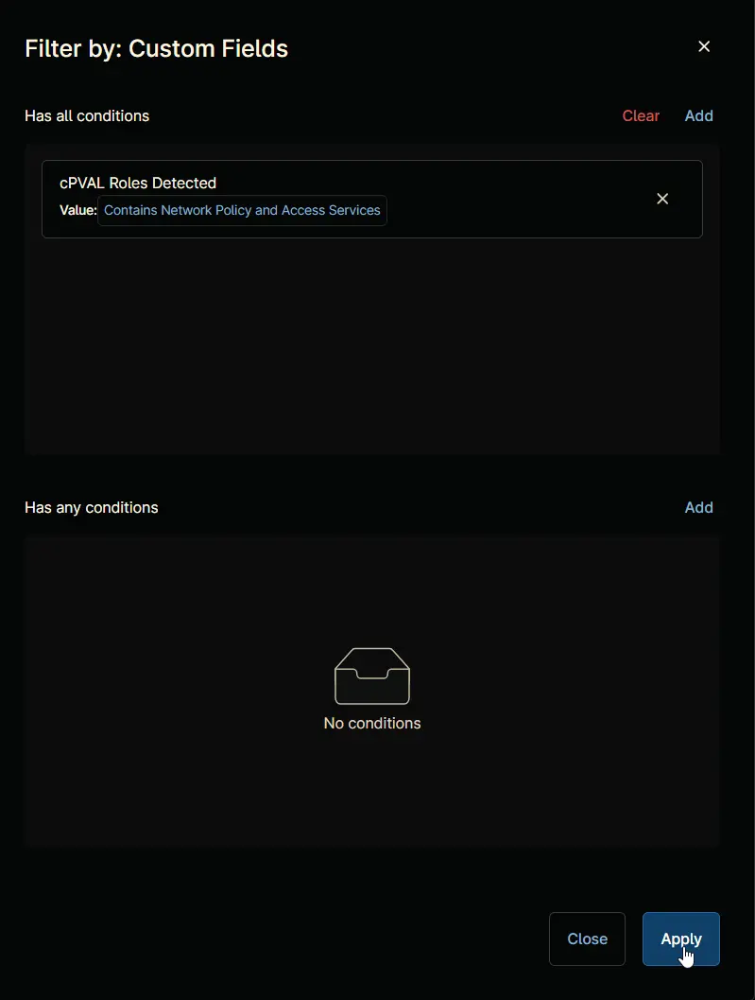
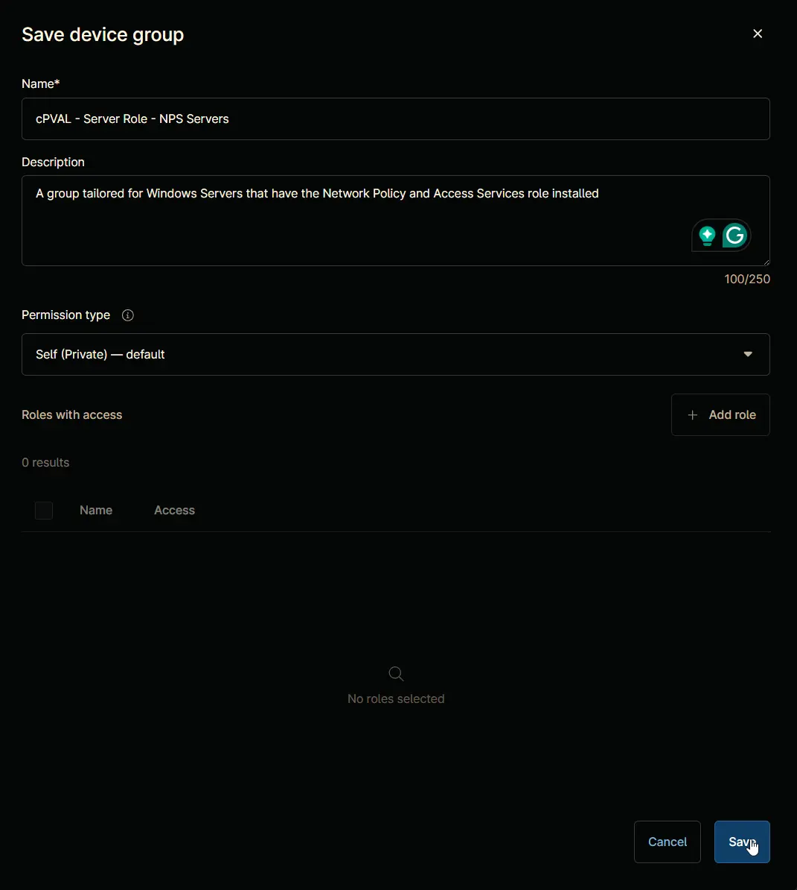
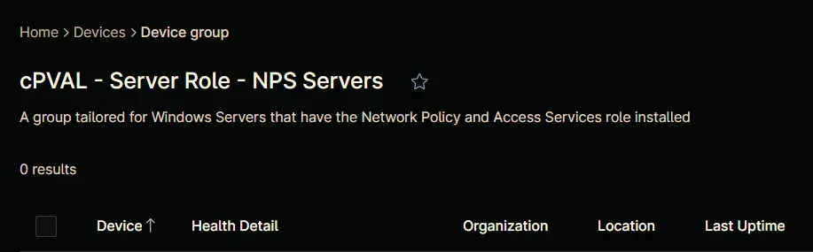

## Summary

A group tailored for Windows Servers that have the `Network Policy and Access Services` role installed

## Details

| Name       | Description |
| ---------- | ----------- |
| cPVAL - Server Role - NPS Servers | A group tailored for Windows Servers that have the Network Policy and Access Services role installed |

## Dependencies
[Solution - Server Roles Detection and Grouping for NinjaOne](/docs/56ed4b40-11ce-4f8d-b1ca-c897d2c496e6)  
[cPVAL - Windows Servers](/docs/c73e004e-6a9c-40e4-8e74-babb4b729256)  
[cPVAL - Roles Detected](/docs/e9ec73dd-98b1-4436-a027-4ee8906f7cba)  
[Windows Server Roles Detection](/docs/5cda8c79-bcd0-4226-b5a4-db846b9b35a9)

## Group Creation

### Step 1

Navigate to `Administration` > `Devices` > `Groups`  

### Step 2

Locate the `Create New Group` button on the right-hand side of the screen, click on it.  

### Step 3

**Condition:** `More filters` `=>` `Custom Fields`

Search and select the `Custom Fields` from the `More filters` button.  

`Filter by: Custom Fields` windows will appear on the screen.  

### Step 4

Click the `Add` button located in the front of `Has all conditions`.  

The `Add Custom Field` screen will appear.  

### Step 5

Fill in the following conditions and click the `Add` button to proceed.  

**Custom Field:** `cPVAL Roles Detected`  
**Condition:** `Contains`  
**Text:** `Network Policy and Access Services`  

### Step 6

Click the `Apply` button to proceed.  

### Step 7

Click the `Save group` button to save changes.  

`Save device group` window will appear on the screen.  

### Step 8

Fill in the following details and click the `Save` button to create the group.

**Name:** `cPVAL - Server Role - NPS Servers`  
**Description:** `A group tailored for Windows Servers that have the Network Policy and Access Services role installed`  
**Permission Type:** `Self (Private) - default`

## Completed Group

