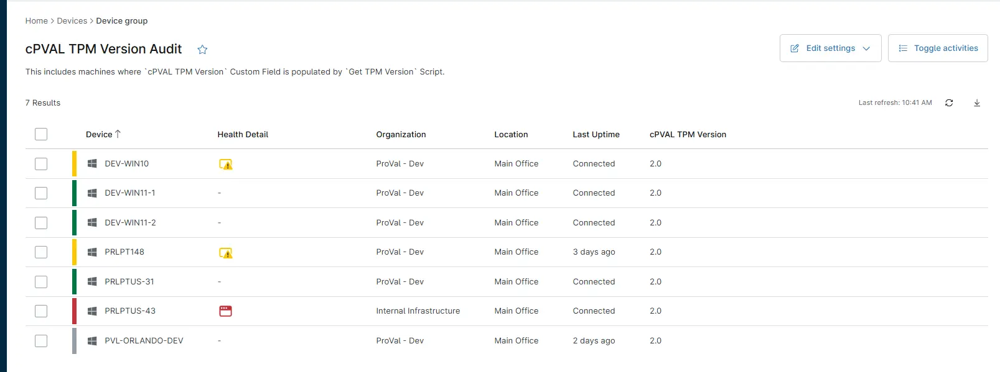

## Summary
This includes machines where [cPVAL TPM Version](/docs/0c7cef51-69c6-4129-aff4-34a73f1cb28e) Custom Field is populated by [Get TPM Version ](/docs/b30479c4-f701-4558-bc9f-91920f125e6d) Script.

## Details

| Name       | Description |
|------------|-------------|
| cPVAL TPM Version Audit | This includes machines where `cPVAL TPM Version` Custom Field is populated by `Get TPM Version` Script. |

## Dependencies

- [Solution: TPM Version Audit](/docs/862f9638-4600-46c2-8894-af488273c1c7)

## Group Creation

[Group Configuration](https://github.com/ProVal-Tech/ninjarmm/blob/main/groups/cpval-tpm-version-audit.toml)

### Group View

Please follow the steps below to add the necessary custom fields to the view.

- Create the group and ensure it is saved successfully.
- Open the newly created group for editing.
- Navigate to the Table Settings option.
- Update the table layout to include the required custom fields.
- Save the changes to apply the updated group view.

### URL TO THE GUIDE

- [How-to Guide URL](/docs/71f3f71d-d6d1-4563-8476-92bbe9df55fa)

Add the below custom field under the Group View:
 
- `cPVAL TPM Version`

### Group Screenshot

This is how the group should looks like after adding the custom fields:

## Changelog

### 2026-03-12

- Initial version of the document