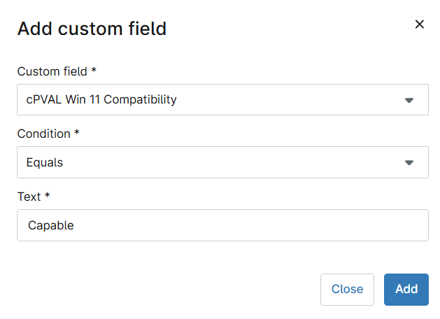
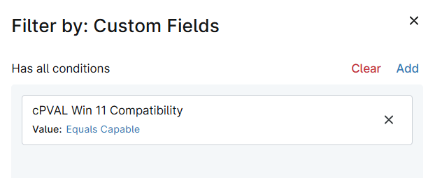
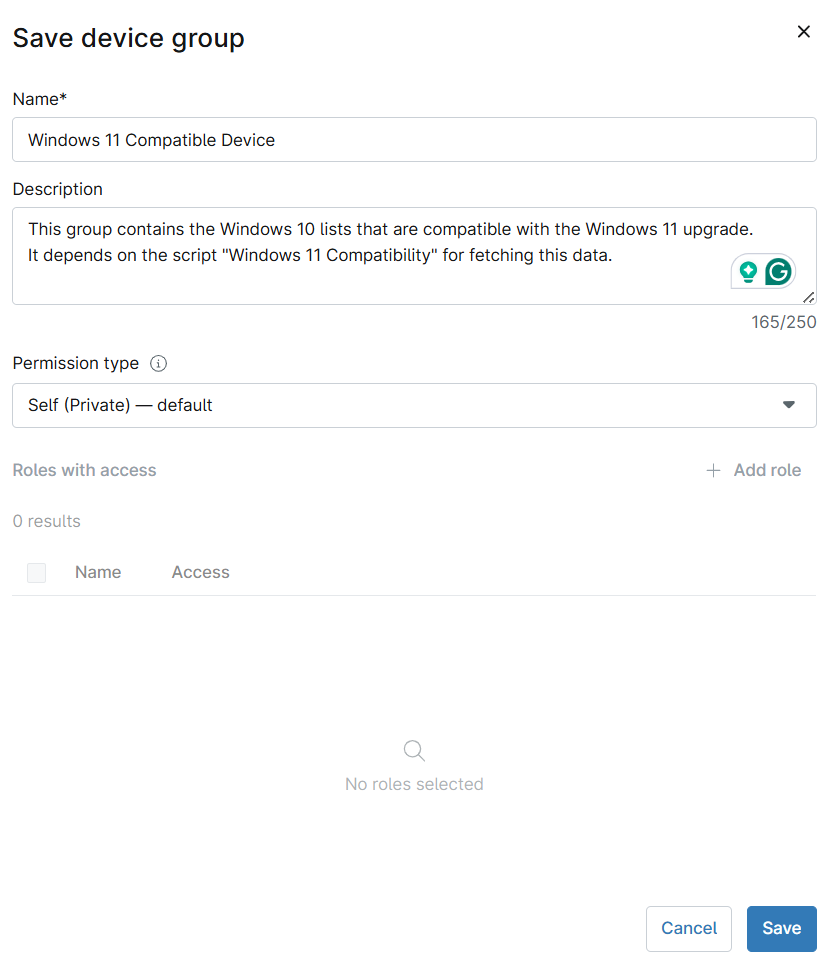
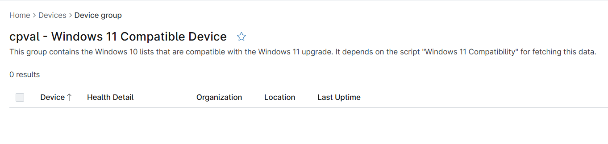

## Summary

This group contains the Windows 11 compatible devices list where the script [Windows 11 Compatibility](/docs/fd6f7153-0a36-4a0b-a46d-ce403f13a540) detects the value stored in [Custom field - cPVAL Win 11 Compatibility](/docs/7967028d-d2ff-4afe-a89e-437541c70208) as 'Capable'.

## Details

| Name       | Description |
| ---------- | ----------- |
| cpval - Windows 11 Compatible Device | This group contains the Windows 10 lists that are compatible with the Windows 11 upgrade. It depends on the [Script - Windows 11 Compatibility](/docs/fd6f7153-0a36-4a0b-a46d-ce403f13a540) for fetching this data. |

## Dependencies

- [Custom field - cPVAL Win 11 Compatibility](/docs/7967028d-d2ff-4afe-a89e-437541c70208)  
- [Script - Windows 11 Compatibility](/docs/fd6f7153-0a36-4a0b-a46d-ce403f13a540)  
- [Solution - Windows 11 Compatibility Validation](/docs/fa172fda-07d3-4a7c-bb17-5e7179db991a)

## Group Creation

### Step 1

Navigate to `Administration` > `Devices` > `Groups`  

### Step 2

Locate the `Create New Group` button on the right-hand side of the screen, click on it.  

### Step 3

**Condition:** `More filters` `=>` `Custom Fields`

Search and select the `Custom Fields` from the `More filters` button.  

`Filter by: Custom Fields` windows will appear on the screen.  

### Step 4

Click the `Add` button located in the front of `Has all conditions`.  

The `Add Custom Field` screen will appear.  

### Step 5

Fill in the following conditions and click the `Add` button to proceed.  

**Custom Field:** `cPVAL Win 11 Compatibility`  
**Condition:** `Equal`  
**Text:** `Capable`  

### Step 6

### Step 7

Click the `Save group` button to save changes.  

`Save device group` window will appear on the screen.  

### Step 8

Fill in the following details and click the `Save` button to create the group.

- **Name:** `Windows 11 Compatible Device`  
- **Description:** `This group contains the Windows 10 lists that are compatible with the Windows 11 upgrade. It depends on the script "Windows 11 Compatibility" for fetching this data.`  
- **Permission Type:** `Self (Private) - default`

## Completed Group

