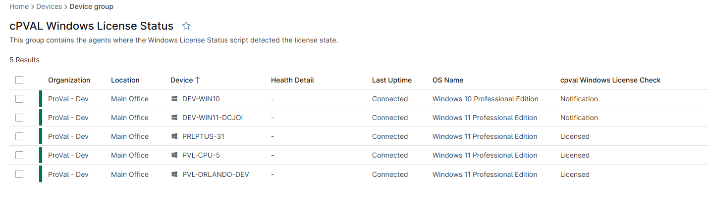

## Summary

This group contains the agents where the Windows License Status script detected the license state.

## Dependencies

- [Solution - Windows License Status](/docs/e05c7729-ebb0-4818-a3a9-b8f736c46c23)
- [Custom Field - cpval Windows License Check](/docs/6d9eacd6-a4e1-474c-bdee-02b753001ac3)

## Group Creation

[Group Configuration](https://github.com/ProVal-Tech/ninjarmm/blob/main/groups/cpval-windows-license-status.toml)

### Group View

Please follow the steps below to add the necessary custom fields or additional columns to the view.

- Create the group and ensure it is saved successfully.
- Open the newly created group for editing.
- Navigate to the Table Settings option.
- Update the table layout to include the required custom fields or additional columns.
- Save the changes to apply the updated group view.

### URL TO THE GUIDE

- [How-to Guide URL](/docs/71f3f71d-d6d1-4563-8476-92bbe9df55fa)

Add the below custom fields or additional columns under the Group View:
 
- [Custom Field - cpval Windows License Check](/docs/6d9eacd6-a4e1-474c-bdee-02b753001ac3)

### Group Screenshot

This is how the group should looks like after adding the custom fields:

## Changelog

### 2026-05-08

- Initial version of the document