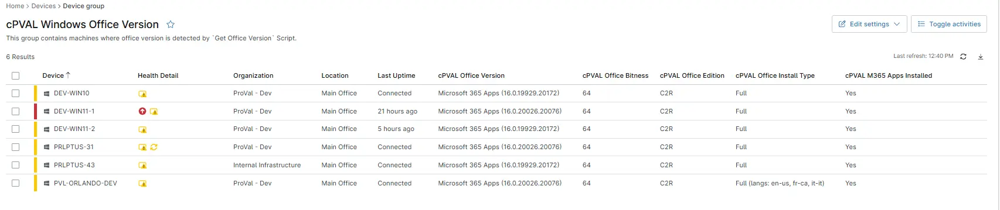

## Summary

This device group displays all machines where the custom fields related to `cPVAL Office Bitness`, `cPVAL Office Install Type`, `cPVAL Office Edition`, `cPVAL Office Version`, `cPVAL M365 Apps Installed` are populated.

## Dependencies

- [Solution - Get Office Version](/docs/19ca26a2-c4f1-4ce1-99a2-b8d37dccfa04) 
- [cPVAL Office Version](/docs/4216d707-95cc-414c-8fa5-73fa9606fa97) 
- [Get Office Version](/docs/9224179e-e14d-4fe2-95a3-a2304e31e108)
- [cPVAL Office Version](/docs/4216d707-95cc-414c-8fa5-73fa9606fa97)
- [cPVAL Office Bitness](/docs/90a2e646-9424-4c8c-b408-e89ccc62c47e)
- [cPVAL Office Edition](/docs/4fad4211-7766-4d7a-af20-8d00123d2fa1) 
- [cPVAL Office Install Type](/docs/03640b47-4b59-4f8e-b8cf-dc20841345ba)  
- [cPVAL M365 Apps Installed](/docs/20fb97b5-2032-4f47-ad06-584799c6f192)

## Group Creation

[Group Configuration](https://github.com/ProVal-Tech/ninjarmm/blob/main/groups/cpval-windows-office-version.toml)

### Group View

Please follow the steps below to add the necessary custom fields or additional columns to the view.

- Create the group and ensure it is saved successfully.
- Open the newly created group for editing.
- Navigate to the Table Settings option.
- Update the table layout to include the required custom fields or additional columns.
- Save the changes to apply the updated group view.

### URL TO THE GUIDE

- [How-to Guide URL](/docs/71f3f71d-d6d1-4563-8476-92bbe9df55fa)

Add the below custom fields or additional columns under the Group View:
 
- cPVAL Office Bitness
- cPVAL Office Install Type
- cPVAL Office Edition
- cPVAL Office Version
- cPVAl M365 Apps Installed

### Group Screenshot

This is how the group should looks like after adding the custom fields:

## Changelog

### 20206-05-26

- Added 2 new custom fields in the group.
- cPVAl M365 Apps Installed
- cPVAL Office Install Type

### 2025-12-12

- Initial version of the document
