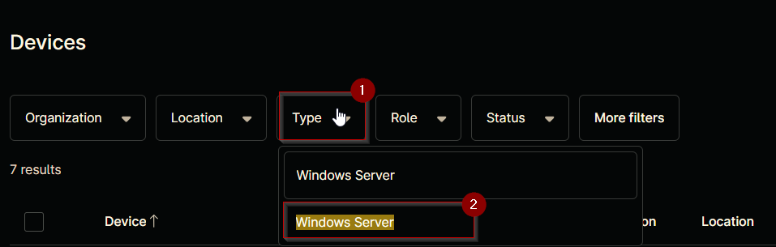
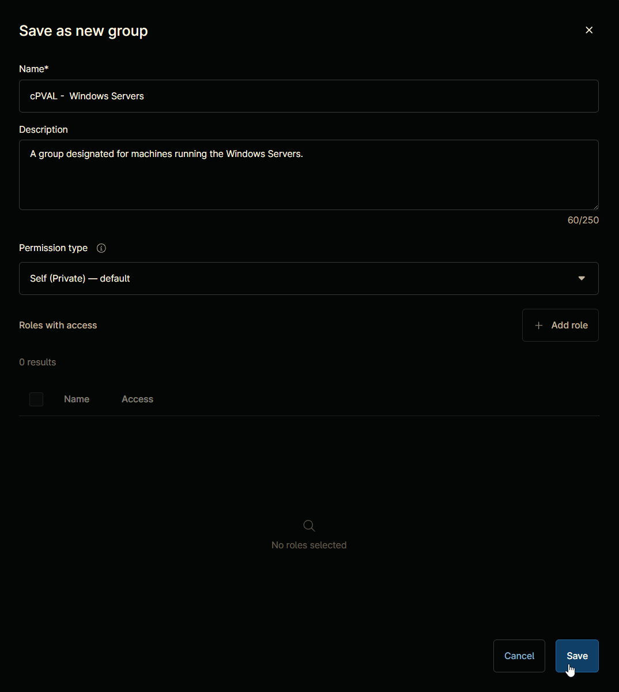
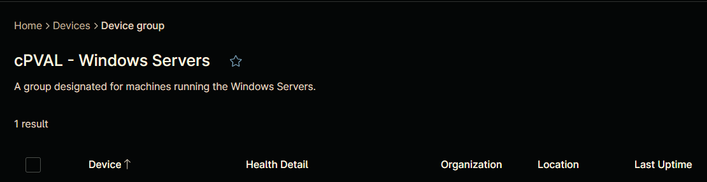

## Summary

A group designated for machines running the Windows Servers.

## Details

| Name       | Description |
| ---------- | ----------- |
| cPVAL Windows Servers | A group designated for machines running the Windows Servers. |

## Group Creation

### Step 1

Navigate to `Administration` > `Devices` > `Groups`  

### Step 2

Locate the `Create New Group` button on the right-hand side of the screen, click on it.  

### Step 3

**Condition:** `Type` `=` `Windows Server`  

Search and select the `Windows Server` from the `Type` filter.  

### Step 4

Click the `Save group` button to save changes.  

`Save device group` window will appear on the screen.  

### Step 5

Fill in the following details and click the `Save` button to create the group.

**Name:** `cPVAL Windows Servers`  
**Description:** `A group designated for machines running the Windows Servers.`  
**Permission Type:** `Self (Private) - default`

## Completed Group

