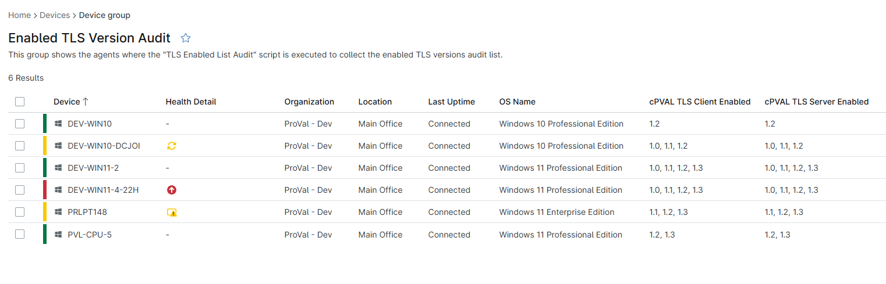

## Summary

This group shows the agents where the [TLS Enabled List Audit](/docs/a19fe079-7179-4bdd-9572-248e1a48fb53) script is executed to collect the enabled TLS versions list.

## Dependencies

- [Solution - TLS Version Audit](/docs/9882903a-a467-4136-bb9e-7e2c8f25ae01)

## Group Creation

[Group Configuration](https://github.com/ProVal-Tech/ninjarmm/blob/main/groups/enabled-tls-version-audit.toml)

### Group View

Please follow the steps below to add the necessary custom fields to the view.

- Create the group and ensure it is saved successfully.
- Open the newly created group for editing.
- Navigate to the Table Settings option.
- Update the table layout to include the required custom fields.
- Save the changes to apply the updated group view.

### URL TO THE GUIDE

- [How-to Guide URL](/docs/71f3f71d-d6d1-4563-8476-92bbe9df55fa)

Add the below custom fields under the Group View:
 
- [cPVAL TLS Client Enabled](/docs/c7b4badf-49a8-40b7-a6a0-db908b1c0694)
- [cPVAL TLS Server Enabled](/docs/0c4cb75a-bc62-4d44-9701-812237e94a36)

### Group Screenshot

## Changelog

### 2026-04-15

- Initial version of the document
