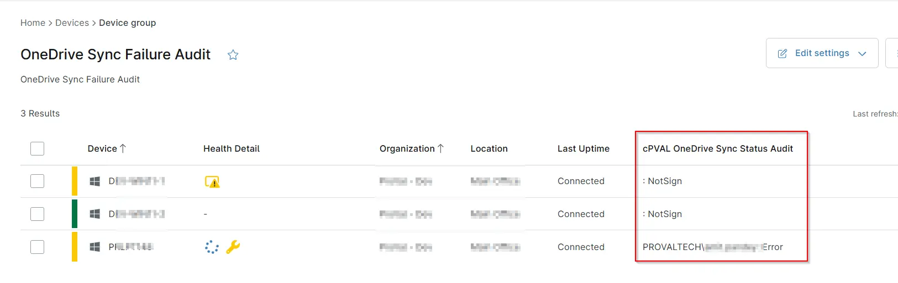

## Summary

This group includes agents for which OneDrive is not syncing properly or where the user is not logged in to OneDrive.

## Dependencies

- [Script - Get OneDrive Sync Status](/docs/29e62bb2-d641-472d-a92b-11404471b915)
- [cPVAL OneDrive Sync Status Audit](/docs/cec3c5c0-10cc-4767-aea2-659f72b5bd56)
- [Solution - Get OneDrive Sync Status](/docs/22d8abe0-2ea4-48e9-8b02-6108cd2de889)

## Group Creation

[Group Configuration](https://github.com/ProVal-Tech/ninjarmm/blob/main/groups/onedrive-sync-failure-audit.toml)

### Group View

Please follow the steps below to add the necessary custom fields to the view.

- Create the group and ensure it is saved successfully.
- Open the newly created group for editing.
- Navigate to the Table Settings option.
- Update the table layout to include the required custom fields.
- Save the changes to apply the updated group view.

### URL TO THE GUIDE

- [How-to Guide URL](/docs/71f3f71d-d6d1-4563-8476-92bbe9df55fa)

Add the below custom fields under the Group View:
 
- `cPVAL OneDrive Sync Status Audit`

### Group Screenshot

This is how the group should looks like after adding the custom fields:

## Changelog

### 2026-06-08

- Updated Group configuration to include the computers where OneDrive process is not running.

### 2026-04-08

- Initial version of the document