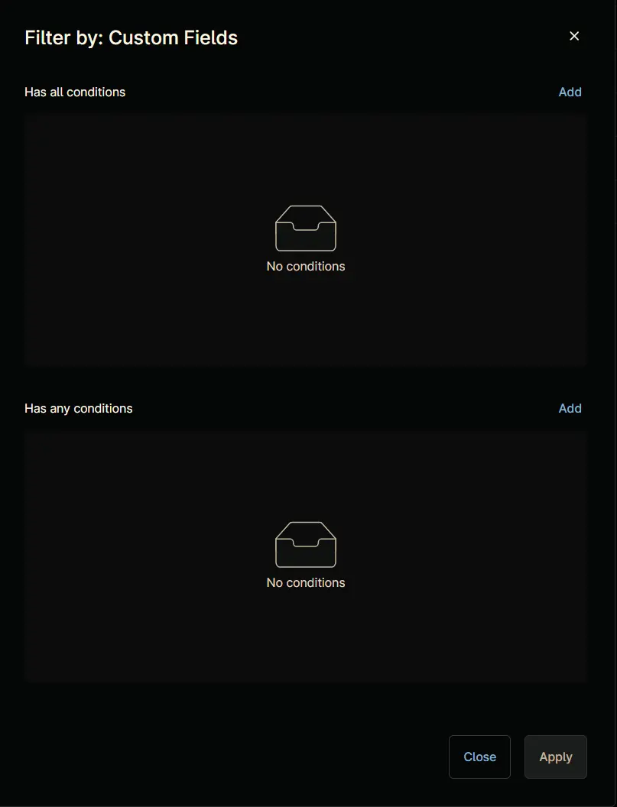
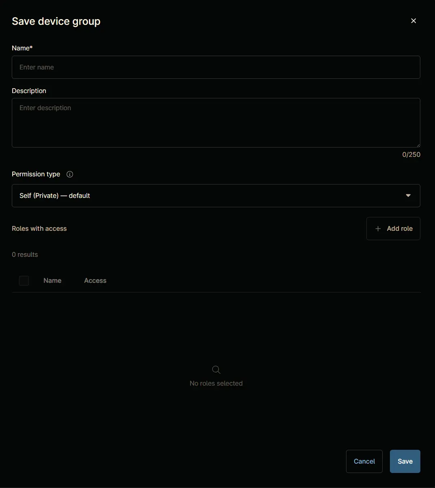

## Summary

This group contains the Windows 10 devices list to schedule the [Script - Windows 11 Compatibility](/docs/fd6f7153-0a36-4a0b-a46d-ce403f13a540) to detect the compatibility check on it. It excludes devices where the script already ran.

## Details

| Name       | Description |
| ---------- | ----------- |
| cpval - Windows 10 Device | This group contains the Windows 10 devices. |

## Dependencies

- [Custom field - cPVAL Win 11 Compatibility](/docs/7967028d-d2ff-4afe-a89e-437541c70208)  
- [Script - Windows 11 Compatibility](/docs/fd6f7153-0a36-4a0b-a46d-ce403f13a540)  
- [Solution - Windows 11 Compatibility Validation](/docs/fa172fda-07d3-4a7c-bb17-5e7179db991a)

## Group Creation

### Step 1

Navigate to `Administration` > `Devices` > `Groups`  

### Step 2

Locate the `Create New Group` button on the right-hand side of the screen, click on it.  

### Step 3

**Condition:** `More filters` `=>` `Custom Fields`

Search and select the `Custom Fields` from the `More filters` button.  

`Filter by: Custom Fields` windows will appear on the screen.  

### Step 4

Click the `Add` button located in the front of `Has all conditions`.  

The `Add Custom Field` screen will appear.  

### Step 5

Fill in the following `Has Any Conditions` and click the `Add` button to proceed.  

- **Custom Field:** `cPVAL Win 11 Compatibility`  
- **Condition:** `Not Exists`  

### Step 6

### Step 7

Select `OS` in the `More Filters` option

Select the `Windows 10`

### Step 8

Click the `Save group` button to save changes.  

`Save device group` window will appear on the screen.  

### Step 9

Fill in the following details and click the `Save` button to create the group.

- **Name:** `Windows 10 Device`  
- **Description:** `This group contains the Windows 10 devices.`  
- **Permission Type:** `Self (Private) - default`

## Completed Group

