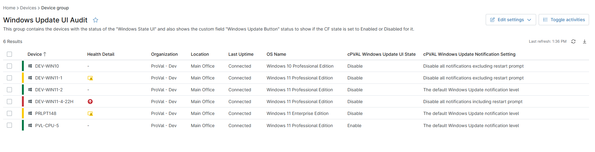

## Summary

This group shows the status of the custom fields [cPVAL Windows Update UI State](/docs/ad629c28-f5f4-432d-93d2-abb3a35e4737) and [cPVAL Windows Update Notification Setting](/docs/96736e81-e157-483b-89e0-449b6c358217) gathered by the script [Windows Updates - Enable or Disable Settings](/docs/c988cacf-1964-4c9b-8a9f-bb6b43c283cb).

## Dependencies

- [Script - Windows Updates - Enable or Disable Settings](/docs/c988cacf-1964-4c9b-8a9f-bb6b43c283cb)
- [Solution - Windows Update UI Enable-Disable](/docs/a6da0735-ac80-40f8-8ad3-375ffa8d0e93)

## Group Creation

[Group Configuration](https://github.com/ProVal-Tech/ninjarmm/blob/main/groups/windows-update-ui-audit.toml)

### Group View

Please follow the steps below to add the necessary custom fields to the view.

- Create the group and ensure it is saved successfully.
- Open the newly created group for editing.
- Navigate to the Table Settings option.
- Update the table layout to include the required custom fields.
- Save the changes to apply the updated group view.

### URL TO THE GUIDE

- [How-to Guide URL](/docs/71f3f71d-d6d1-4563-8476-92bbe9df55fa)

Add the below custom fields under the Group View:
 
- [cPVAL Windows Update UI State](/docs/ad629c28-f5f4-432d-93d2-abb3a35e4737)
- [cPVAL Windows Update Notification Setting](/docs/96736e81-e157-483b-89e0-449b6c358217)

### Group Screenshot

## Changelog

### 2026-04-22

- Initial version of the document