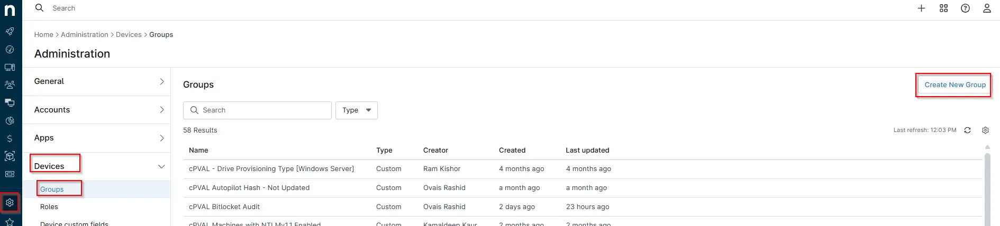
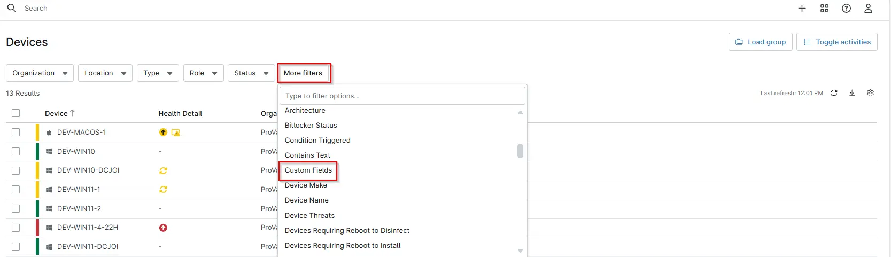
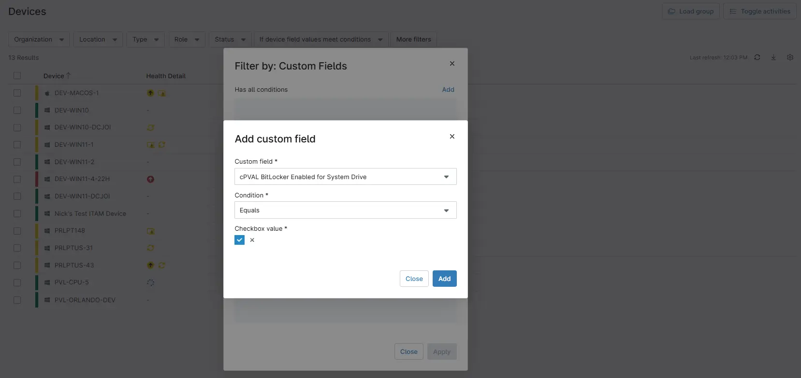
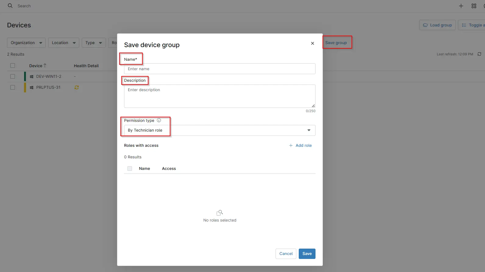
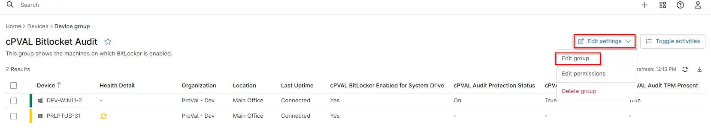
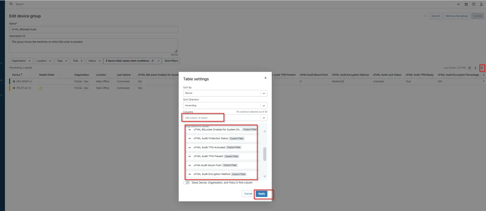

## Purpose

This guide explains how to configure a group in NinjaRMM to monitor devices with BitLocker enabled.

The group is designed to dynamically display machines based on a defined configuration. Specifically, it identifies and lists all devices where BitLocker encryption is enabled.

By using this group, administrators can quickly view and manage systems that have BitLocker active, ensuring compliance with security policies and simplifying device monitoring.

## Dependencies

- [Automation: BitLocker and TPM Audit](/docs/2d104874-ec69-4d95-b912-7fcd240bf592)
- [Custom Field: cPVAL BitLocker Enabled for System Drive](/docs/5f6128a5-4fc8-44b2-adb2-40c2ac92edc5)
- [Custom Field: cPVAL Audit Encryption Percentage](/docs/1c59227a-466d-4f42-a06f-0c2c0950d07e)
- [Custom Field: cPVAL Audit Encryption Method](/docs/66adc025-26ec-43f9-ae1e-330c422c799c)
- [Custom Field: cPVAl Audit Mount Point](/docs/ced74400-a022-4fa2-9b72-4c10e92e36ab)
- [Custom Field: cPVAL Audit Lock Status](/docs/52ff36d4-e554-4741-aae1-4bd1a50165ee)
- [Custom Field: cPVAL Audit Protection Status](/docs/dbf6abbd-fff0-4e1f-a6a7-b87994df64ca)
- [Custom Field: cPVAL Audit Volume Status](/docs/916d0353-8a35-4690-8d40-04b2a95112e1)
- [Custom Field: cPVAL Audit TPM Activated](/docs/d7079417-ab2f-460a-ab63-6ec1f7b986ca)
- [Custom Field: cPVAL Audit TPM Enabled](/docs/20f300a5-65f7-443b-aeeb-16ee9e7dc923)
- [Custom Field: cPVAL Audit TPM Present](/docs/5014cdab-65a5-45d9-9587-70d354cbe89b)
- [Custom Field: cPVAL Audit TPM Ready](/docs/878b60d8-f498-4479-85db-43252189026e)
- [Custom Field: cPVAL BitLocker Info](/docs/fd545101-1cd5-4d9f-8df7-57c4df1616b9)
- [Custom Field: cPVAL TPM Info](/docs/68c098e2-54f1-40f8-9574-f70f1948e4ba)
- [Solution: BitLocker and TPM Audit](/docs/57c787ad-8d22-4ae4-b5e5-dac34fc600fc)

## Implementation

1. Navigate to `Administration` > `Devices` > `Groups`

2. Click `Create New Group`

  

3. Click `More Filters` > `Custom Field`

  

4. Add the Custom Field `cPVAL BitLocker Enabled for System Drive`. Set Condition `Equals` and the tick the Box. Which means `True` Andd `ADD`. The Click `Apply`

  

5. Then click `Save Group`. Once click on save Group then popup shows to Enter the `Name` > `Description` and Set `Permission Type` and click `Save`.

 

6. Once Save it Click on `Edit Settings` > `Edit Group`  

 

7. Click on `Table Settings` icon located on the right side of your screen. You will get the below screen. From the `Columns` drop-down, search for the attributes you want to add. 

  

8. The selected columns will now appear in your group’s device view. To save the view, click the `Update` icon at the top-right corner of the screen. Your group will now display all the newly added columns in the view. 
  

## FAQ

1. What does this group actually show?

`Ans`:- This group dynamically lists all devices where BitLocker is enabled on the system drive, based on the custom field cPVAL BitLocker Enabled for System Drive.

2. What happens if a device does not appear in the group?

`Ans`:- If a device is missing, check the following:

  - The custom field is correctly populated
  - The value is set to True
  - The device has recently checked in with NinjaRMM
  - The filter conditions are configured correctly

3. Can I add more columns to the group view?

`Ans`:- Yes, you can customize the view by:

  - Clicking on Table Settings
  - Adding or removing columns from the Columns dropdown
  - Saving the layout using the Update button

4. How is the BitLocker status determined?

`Ans`:- The status is pulled from the custom field cPVAL BitLocker Enabled for System Drive, which is typically populated via a script or automation that checks the BitLocker state on the endpoint.

## Changelog

- Initial Version of the Document.
