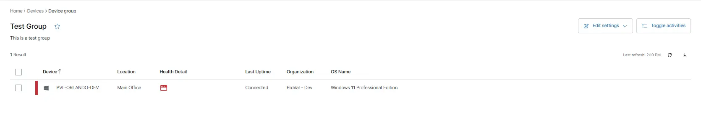
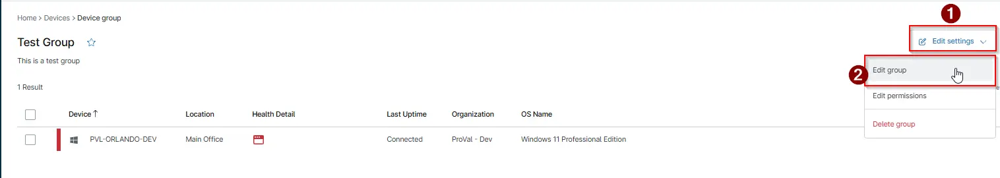
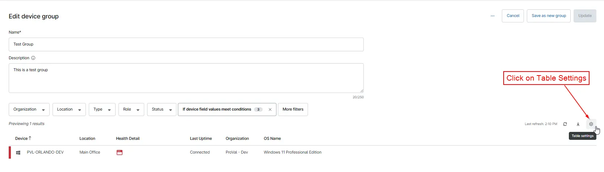
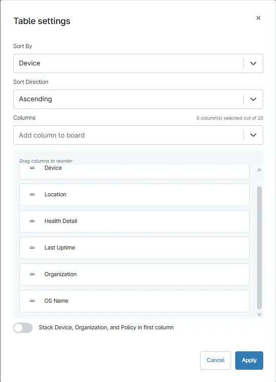
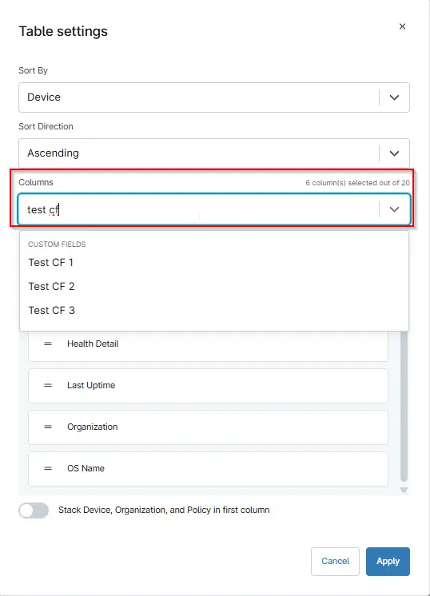
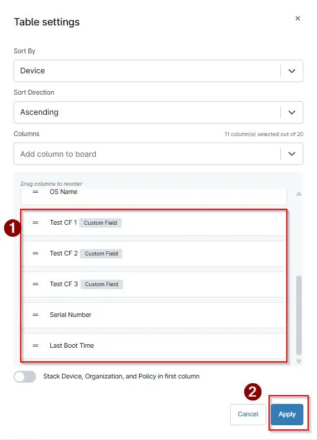
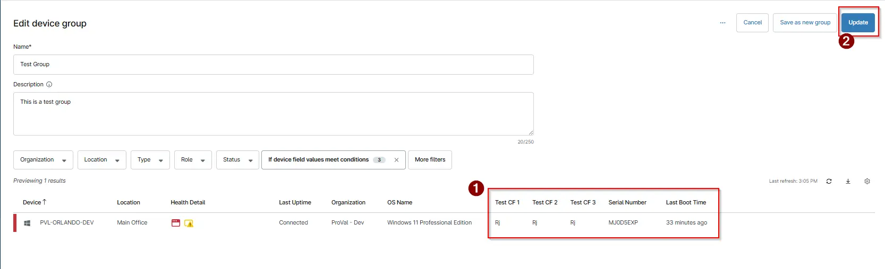
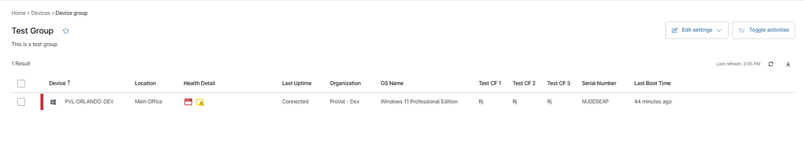

## Purpose

This guide explains how to create a customized Group View in NinjaOne by adding additional columns—such as Custom Fields or any other device attributes to the device list. By enhancing the column layout within a group, technicians can display key data points directly in the view, making it easier to analyze device information, track configurations, and manage assets efficiently.

It is recommended to add additional columns after the group has been created and saved successfully. This approach ensures that your default device view remains unchanged during the group creation process. By first saving the group and then adjusting the column layout, you avoid unintentionally modifying the standard column configuration in the main Devices screen. 

## Implementation

Ensure the group has already been created and saved before modifying the column layout. Here we will take `Test Group` group as an example.

1. Navigate to `Administration` > `Devices` > `Groups`

2. Search and open the group you want to update.

3. Click on `Edit Settings` > `Edit Group`  
  

4. Click on `Table Settings` icon located on the right side of your screen.  
  

5. You will get the below screen. From the `Columns` drop-down, search for the attributes you want to add.   
  

6. For example, add `Test CF 1`, `Test CF 2`, `Test CF 3`, `Serial Number`, `Last boot Time`.   
  

7. After selecting your columns, click `Apply`.   
  

8. The selected columns will now appear in your group’s device view. To save the view, click the `Update` icon at the top-right corner of the screen.  
  

9. Your group will now display all the newly added columns in the view.  
  

## FAQ

**Q. How many columns we can add upto?**  
**A.** You can add up to 20 columns in your Group View.  
This allows you to include a wide range of attributes such as custom fields, device details, and operational metrics without overcrowding the layout.

**Q. How can we remove any existing column in the Group view?**  
**A.**  To remove a column:  
1. Click on Table Settings (Column Selector).
2. Hover your cursor over the column you want to remove in the list of selected columns.
3. An “X” icon will appear next to the column name.
4. Click the X to remove that column from your view.

**Q. Can we rearrange the columns according to our preference?**  
**A.** Yes. Columns can be rearranged in any order you prefer. To rearrange, follow below: 
1. Hover over the `=` (drag handle) at the left to any column name.
2. When the hand icon appears, click and hold.
3. Drag the column up or down to the desired position.
4. Release to drop it into place.