## Purpose

This article explains how to set up and use the Systray Menu as part of your custom NinjaOne site. NinjaOne allows you to create and deploy a custom Systray Menu for your organization.

## Implementation

Before you can work with the Systray Menu, you must activate it in NinjaOne. To do so, navigate to Administration → General → Systray → Enable. 

1. Once enabled, you can use the Add systray button to configure it. Navigate the `Administration` →  `General` → `Systray `.

2. Click on Add Systray.

3. Once the Systray configration page shows, fill in the below details:
    - **Name**: ProVal Tech Support
    - **Description**: This is used to setup the systray.
    - **Tooltip**: ProVal Tech Support
    - **Add operting system systray icon**: Upload the Icon that will be shown under the systray.  

     **Note**: `Icons must be .jpg or .png files, sized 16x16 px to 128x128 px. If no icon or image is uploaded, the default icon below will appear in the systray list.`

     

4. Click on `SysTray menu`.

5. Click on `Add Menu Item`. The below option will be shown. You can select any of them to configure the systray.

    - About
    - Automation
    - Email
    - Exit
    - Group
    - Help Request Form
    - Launch
    - Separator
    - Static
    - URL

## About

- This item allows you to include information about your company. It is single-use and will always be at the root level position; it cannot be nested.

  - The Description field supports basic HTML.
  - The system will display the email and phone number created under Branding here. 

#### Implemetation

- While clicking the `About` option you will see the below that needs to be filled:

     1. Upload the Icon.
     2. Label: Add the label name.
     3. Add Company Logo
     4. Description: Add the description that you want to highlight under the user screen.
          

## Automation

- NinjaOne will only offer automations compatible with the selected operating system.
- When a user selects an automation, the NinjaRMM agent runs the automation and all associated scripts in sequence.
- Automations run from the Systray will trigger an activity at the device level: "Start Requested by Device End User." You can filter these activities on the device dashboard.
- You can add automation that is not native to NinjaOne. First, add the automation to the Automation Library.
- Do not run Systray automations as the "current logged-in user" on Remote Desktop Servers. Doing so causes the script to run on the first session in a multi-user environment and, as such, will not target a specific user.

#### Implementation:
- While clicking under the Automation you will see the below option:

     1. `Operating system systray icon menu`: Under which we can add the icon. "**Icons must be .jpg or .png files, sized 16x16 px to 128x128 px**".

     2. `Label`: Used to set the name of the automation.

     3. `Notification Message`: This message will be displayed immediately to the user whenever an automation is run from the system tray and will automatically close after two minutes.

     4. `Operating System`: Select the OS using the drop down option. (`Windows`, `Macos`, `Linux`).

     5. `Automations`: Click Add Automation and add the script that needs to run. "**Minimum of 1 automation required and maximum of 20 automations allowed**". Then click apply.

          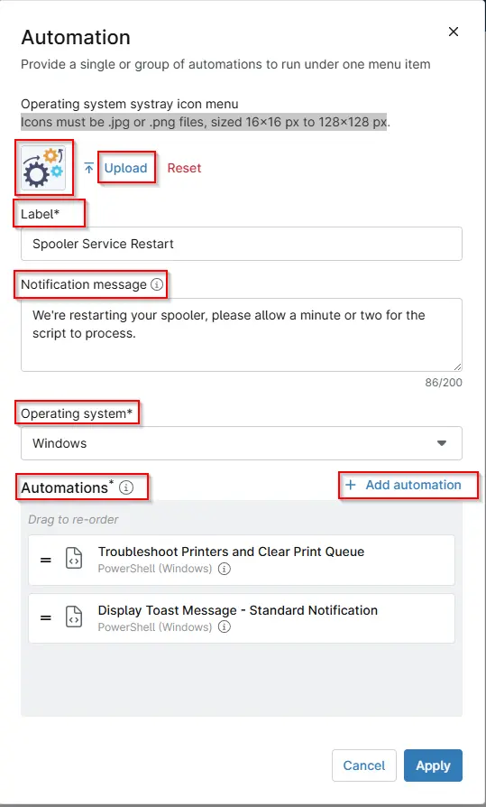

## Email

The Email type allows you to customize an email that a customer can send to you. This option utilizes the mail program configured on the node. You can also use environment variables with the Email menu item.

#### Implemetation

- While clicking the `Email` option you will see the below that needs to be filled:
     1. Upload the Icon.
     2. **Label:** Used to add the name.
     3. **Email:** Add the Email address.
     4. **Subject:** Add the subject of the the email.
     5. **Body:** Add the body of the email and click apply..
          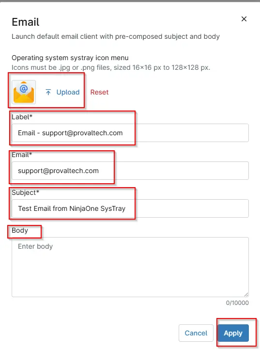

## Exit

This single-use item will always be at the root level position. It cannot be nested. The item inserts an "exit" option to allow your users to close out of the Systray executable.

#### Implemetation
- While clicking the `Exit` option you will see the below that needs to be filled:
     1. Upload the Icon.  
     2. Label: Add the label and click apply.

     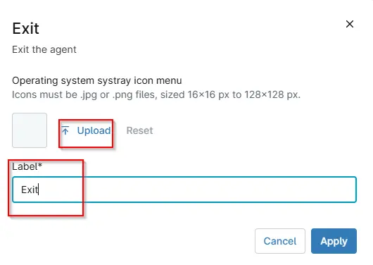

## Group

Group lets you create menu headings for your Systray items. By default, items are added at the root level. You can create as many groups as needed.

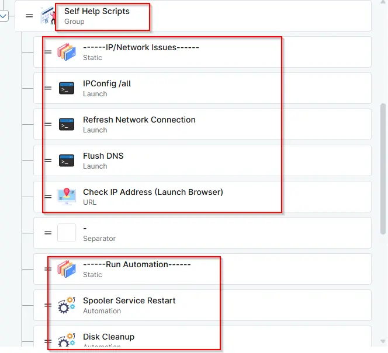

#### Implemetation

- While clicking the `Group` option you will see the below that needs to be filled:

     1. Upload the Icon.
     2. Label: Add the Group label and click apply.

     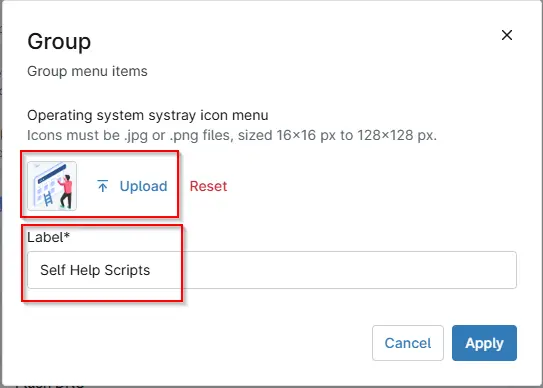

- You can drag and drop any menu to move under the creared group.

## Launch

- This item type lets you populate launch commands for your customers to use. You can specify the location and file name of the executable to launch along with command line arguments.
- This feature will run applications as the logged-on user.
- Here are some example cmd commands you can run through the Systray icon (this list is not exhaustive):

        - show add/remove programs: cmd.exe /c "appwiz.cpl"
        - show computer management: cmd.exe /c "compmgmt.msc"
        - show control panel: cmd.exe /c "control panel"
        - launch cmd prompt:  cmd.exe
        - show device management: cmd.exe /c "devmgmt.msc"
        - show disk management utility: cmd.exe /c "diskmgmt.msc"
        - show event viewer: cmd.exe /c "eventvwr.msc"
        - show network connections: cmd.exe /c "control netconnections"
        - show printers: cmd.exe /c "control printers"
        - show MTSC: cmd.exe /c "mstsc"
        - show services: cmd.exe /c "services.msc"
        - show msinfo: cmd.exe /c "msinfo32"
        - show task manager: cmd.exe /c "taskmgr"
        - show computer name: cmd.exe /c "Control sysdm.cpl"
        - show full IP configuration information: cmd.exe /k "ipconfig /all"
        - release the IP address: cmd.exe /k "ipconfig /release"
        - renew the IP address: cmd.exe /k "ipconfig /renew"
        - purge DNS resolver cache: cmd.exe /k "ipconfig /flushdns"
     Note: The full path is not required for executables residing in directories listed in PATH environment variable.  
     -  Use the open command built natively into macOS for macOS devices. 
     - For example:
         - open "/Applications/Google\ Chrome.app"
     - For more examples of using the open command, use the man open command within the native terminal or the NinjaOne Remote Terminal.
     - For macOS devices, you can also use the following example to write in a custom field:
        `/Applications/NinjaRMMAgent/programdata/ninjarmm-cli` set Systraymacinstallshottr true

#### Implemetation

- While clicking the `Launch` option you will see the below that needs to be filled:

     1. Upload the Icon.
     2. Label: Add the Launch label name.
     3. Windows command: Add Windows Command
     4. Add MAC command: Add the Macos Command

    **Note**: 
     - If in system32 directory, (i.e. cmd.exe), enter “cmd.exe”. If in program files or another directory, must enter full path name. i.e. “c:\program files\office 2016\app\word.exe”  
     - Run TOP = "open /usr/bin/top". Run Calendar = "open /Applications/Calendar.app". Run CONSOLE COMMAND = "touch /tmp/ninja_test.txt". Run Midnight Commander = "open /usr/local/bin/mc"

          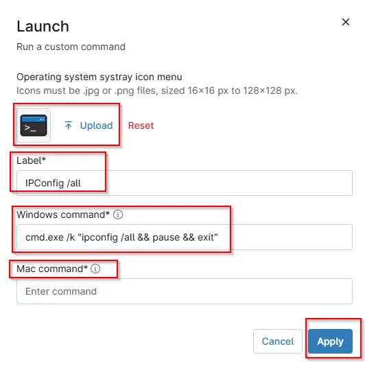

## Separator

This item type inserts a line separator between menu items or groups.

#### Implemetation
- While clicking the `Separator` option you will see the below that needs to be filled:
  1. Click seperator option
  2. Then click Apply.

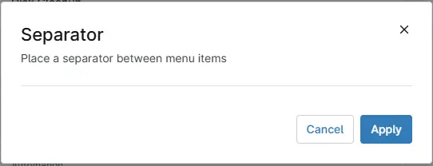

## Static

This command lets you enter static text the system will display to the user.

#### Implemetation
- While clicking the `Static` option you will see the below that needs to be filled:

     1. Upload the Icon.
     2. Label: Add the label name.

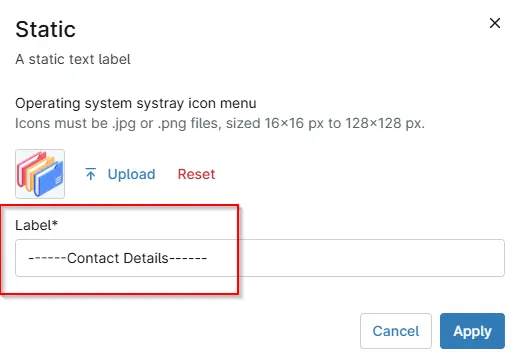

## URL

This item type allows you to configure specific URLs for your customers to launch as needed.  This command is helpful if you'd like to enable your customers to call you via Skype or any other dynamic URL.

#### Implemetation
- While clicking the `URL` option you will see the below that needs to be filled:

     1. Upload the Icon.
     2. Label: Add the label name.
     3. Add the URL

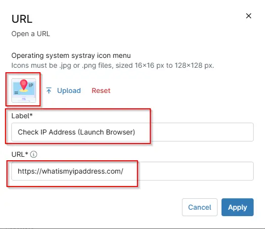

## Help Request Form

- This single-use item will always be at the root level position; it cannot be nested.
- This item type allows you to configure a dynamic form you can forward to an email address, your integrated PSA tool, or NinjaOne Ticketing.
- When you send the request to your integrated PSA tool, you can choose the ticket template. This option does not apply to NinjaOne Ticketing.
- The Subject and Description fields support basic HTML and placeholders. By default, all available placeholders are added to the form (and are listed in text form below). You can add, remove, and rearrange placeholders as desired.
- You can truncate any of the fields, which is helpful when forwarding to a PSA tool that limits the length of ticket titles. For example:
 `Help request from ${client.name?truncate(25)} / ${form.subject?truncate(100)}`
- You can use environment variables with the Help Request Form menu item. Refer to Branding: Environment Variables via Systray Icon for more information.
- End users can submit screenshots and include image attachments.
- If your help request form is set up to forward to an integrated PSA tool, the email will appear as a note (along with all the other contents) on the ticket. The email will not automatically populate fields in your PSA or sync to an existing contact.

#### Implemetation

- While clicking the `Help Request Form` option you will see the below that needs to be filled:

     1. Upload the Icon.
     2. Label: Add the label name.
     3. Forwarding: Select the addess on which ticket will get forward. The below 3 option is shown while clicking the dropdown:
           - `To a support email address`
           - `PSA Integration`
           - `To Ninja Ticketing`
     4. Email: If we set `To a support email address` under the Forwarding, then need to add the email ID on which ticket will be delivered.

         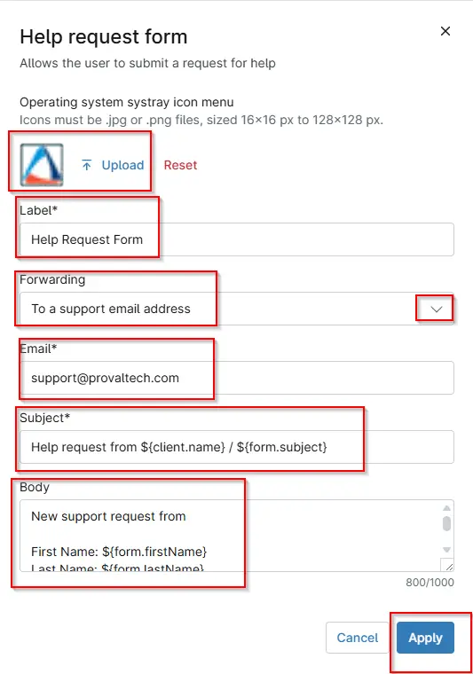

     5. Template: If we set `PSA Integration` under the Forwarding then need to select the `Default ticket template`.

         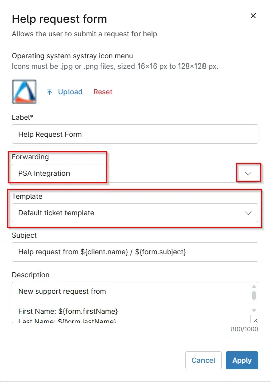

     6. Template: If we set `To Ninja Ticketing` under the Forwarding then need to select the Default ticket template.

         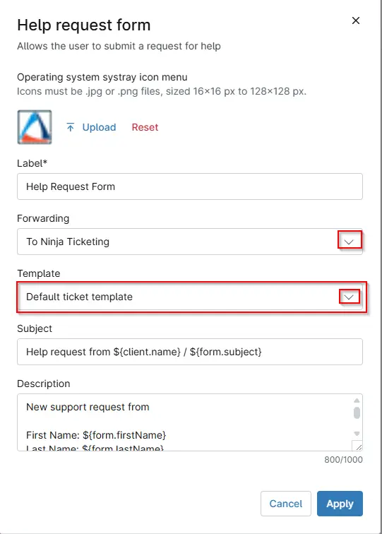

     7. Subject: Used to set the subject of the ticket.
     8. Description: Add the description that want to highlight under the user screen.

## Logo

- Below are the logs that needs to be added while creating the systray.

## FAQ

**Q1. What is the NinjaOne Systray?**

**A:** The NinjaOne Systray is a system tray icon that allows end users to quickly access support tools, automations, links, and help options directly from their device without opening the NinjaOne agent.

**Q2. Why do we need to enable the Systray?**

**A:** The Systray must be enabled to allow custom menus, automations, and support options to appear on end-user devices. Without enabling it, users will not see or interact with the Systray icon.

**Q3. Which operating systems support the Systray?**

**A:** The Systray supports Windows, macOS, and Linux, depending on the menu item and automation compatibility.

**Q4. What types of actions can users perform from the Systray?**

**A:** Users can perform the below actions:
- Run approved automations
- Launch applications or system tools
- Open URLs
- Send support emails
- Submit help requests
- View static information
- Exit the Systray application

**Q5. Do Systray automations run as the logged-in user?**

**A:** No. Systray automations run at the device level unless explicitly designed otherwise. On multi-user systems (such as RDS servers), automations should not be run as the current logged-in user.

**Q6. Are Systray automation activities logged?**

**A:** Yes. When a user runs an automation from the Systray, NinjaOne logs the activity as "Start Requested by Device End User", which can be filtered on the device dashboard.

**Q7. Can we limit which automations appear in the Systray?**

**A:** Yes. Only automations compatible with the selected operating system are available, and you can choose exactly which automations are added to the Systray menu.

**Q8. What icon formats are supported for the Systray?**

**A:** Icons must be .jpg or .png files and sized between 16x16 px and 128x128 px. If no icon is uploaded, NinjaOne will display the default icon.

**Q9. Can users submit support tickets through the Systray?**

**A:** Yes. Using the Help Request Form, users can submit tickets that are forwarded to:
- A support email
- An integrated PSA
- NinjaOne Ticketing  
Attachments and screenshots are also supported.

**Q10. Can we organize Systray items into groups?**

**A:** Yes. The Group menu type allows you to create headings and organize menu items for better usability.

**Q11. Is it possible to launch system tools from the Systray?**

**A:** Yes. The Launch menu item allows users to open system tools such as Task Manager, Control Panel, Network Settings, and more, using predefined commands.

**Q12. Can the Systray be customized per organization?**

**A:** Yes. Each NinjaOne site can have its own Systray configuration, branding, menu items, and automations tailored to organizational needs. Follow below steps to override the global Systray Menu for an Organization:
- Navigate to the Administration → Organizations tab and select the organization. The General tab will be open by default.
- Activate the Systray icon toggle switch, select the desired Systray icon template from the drop-down menu, and click Save.

**Q13. Does disabling the Systray remove it from devices?**

**A:** Yes. If the Systray is disabled in NinjaOne, the icon and all associated menu items will no longer appear on end-user devices.