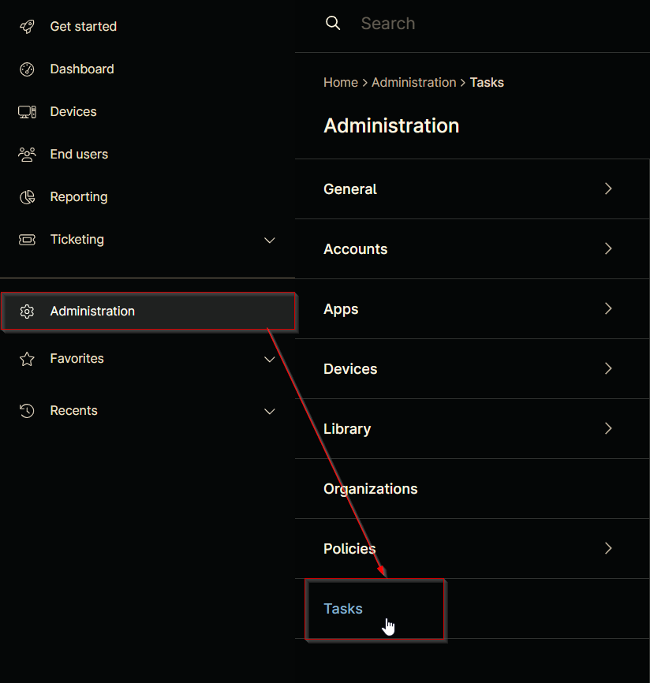
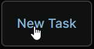
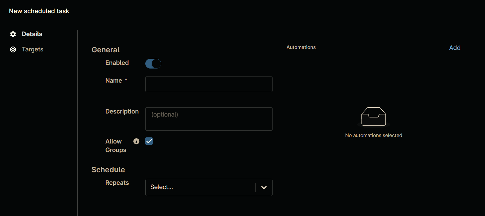

## Summary

## Dependencies

## Details

| Name       | Description | Allow Groups | Repeats | Recur every | Start At | Ends | Targets | Automations |
| ---------- | ----------- | ------------ | ------- | ----------- | -------- | ---- | ------- | ----------- |

## Task Creation

### Step 1

Navigate to `Administration` > `Tasks`  

### Step 2

Locate the `New Task` button on the right-hand side of the screen, click on it.  

The `New Scheduled Task` window will appear on the screen.  

## Completed Task