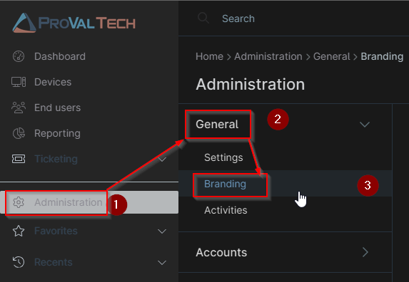
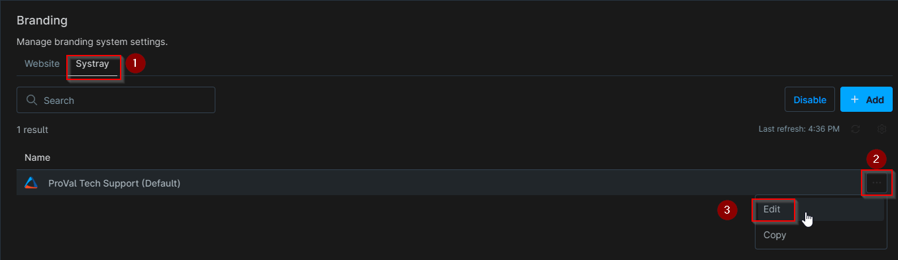
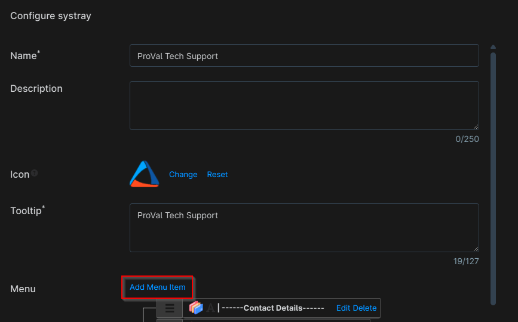
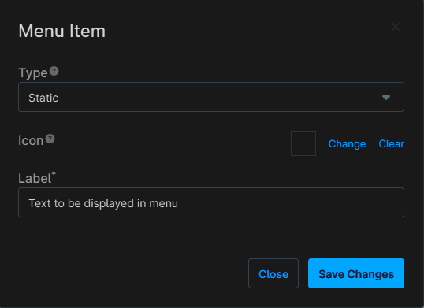
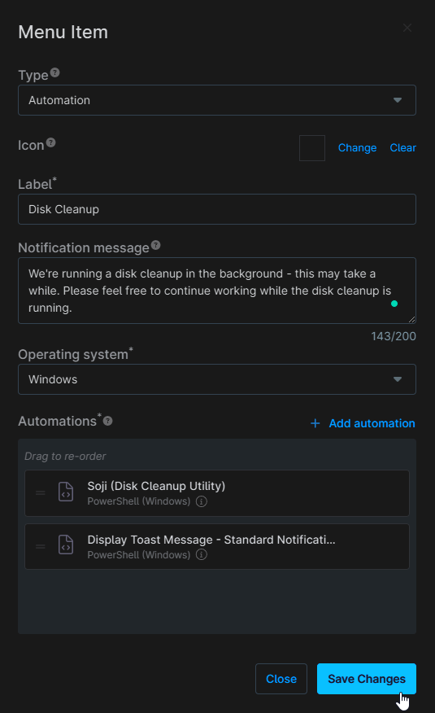
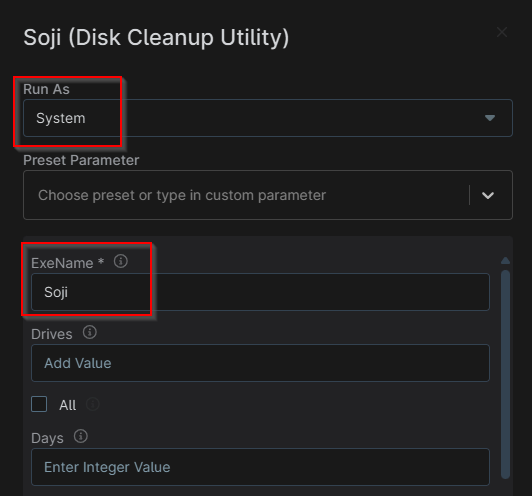
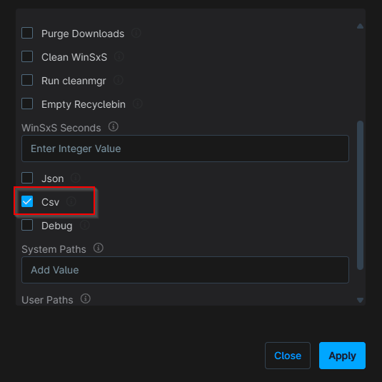
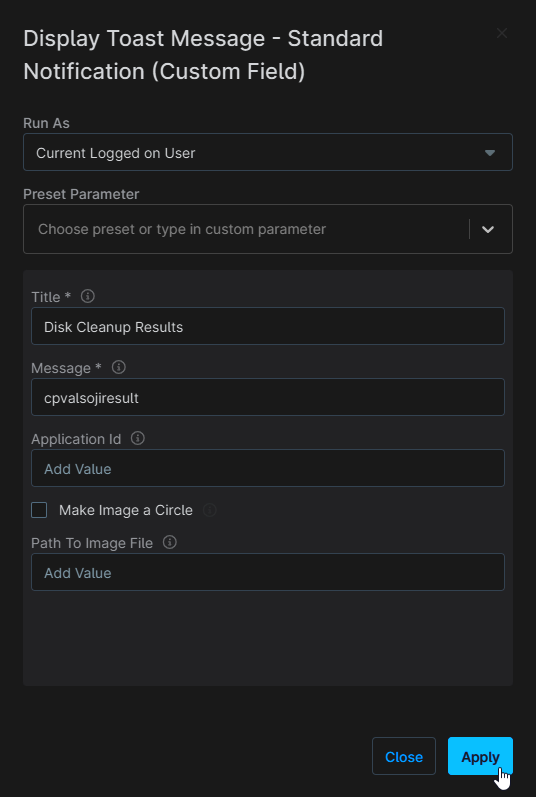
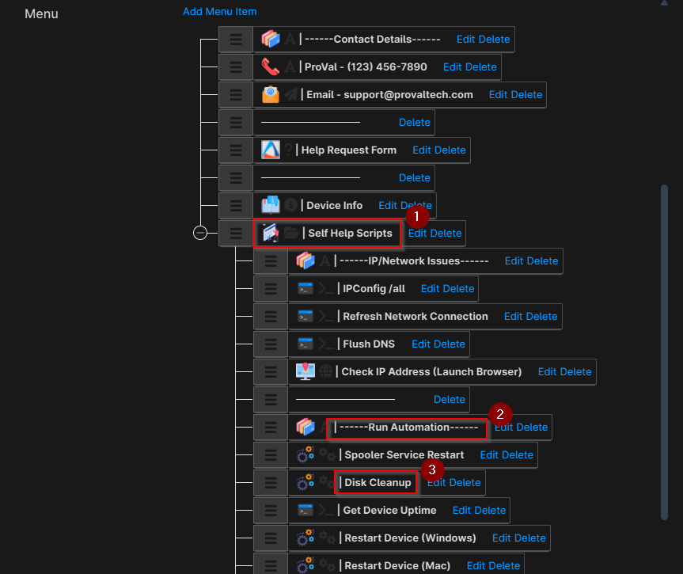
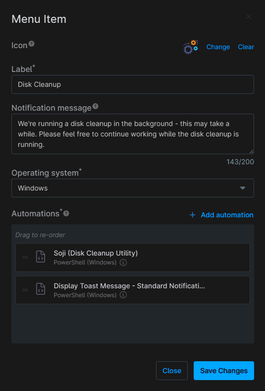

## Summary

Runs the `Soji Disk Cleanup Utility` automation on demand from the tray icon self help menu and updates the `cPVALSojiResult` custom field. This is followed by the `Display Toast Message - Standard Notification (Custom Field)` automation, which will display the lastest result of the disk cleanup as a toast notification to the end user.

## Dependencies

- [Soji Disk Cleanup](/docs/ef289b50-fe18-4114-93d0-680437f7c480)
- [cPVAL Soji Result](/docs/0d8c8069-8883-4135-b322-da61e1a932e0)
- [Display Toast Message - Standard Notification (Custom Field)](/docs/1ae78d4c-7ca4-4e20-af21-59cf0d366780)

## Details

| Label      | Description | Notification Message | Operating system | Automations |
| ---------- | ----------- | -------------------- | ---------------- | ----------- |
| Disk Cleanup | On demand disk cleanup task | We're running a disk cleanup in the background - this may take a while. Please feel free to continue working while the disk cleanup is running. | Windows | [Soji Disk Cleanup](/docs/ef289b50-fe18-4114-93d0-680437f7c480), [Display Toast Message - Standard Notification (Custom Field)](/docs/1ae78d4c-7ca4-4e20-af21-59cf0d366780) |

## Task Creation

### Step 1

Navigate to `Administration` > `General` > `Branding`  

### Step 2

Locate the configuration you would like to add this task to and select the `Edit` button within the actions menu.  

### Step 3

Select the `Add Menu Item` option at the top of the `Menu` section

You will then see this empty window

### Step 4

Set the following details in the Menu Item window

- `Type:` Automation
- `Label:` Disk Cleanup
- `Notification Message:` We're running a disk cleanup in the background - this may take a while. Please feel free to continue working while the disk cleanup is running.
- `Operating System:` Windows
- `Automations:` [Soji Disk Cleanup](/docs/ef289b50-fe18-4114-93d0-680437f7c480), [Display Toast Message - Standard Notification (Custom Field)](/docs/1ae78d4c-7ca4-4e20-af21-59cf0d366780)

The [Soji Disk Cleanup](/docs/ef289b50-fe18-4114-93d0-680437f7c480) script should be run as `System`, with the ExeName field set to `Soji` and Csv field `checked`

The Display Toast Message - Standard Notification (Custom Field) script should be set to run as the `Current Logged on User`, with the Title set to `Disk Cleanup Results` and Message field set to `cpvalsojiresult`

Select Save Changes in the bottom right once everything is configured correctly

### Step 5

Now that the menu item has been created, you can drag and drop it into place. The standard location will be within the `Run Automation` section under `Self Help Scripts`, but this can vary from client to client.

## Completed Task

