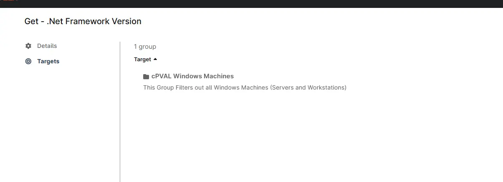

## Summary
Runs the `Get - .Net Framework Version [CF]` automation weekly against `cPVAL Windows Machines` group to get .Net Framework Version and updates the `cPVALnetFrameWorkVersion` custom field with the retrieved information.

## Dependencies
[Automation - Get - .Net Framework Version [CF]](/docs/da0dccbe-ef31-4627-ac10-e242828102e0)  
[ Group - cPVAL Windows Servers](/docs/c73e004e-6a9c-40e4-8e74-babb4b729256)  
[Custom Field - cPVAL .NET FrameWork Version](/docs/06ee57e9-a6cf-4ee0-9430-8e548fac15fb/)

## Details

| Name       | Description | Allow Groups | Repeats | Recur every | Start At | Ends | Targets | Automations |
| ---------- | ----------- | ------------ | ------- | ----------- | -------- | ---- | ------- | ----------- |
| Get - .Net Framework Version | Retrieves .net Framework Version and stores it in `cPVALnetFrameWorkVersion` custom field.| True | Weekly | 1 week | Current Time | Never | `cPVAL Windows Machines` Group | `Get - .Net Framework Version [CF]` |

## Task Creation

### Step 1

Navigate to `Administration` > `Tasks`  

### Step 2

Locate the `New Task` button on the right-hand side of the screen, click on it.  

The `New Scheduled Task` window will appear on the screen.  

### Step 3
Set the following details in the General section.

- `Enabled:` True  
- `Name:` Get - .Net Framework Version 
- `Description:` Retrieves .net Framework Version and stores it in 'cPVALnetFrameWorkVersion' custom field.  
- `Allow Groups:` True  

### Step 4
Set the following details in the Schedule section:

- `Repeats:` Weekly  
- `Recur every:` 1 Week 
- `Start At:` \<Current Time\>  
- `Ends:` Never  

### Step 5

Click the `Add` button in the `Automations` section to add the `Get - .Net Framework Version [CF]` automation.

Search and select the `Get - .Net Framework Version [CF]` automation in the Automation Library, that will appear after clicking the `Add` button.

### Step 6
Click the `Apply` button on the script's parameter window without making any changes.
 

### Step 7
- Navigate to the  `Targets` section by clicking the `Targets` button.
- Click the `Add` button located on the right-hand side of the screen.
- In the `Targets` window that appears, select the `Group` option from the dropdown menu.
- Search for cPVAL and select the `cPVAL Windows Machines` group.
- Click the `Apply` button at the bottom of the screen to save the selected target.

 

## Completed Task
### Details Section

The `Details` section will display the configured task details.

 

### Targets Section
The `Targets` section will show the selected target group.
 

## Saving the Task
Click the `Save` button at the top of the screen to save the scheduled task.

You will be prompted to verify your MFA code after clicking the `Save` button. Enter your MFA code and click the `Continue` button to finalize the task creation.  
 