## Summary

Runs the [Windows Server Roles Detection](/docs/5cda8c79-bcd0-4226-b5a4-db846b9b35a9) automation daily against [cPVAL - Windows Servers](/docs/c73e004e-6a9c-40e4-8e74-babb4b729256) group to identify the installed Windows Server roles and updates the [cPVAL Roles Detected](/docs/e9ec73dd-98b1-4436-a027-4ee8906f7cba) custom field with the retrieved information.

## Dependencies

[cPVAL Roles Detected](/docs/e9ec73dd-98b1-4436-a027-4ee8906f7cba)
[Windows Server Roles Detection](/docs/5cda8c79-bcd0-4226-b5a4-db846b9b35a9)

## Details

| Name       | Description | Allow Groups | Repeats | Recur every | Start At | Ends | Targets | Automations |
| ---------- | ----------- | ------------ | ------- | ----------- | -------- | ---- | ------- | ----------- |
| Windows Server Roles Detection | Retrieves installed Windows Server roles and stores to the cPVAL Roles Detected custom field. | True | Daily | 1 Days | Current Time | Never | [cPVAL - Windows Servers](/docs/c73e004e-6a9c-40e4-8e74-babb4b729256) group | [Windows Server Roles Detection](/docs/5cda8c79-bcd0-4226-b5a4-db846b9b35a9) automation |

## Task Creation

### Step 1

Navigate to `Administration` > `Tasks`  

### Step 2

Locate the `New Task` button on the right-hand side of the screen, click on it.  

The `New Scheduled Task` window will appear on the screen.  

### Step 3

Set the following details in the `General` section.  

**Enabled:** `True`  
**Name:** `Windows Server Roles Detection`  
**Description:** `Retrieves installed Windows Server roles and stores to the 'cPVAL Roles Detected' custom field.`  
**Allow Groups:** `True`

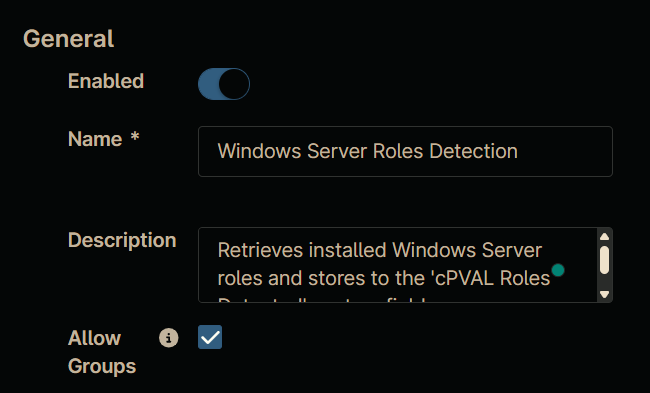

### Step 4

Set the following details in the `Schedule` section.

**Repeats:** `Daily`  
**Recur every:** `1 days(s)`  
**Start At:** `<Current Time>`  
**Ends:** `Never`

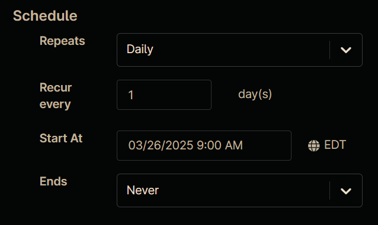

### Step 5

Click the `Add` button in the `Automations` section to add the [Windows Server Roles Detection](/docs/5cda8c79-bcd0-4226-b5a4-db846b9b35a9) automation.  
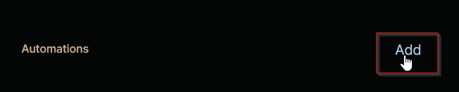

### Step 6

Search and select the [Windows Server Roles Detection](/docs/5cda8c79-bcd0-4226-b5a4-db846b9b35a9) automation in the `Automation Library`, that will appear after clicking the `Add` button.  
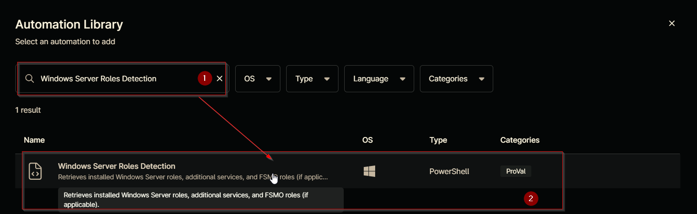

### Step 7

Click the `Apply` button on the script's parameter window without making any changes.  
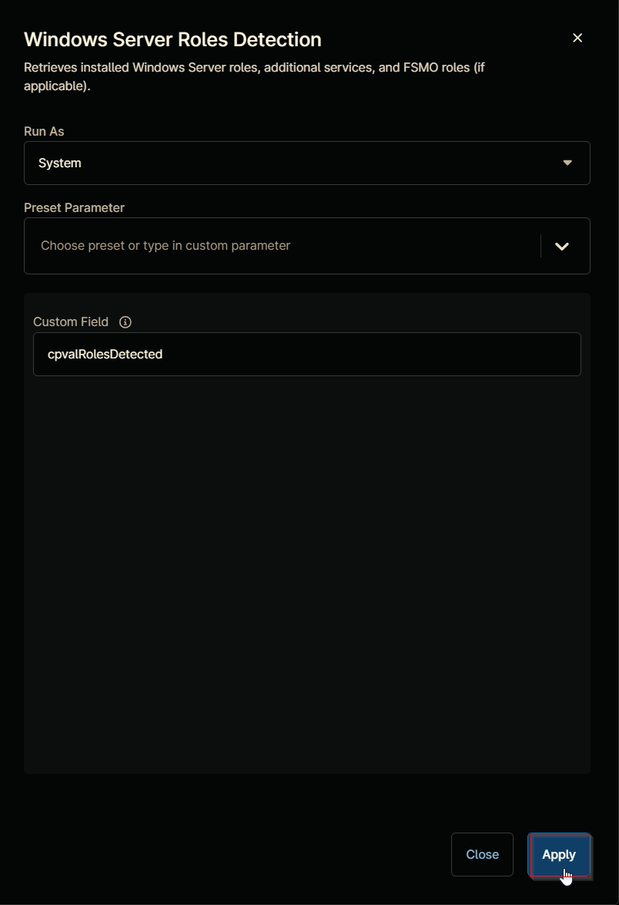

### Step 8

Navigate to the `Targets` section by clicking the `Targets` button.  

### Step 9

Click the `Add` button located on the right-hand side of the screen.  
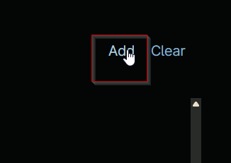

### Step 10

In the `Targets` window that appears, select the `Group` option from the dropdown menu.  
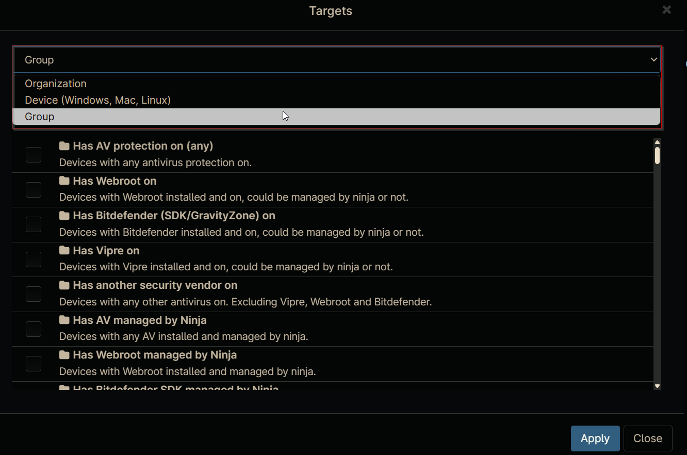

### Step 11

Search for `cPVAL` and select the [cPVAL - Windows Servers](/docs/c73e004e-6a9c-40e4-8e74-babb4b729256) group.  
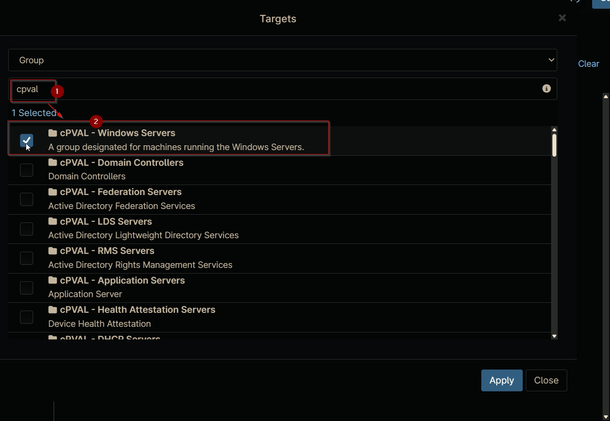

### Step 12

Click the `Apply` button at the bottom of the screen to save the selected target.  
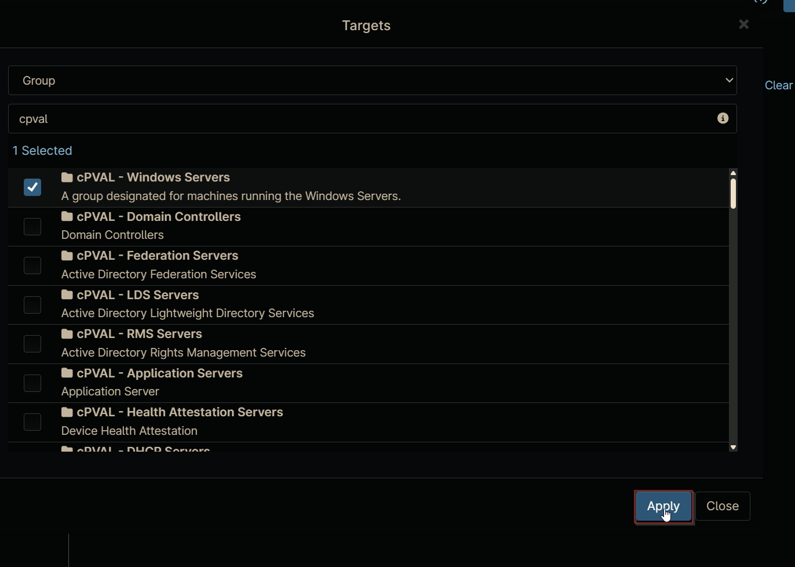

## Completed Task

### Details Section

The `Details` section will display the configured task details.  
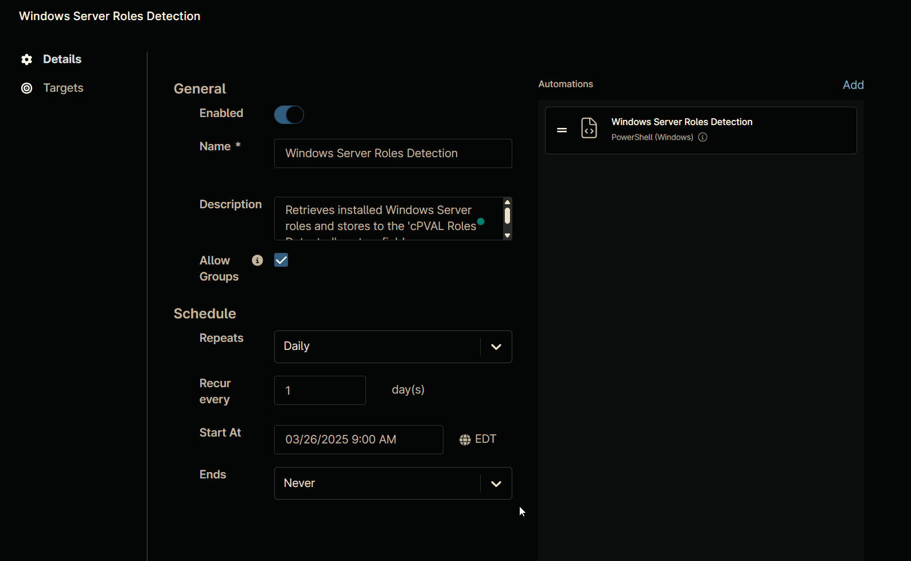

### Targets Section

The `Targets` section will show the selected target group.  
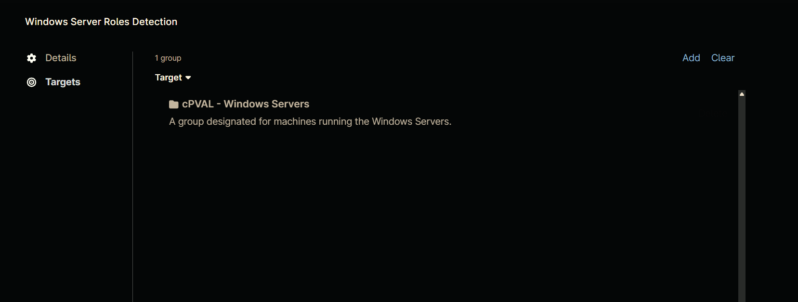

## Saving the Task

Click the `Save` button at the top of the screen to save the scheduled task.  

You will be prompted to verify your MFA code after clicking the `Save` button. Enter your MFA code and click the `Continue` button to finalize the task creation.  
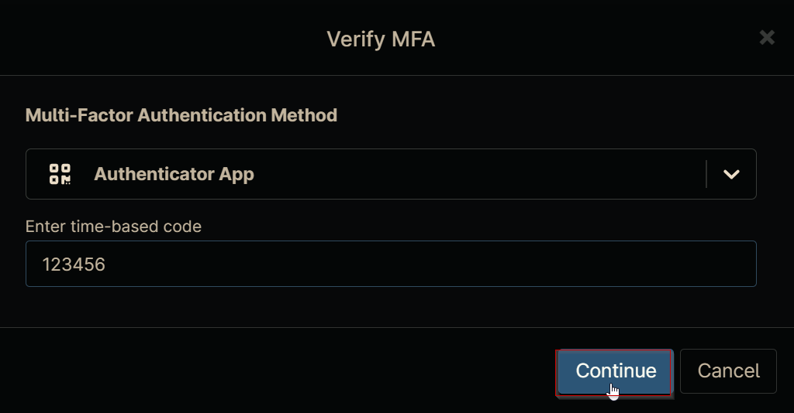