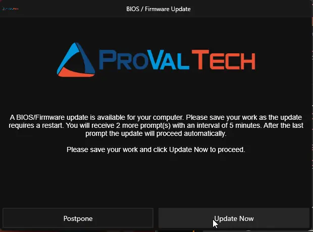
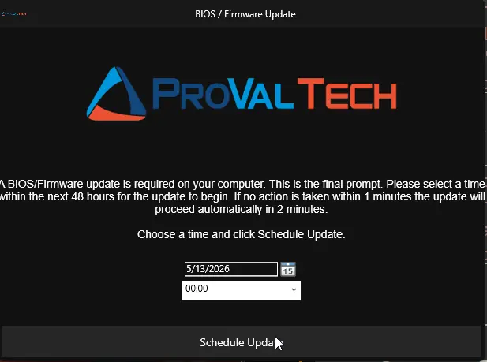
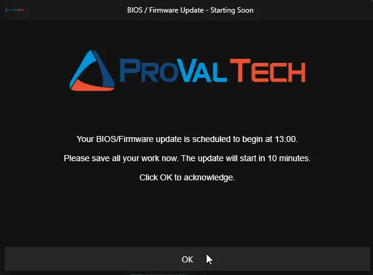
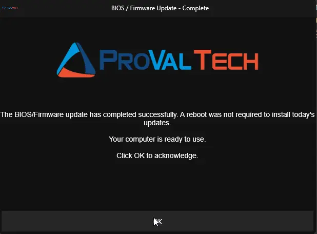
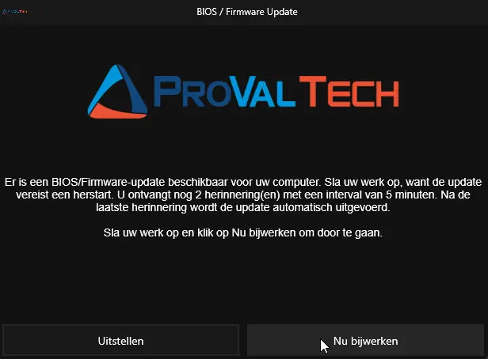
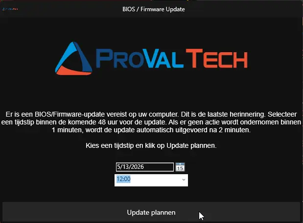
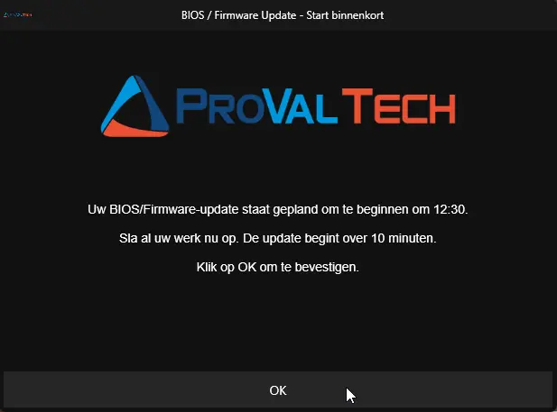
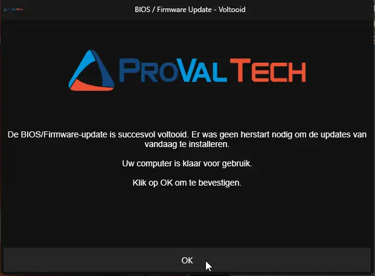

## Overview

Manages prompting end users before OEM BIOS and Firmware upgrades on Windows 10/11 devices. Solves the problem of unattended BIOS/Firmware updates that restart a device without warning, causing data loss and user frustration. The script gives users the ability to postpone the upgrade up to a configurable number of times, then forces the upgrade after all postponements are exhausted.

Designed for RMM platforms (ConnectWise, NinjaRMM, Datto, etc.) that run scripts as SYSTEM. The RMM only needs to deploy and execute the script once; subsequent prompt cycles are handled automatically via self-rescheduling Windows Scheduled Tasks.

Prompt messages and button labels are automatically displayed in Dutch when the logged-in user's Windows display language is set to `nl-NL` or `nl-BE`. All other languages default to English.

## Requirements

| Requirement | Details |
| --- | --- |
| Operating System | Windows 10 or Windows 11 |
| PowerShell | Version 5.0 or later |
| Execution Context | Must run as Administrator (SYSTEM context via RMM) |
| Internet Access | Required to download Prompter app, .NET runtime, and OEM update scripts from `contentrepo.net` |
| .NET Desktop Runtime 10 | Automatically installed by the script if not present |
| Strapper Module | Automatically installed/updated from PSGallery |
| Prompter Application | Automatically downloaded from the content repository |

No manual pre-configuration is needed. All dependencies are bootstrapped by the script on first run.

## Dependencies

- [Prompter](/docs/aba254a9-e917-481d-9152-ecb6e990d98c)
- [Optimize-DotNetRunTime](/docs/6ec8fb3c-29ef-4b05-b8fd-546eb07176c7)
- [Initiaize-DellCommandUpdate](/docs/aa963f3d-f149-4bfa-8fdc-30f12c21ce7f)
- [Initialize-HPImageAssistant](/docs/92b749f0-2e30-4d4d-8916-fb5f30d85bff)
- [Install-LenovoUpdates](/docs/3640e534-d089-4304-89ba-68d3bc113978)
- [Install-WindowsUpdates](/docs/3ccc8542-1961-4d3f-a54b-4a1bb9a78edd)

## Process

1. **Validation** - Confirms the OS is Windows 10 or 11. Exits if unsupported.
2. **Force Reset** (if `-Force`) - Clears all existing scheduled tasks and stored prompt state, then restarts from prompt 0.
3. **Existing Task Check** - If `-Force` was not specified and a scheduled task from a previous run already exists, the script logs the current prompt state (prompts sent, interval, timeouts, suppress window, etc.) and exits. This prevents a duplicate prompt cycle from being created when the RMM re-deploys the script. Use `-Force` to clear existing tasks and restart the prompt cycle.
4. **Dependency Installation** - Installs/updates the Strapper module from PSGallery and .NET Desktop Runtime 10.
5. **Self-Persistence** - Saves itself to `C:\ProgramData\_Automation\Script\Invoke-OEMUpdatePrompt\Invoke-OEMUpdateWithPrompt.ps1` for future rescheduled runs.
6. **Prompter Download** - Downloads the Prompter desktop application to `C:\ProgramData\_Automation\App\Prompter\`. If internet connectivity is unavailable at this stage, the script creates a one-time SYSTEM reschedule task for `IntervalMinutes`, then exits.
7. **Condition Checks** - Evaluates suppress windows, weekend exclusions, locked machine state, and user login state. If conditions are not met, the script reschedules itself at the configured interval and exits.
8. **Language Detection** - Reads the logged-in user's Windows display language from the registry (`PreferredUILanguages`). If the language matches `nl-NL` or `nl-BE`, all prompt messages and button labels are displayed in Dutch. All other languages default to English.
9. **Prompt Display** - Creates a scheduled task running in the user session (BUILTIN\Users group) that launches the Prompter application on the user's desktop.
10. **Response Handling**:
    - **Postpone / Missed (regular prompt)** - Records the postponement, creates a one-time SYSTEM scheduled task to re-run itself at the configured interval, then exits.
    - **Update Now** - Cleans up all tasks and stored state, then executes the OEM update script immediately.
    - **Final Prompt (Schedule Update)** - User picks a date/time within the next 48 hours. The script saves the selection, schedules itself to run 10 minutes before that time, and exits. On re-launch it shows a reminder prompt, then proceeds with the upgrade.
    - **Final Prompt Timeout** - Waits the configured delay, then forces the upgrade.
    - **Post-Upgrade Completion Acknowledgement** - If OEM updates complete and no reboot is pending, a completion prompt is shown only when a user is logged in and the machine is unlocked. The prompt stays open until user acknowledgement or `RegularPromptTimeout`.
    - **BitLocker Handling** - If `-HandleBitLocker` is specified, BitLocker protection is suspended on the OS drive (for one reboot cycle) before the vendor script runs. If no reboot is required after the update, BitLocker protection is automatically resumed before the completion prompt is shown.
11. **Cleanup** - Before any upgrade path executes, all scheduled tasks (Prompter task + reschedule task) are removed and stored prompt data is reset.

> **NOTE:** After the OEM update script completes successfully, a reboot pending check is performed by inspecting Windows registry keys (Component Based Servicing, Windows Update, Session Manager pending file renames, and computer name changes). If a pending reboot is detected, the machine is **forcefully restarted** via `Restart-Computer -Force` to complete the update installation. If no reboot is pending, the script shows a completion acknowledgement prompt only when a user is logged in and the machine is unlocked; otherwise it exits silently. If the vendor script already triggered a reboot, this check will not execute.
>
> If `-HandleBitLocker` is specified, BitLocker protection is suspended before the vendor script runs (using `Suspend-BitLocker -RebootCount 1`). If no reboot occurs after the update, BitLocker is automatically resumed via `Resume-BitLocker` before the completion prompt. If a reboot is triggered, BitLocker auto-resumes after that single reboot without requiring manual intervention.

## Payload Usage

Deploy this script via your RMM platform as a one-time execution under the SYSTEM account. The script handles all subsequent rescheduling internally.

Basic deployment with defaults (5 postponements, 4-hour intervals):

```powershell
.\Invoke-OEMUpdateWithPrompt.ps1
```

Aggressive schedule with weekend skipping and off-hours suppression:

```powershell
.\Invoke-OEMUpdateWithPrompt.ps1 -MaxPostpone 3 -IntervalMinutes 120 -SkipWeekends -SuppressPopupTimeWindows '1800-0900'
```

Use PSWindowsUpdate instead of OEM-specific tools:

```powershell
.\Invoke-OEMUpdateWithPrompt.ps1 -UsePsWindowsUpdate -MaxPostpone 3 -IntervalMinutes 120
```

Force a clean restart of the prompt cycle on a device that was previously deployed:

```powershell
.\Invoke-OEMUpdateWithPrompt.ps1 -Force
```

Run upgrade immediately if no user is logged in:

```powershell
.\Invoke-OEMUpdateWithPrompt.ps1 -IfNotLoggedIn -MaxPostpone 5 -IntervalMinutes 240
```

Suspend BitLocker before OEM updates on an encrypted device:

```powershell
.\Invoke-OEMUpdateWithPrompt.ps1 -HandleBitLocker
```

Install driver updates via PSWindowsUpdate while excluding BIOS, Firmware, and UEFI updates:

```powershell
.\Invoke-OEMUpdateWithPrompt.ps1 -UsePsWindowsUpdate -OEMScriptParametersOverride "-Category 'Drivers','Tools' -Description '(?i).*BIOS.*|.*Firmware' -AllowReboot"
```

## Detailed Example Walkthrough

### Example 1: Default Behavior (MaxPostpone = 5, IntervalMinutes = 240)

```powershell
.\Invoke-OEMUpdateWithPrompt.ps1
```

The RMM deploys and runs the script once. The following prompt cycle occurs automatically:

**PROMPT 1** (initial run):

```PlainText
Title:   BIOS / Firmware Update
Message:
  A BIOS/Firmware update is available for your computer. Please save your work as the
  update requires a restart.

  You will receive 4 more prompt(s) with an interval of 240 minutes. After the last
  prompt the update will proceed automatically.

  Please save your work and click Update Now to proceed.
Buttons: [Postpone] [Update Now]
Timeout: 600 seconds (10 minutes)
```

→ User clicks **[Postpone]**. Script creates a SYSTEM scheduled task to re-run itself in 240 minutes.

**PROMPTS 2-5** (each 240 minutes apart):

Same format as Prompt 1, with the remaining prompt count decreasing (3, 2, 1, 0). Each postpone or missed prompt reschedules the script for the next interval.

**PROMPT 6 - FINAL** (240 minutes after last postpone):

```PlainText
Title:   BIOS / Firmware Update
Message:
  A BIOS/Firmware update is required on your computer. This is the final prompt.

  Please select a time within the next 48 hours for the update to begin. If no
  action is taken within 15 minutes the update will proceed automatically in
  10 minutes.

  Choose a time and click Schedule Update.
Buttons: [Schedule Update]
Controls: Date/Time picker (next 48 hours, 12-hour format)
Timeout: 900 seconds (15 minutes)
```

→ User selects 4:30 PM and clicks **[Schedule Update]**.
→ Script saves the selected time, creates a scheduled task to re-run itself at 4:20 PM, and exits.

**PRE-UPGRADE REMINDER** (script re-launches at 4:20 PM via scheduled task):

```PlainText
Title:   BIOS / Firmware Update - Starting Soon
Message:
  Your BIOS/Firmware update is scheduled to begin at 16:30.

  Please save all your work now. The update will start in 10 minutes.

  Click OK to acknowledge.
Buttons: [OK]
Timeout: 600 seconds (10 minutes)
```

→ At 4:30 PM the OEM update script executes and the machine restarts.

---

### Example 1a: Default Behavior - Dutch Language (nl-NL / nl-BE)

When the logged-in user's Windows display language is `nl-NL` or `nl-BE`, the same prompt cycle is shown with Dutch messages and button labels. No additional configuration is needed.

**PROMPT 1** (initial run, Dutch user):

```PlainText
Title:   BIOS / Firmware Update
Message:
  Er is een BIOS/Firmware-update beschikbaar voor uw computer. Sla uw werk op, want
  de update vereist een herstart.

  U ontvangt nog 4 herinnering(en) met een interval van 240 minuten. Na de laatste
  herinnering wordt de update automatisch uitgevoerd.

  Sla uw werk op en klik op Nu bijwerken om door te gaan.
Buttons: [Uitstellen] [Nu bijwerken]
Timeout: 600 seconds (10 minutes)
```

→ User clicks **[Uitstellen]**. Script creates a SYSTEM scheduled task to re-run itself in 240 minutes.

**PROMPT 6 - FINAL** (Dutch, 240 minutes after last postpone):

```PlainText
Title:   BIOS / Firmware Update
Message:
  Er is een BIOS/Firmware-update vereist op uw computer. Dit is de laatste herinnering.

  Selecteer een tijdstip binnen de komende 48 uur voor de update. Als er geen actie
  wordt ondernomen binnen 15 minuten, wordt de update automatisch uitgevoerd na
  10 minuten.

  Kies een tijdstip en klik op Update plannen.
Buttons: [Update plannen]
Controls: Date/Time picker (next 48 hours, 12-hour format)
Timeout: 900 seconds (15 minutes)
```

→ User selects 4:30 PM and clicks **[Update plannen]**.

**PRE-UPGRADE REMINDER** (Dutch):

```PlainText
Title:   BIOS / Firmware Update - Start binnenkort
Message:
  Uw BIOS/Firmware-update staat gepland om te beginnen om 16:30.

  Sla al uw werk nu op. De update begint over 10 minuten.

  Klik op OK om te bevestigen.
Buttons: [OK]
Timeout: 600 seconds (10 minutes)
```

→ At 4:30 PM the OEM update script executes and the machine restarts.

---

### Example 2: Aggressive Schedule with Suppression (MaxPostpone = 3, IntervalMinutes = 120)

```powershell
.\Invoke-OEMUpdateWithPrompt.ps1 -MaxPostpone 3 -IntervalMinutes 120 -SkipWeekends -SuppressPopupTimeWindows '1800-0900'
```

- Prompts only appear Monday-Friday between 9:00 AM and 6:00 PM.
- If the script's scheduled task fires at 7:00 PM, on a Saturday, or while the machine is locked, it reschedules itself for the next interval (120 minutes) and exits.
- User gets 3 regular prompts with 2-hour intervals, then a final prompt.
- Total time from first prompt to forced upgrade (if user never interacts): ~6 hours + final timeout + delay.

---

### Example 3: Force Reset After Previous Deployment

```powershell
.\Invoke-OEMUpdateWithPrompt.ps1 -Force -MaxPostpone 5 -IntervalMinutes 240
```

- Kills any running Prompter process.
- Removes the `Scheduled_Task_Invoke-OEMUpdatePrompt` task (user-session Prompter).
- Removes the `Scheduled_Task_Invoke-OEMUpdatePrompt_Reschedule` task (SYSTEM self-reschedule).
- Resets stored prompt counter to 0.
- Starts a fresh prompt cycle from Prompt 1 as if the script had never been deployed.

---

### Example 4: Final Prompt Timeout (User Away From Desk)

```powershell
.\Invoke-OEMUpdateWithPrompt.ps1 -MaxPostpone 5 -IntervalMinutes 240 -FinalPromptTimeout 900 -DelayAfterFinalPrompt 600
```

After 5 postponements, the final prompt appears:

→ User does not interact. After 900 seconds (15 minutes) the prompt closes with "Timer elapsed".
→ Script cleans up all scheduled tasks and stored state.
→ Script waits 600 seconds (10 minutes) as a grace period.
→ OEM update script executes and the machine restarts.

---

### Example 5: No User Logged In

```powershell
.\Invoke-OEMUpdateWithPrompt.ps1 -IfNotLoggedIn -MaxPostpone 3 -IntervalMinutes 120
```

- If no user is logged in when the script runs and prompt conditions are met, the upgrade executes immediately without any prompt.
- If a user IS logged in, the normal prompt workflow proceeds (3 prompts, 2-hour intervals).

## Parameters

| Parameter | Alias | Required | Default | Type | Description |
| --- | --- | --- | --- | --- | --- |
| `MaxPostpone` | `MaxDefer` | False | `5` | Int32 | Maximum number of times the upgrade can be postponed before the final prompt is shown. Total prompts = MaxPostpone + 1 (final). |
| `IntervalMinutes` | `Interval` | False | `240` | Int32 | Minutes between each prompt. After postpone or miss, a SYSTEM scheduled task re-runs the script at this interval. |
| `RegularPromptTimeout` | `Timeout` | False | `600` | Int32 | Seconds before a regular prompt auto-closes and counts as missed. |
| `FinalPromptTimeout` | `FinalTimeout` | False | `900` | Int32 | Seconds before the final prompt times out and the upgrade is forced. |
| `DelayAfterFinalPrompt` | `Delay` | False | `600` | Int32 | Seconds to wait before forcing the upgrade after the final prompt times out or user picks a time < 15 min away. |
| `SuppressPopupTimeWindows` | `Suppress` | False | | String | Time window (24-hour format, e.g., `1800-0900`) during which prompts are suppressed. |
| `SkipWeekends` | `NoWeekends` | False | `False` | Switch | Prevents prompts on Saturdays and Sundays. |
| `IfNotLoggedIn` | `Unattended` | False | `False` | Switch | Runs the upgrade immediately without prompting if no user is logged in. |
| `Force` | `Recreate` | False | `False` | Switch | Clears all scheduled tasks and stored state, restarting the prompt cycle from 0. |
| `UsePsWindowsUpdate` | `WindowsUpdate` | False | `False` | Switch | Uses the PSWindowsUpdate module instead of OEM-specific scripts (Dell/HP/Lenovo). |
| `Icon` | `IconUrl`, `IconPath` | False | | String | URL or local file path for the icon displayed in the prompt dialog (e.g., `https://example.com/icon.png` or `C:\Icons\icon.png`). |
| `HeaderImage` | `HeaderUrl`, `HeaderPath` | False | | String | URL or local file path for the header image displayed at the top of the prompt dialog (e.g., `https://example.com/header.png` or `C:\Images\header.png`). |
| `HandleBitLocker` | `BitLocker`, `SuspendBitLocker` | False | `False` | Switch | Suspends BitLocker protection on the OS drive for one reboot cycle before OEM updates run. If no reboot is required after the update, BitLocker protection is automatically resumed. |
| `OEMScriptParametersOverride` | `Override`, `ParamsOverride` | False | | String | Custom parameter string passed to the vendor update script, replacing the default parameter set for the detected manufacturer (e.g., `'/applyUpdates -updateType=bios -silent'` for Dell DCU or `"-Category 'Drivers','Tools' -AllowReboot"` for PSWindowsUpdate). |

## Output

### Log Files

The Strapper module `Write-Log` writes log and error files in the same directory from which the script is executed. The log file name is derived from the script name.

#### Initial Run (RMM deployment)

When the RMM first deploys and executes the script, logs are written to the RMM's working directory (wherever the RMM places and runs the script):

```PlainText
.\Invoke-OEMUpdateWithPrompt-log.txt
.\Invoke-OEMUpdateWithPrompt-error.txt
```

For example, if the RMM executes from `C:\Windows\Temp\`:

```PlainText
C:\Windows\Temp\Invoke-OEMUpdateWithPrompt-log.txt
C:\Windows\Temp\Invoke-OEMUpdateWithPrompt-error.txt
```

#### Subsequent Rescheduled Runs (Scheduled Task)

After the first run, the script persists itself and all subsequent executions run from the persisted path. Logs are written alongside the script:

```PlainText
C:\ProgramData\_Automation\Script\Invoke-OEMUpdatePrompt\Invoke-OEMUpdateWithPrompt-log.txt
C:\ProgramData\_Automation\Script\Invoke-OEMUpdatePrompt\Invoke-OEMUpdateWithPrompt-error.txt
```

#### OEM Update Script Logs

When the embedded `Install-OEMUpdates.ps1` executes, it writes its own log to track upgrade actions (manufacturer detection, script download, execution, and verification):

```PlainText
C:\ProgramData\_Automation\Script\Install-OEMUpdates\Install-OEMUpdates-log.txt
```

The vendor-specific scripts it calls produce additional logs in their own directories:

```PlainText
C:\ProgramData\_Automation\Script\Initialize-DellCommandUpdate\Initialize-DellCommandUpdate-log.txt
C:\ProgramData\_Automation\Script\Initialize-DellCommandUpdate\Initialize-DellCommandUpdate-error.txt

C:\ProgramData\_Automation\Script\Initialize-HPSupportAssistant\Initialize-HPSupportAssistant-log.txt
C:\ProgramData\_Automation\Script\Initialize-HPSupportAssistant\Initialize-HPSupportAssistant-error.txt

C:\ProgramData\_Automation\Script\Install-LenovoUpdates\Install-LenovoUpdates-log.txt
C:\ProgramData\_Automation\Script\Install-LenovoUpdates\Install-LenovoUpdates-error.txt

C:\ProgramData\_Automation\Script\Install-WindowsUpdates\Install-WindowsUpdates-log.txt
C:\ProgramData\_Automation\Script\Install-WindowsUpdates\Install-WindowsUpdates-error.txt
```

### Working File Artifacts

```PlainText
C:\ProgramData\_Automation\App\Prompter\Prompter.exe
C:\ProgramData\_Automation\Script\Invoke-OEMUpdatePrompt\Invoke-OEMUpdateWithPrompt.ps1
C:\ProgramData\_Automation\Script\Invoke-OEMUpdatePrompt\Invoke-OEMUpdatePrompt.cmd
C:\ProgramData\_Automation\Script\Invoke-OEMUpdatePrompt\Invoke-OEMUpdatePrompt.vbs
C:\ProgramData\_Automation\Script\Invoke-OEMUpdatePrompt\Invoke-OEMUpdatePrompt.txt
C:\ProgramData\_Automation\Script\Invoke-OEMUpdatePrompt\Invoke-OEMUpdatePrompt-exit.txt
C:\ProgramData\_Automation\Script\Install-OEMUpdates\Install-OEMUpdates.ps1
```

### Scheduled Tasks

```PlainText
Scheduled_Task_Invoke-OEMUpdatePrompt (Prompter user-session task - runs as BUILTIN\Users)
Scheduled_Task_Invoke-OEMUpdatePrompt_Reschedule (Self-rescheduling task - runs as SYSTEM)
```

### Sample Prompts - English

  
  
  

### Completion Acknowledgement Prompt (No Reboot Pending) - English

  

### Sample Prompts - Dutch

  
  
  

#### Completion Acknowledgement Prompt (No Reboot Pending) - Dutch

  

## Changelog

### 2026-05-13

- Initial version of the document
