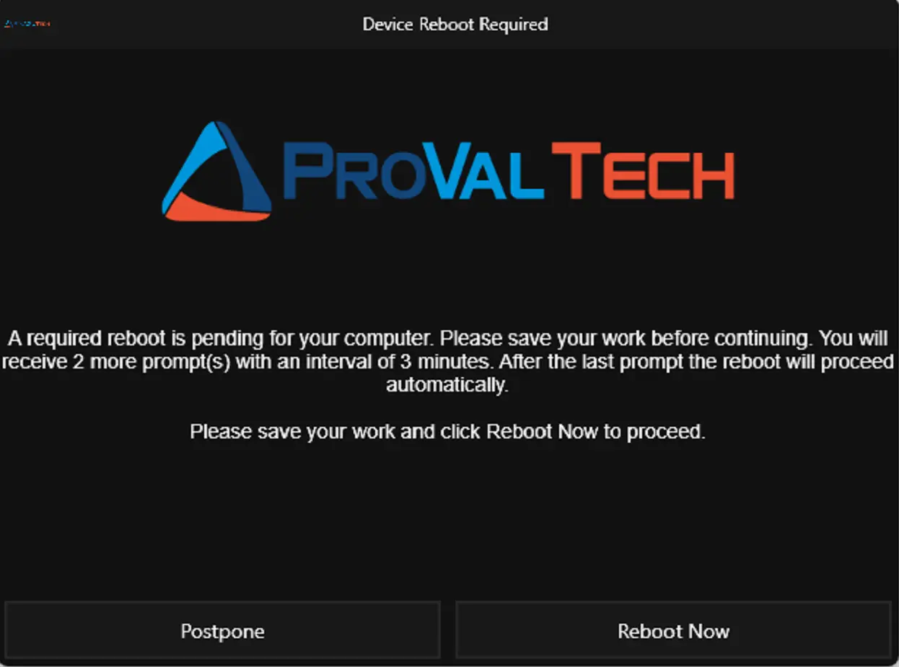
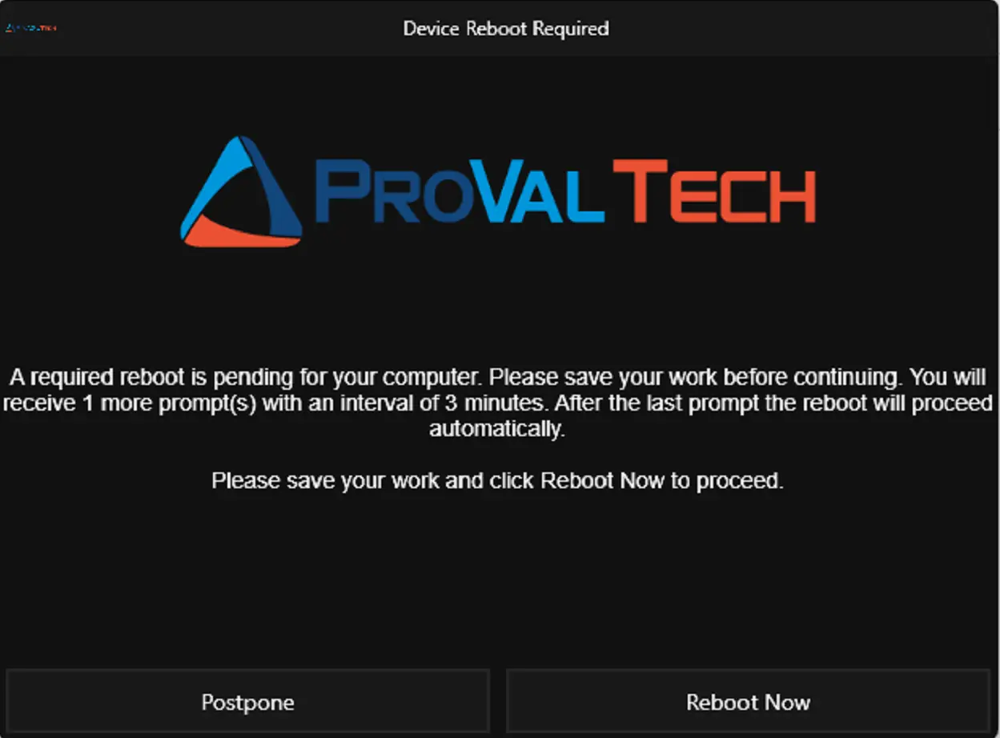
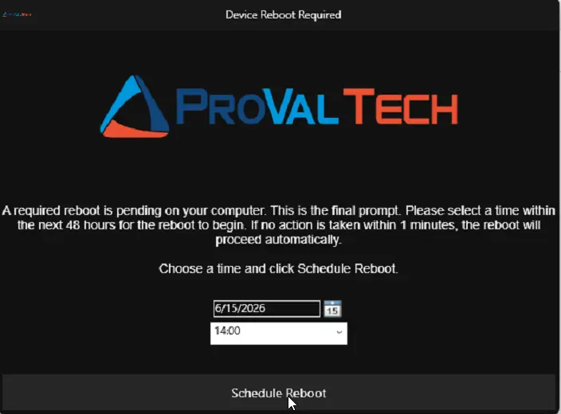
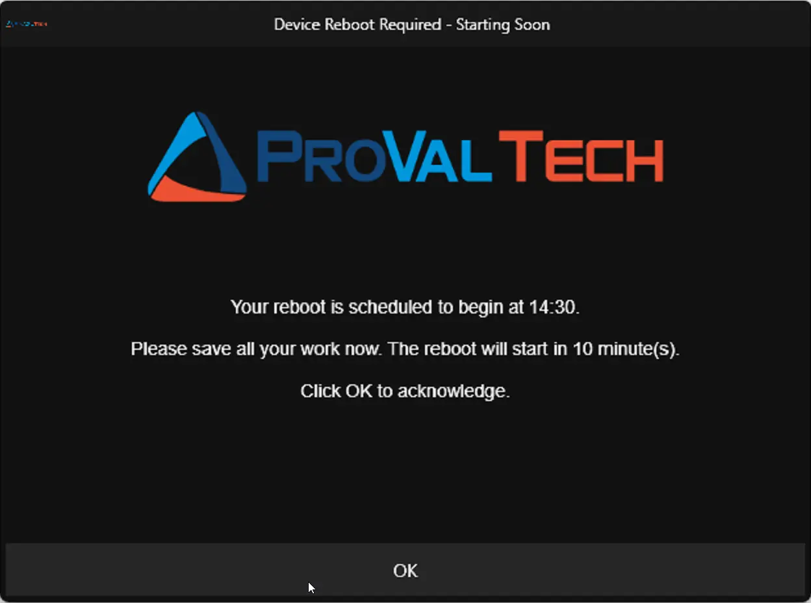
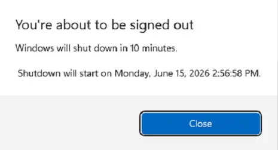

## Description

Prompts end users to reboot their Windows 10/11 device with postponement and scheduling logic.

The script runs under SYSTEM via your RMM platform and manages itself automatically after the first execution — no recurring jobs or repeating scheduled tasks need to be configured in your RMM. It creates its own one-time scheduled tasks to handle retries, postponements, and reminders until the machine is rebooted.

> Button labels switch to Dutch automatically when the user’s display language is nl-NL or nl-BE. Set the title and message text in your implementation script parameters.

---

## How It Works

### Default Prompt Flow (4 prompts, 4 hours apart)

1. **Prompt 1–3 (Regular):** The user sees a prompt with two buttons — `Postpone` and `Reboot Now`.
   - If the user clicks **Postpone**, the script reschedules itself to try again in 4 hours (default).
   - If the user clicks **Reboot Now**, the machine reboots immediately.
   - If the prompt times out (default 10 minutes), the script treats it as a postpone.
2. **Prompt 4 (Final/Scheduling):** The user sees a date/time picker and must select a reboot time within the next 48 hours.
   - If the user picks a time 15+ minutes in the future, the reboot is scheduled and a reminder appears 10 minutes before.
   - If the user picks a time less than 15 minutes away, the reboot is forced shortly after.
   - If the prompt times out (default 15 minutes), the machine reboots automatically.

### Automatic Behaviors

| Scenario | What Happens |
|----------|--------------|
| User reboots on their own | On the next scheduled run the script detects either fresh uptime OR that `LastBootUpTime` is newer than the last prompt timestamp, cleans up all tasks and state, and exits. No further prompts. |
| User reboots after reminder / during shutdown countdown | Windows automatically cancels the pending `shutdown /r` timer. All tasks and state were already cleaned up when the shutdown was scheduled, so nothing remains to trigger a second reboot. |
| Machine is locked | Prompt is skipped; script reschedules for the next interval. |
| No user logged in | Prompt is skipped and rescheduled — unless `IfNotLoggedIn` is enabled, in which case the machine reboots directly. |
| No user logged in + install in progress | Even with `IfNotLoggedIn` enabled, the script defers the reboot if it detects an active installation (Windows Update, MSI, BITS, etc.) and reschedules. |
| Weekend (when `SkipWeekends` is on) | Prompt is skipped; script reschedules. |
| Suppress time window active | Prompt is skipped; script reschedules. |
| No internet | Script reschedules itself rather than failing. |
| Script already running (tasks exist) | Exits immediately without changes unless `-Force` is used. |
| `.NET Desktop Runtime 10` missing | Automatically installed before the first prompt. |

---

## Requirements

- Windows 10 or Windows 11
- PowerShell 5.0+
- Administrative context (SYSTEM via RMM recommended)
- Internet access (for Prompter application, .NET Desktop Runtime 10, and Strapper module)

---

## Parameters

| Parameter | Default | Type | Description |
|-----------|---------|------|-------------|
| `MaxPostpone` | `4` | Int | Total number of prompts in the cycle (regular + final). Regular prompts = MaxPostpone - 1. Default gives 3 regular + 1 final. |
| `IntervalMinutes` | `240` | Int | Minutes between prompt attempts (regular and rescheduled). |
| `RegularPromptTimeout` | `600` | Int | Seconds before a regular prompt auto-closes (treated as postpone). |
| `FinalPromptTimeout` | `900` | Int | Seconds before the final prompt auto-closes (triggers forced reboot). |
| `DelayAfterFinalPrompt` | `900` | Int | Seconds to wait before rebooting when an invalid/too-soon time is selected. |
| `SuppressPopupTimeWindows` | *(none)* | String | Time window to suppress prompts, format `HHmm-HHmm` (e.g. `1800-0900`). |
| `SkipWeekends` | `False` | Switch | Skip prompting on Saturdays and Sundays. |
| `IfNotLoggedIn` | `False` | Switch | Reboot immediately if no user is logged in (guarded by install-in-progress check). |
| `Force` | `False` | Switch | Reset all stored state and scheduled tasks, restarting the prompt cycle. |
| `Icon` | *(none)* | String | Path or URL to an icon file for the prompt window. |
| `HeaderImage` | *(none)* | String | Path or URL to a header image for the prompt window. |
| `Title` | `Device Reboot Required` | String | Title bar text for all prompt windows. |
| `RegularPromptMessage` | *(see below)* | String | Body text for regular prompts. Supports substitution variables and `\n`. |
| `FinalPromptMessage` | *(see below)* | String | Body text for the final scheduling prompt. Supports substitution variables and `\n`. |
| `ReminderPromptTitle` | `Device Reboot Required - Starting Soon` | String | Title for the pre-reboot reminder. |
| `ReminderPromptMessage` | *(see below)* | String | Body text for the reminder prompt. Supports substitution variables and `\n`. |
| `Theme` | `Dark` | String | Prompt window theme. Valid values: `Dark`, `Light`. |

---

## Substitution Variables

Use these in any message parameter. They are replaced with live values at display time.

| Variable | Description | Example Value |
|----------|-------------|---------------|
| `%PromptsToSend%` | Total prompts the user will receive | `5` |
| `%PromptsSent%` | Number of prompts already shown | `2` |
| `%PromptsLeft%` | Remaining prompts before the final one | `3` |
| `%PromptIntervalMinutes%` | Interval between prompts in minutes | `240` |
| `%PromptIntervalHours%` | Same interval in hours | `4` |
| `%RegularTimeoutSeconds%` | Regular prompt timeout in seconds | `600` |
| `%RegularTimeoutMinutes%` | Same timeout in minutes | `10` |
| `%FinalTimeoutSeconds%` | Final prompt timeout in seconds | `900` |
| `%FinalTimeoutMinutes%` | Same timeout in minutes | `15` |
| `%DelayAfterFinalSeconds%` | Delay after final prompt in seconds | `900` |
| `%DelayAfterFinalMinutes%` | Same delay in minutes | `15` |
| `%ScheduledRebootTime%` | User-selected reboot time | `14:30` |
| `%MinutesUntilReboot%` | Minutes until scheduled reboot | `10` |
| `%ComputerName%` | Machine name | `PC-OFFICE-01` |
| `%UserName%` | Logged-in username | `jsmith` |

Variables that don't apply in a given context (e.g. `%ScheduledRebootTime%` during a regular prompt) are replaced with an empty string.

Use `\n` in any message to insert a line break.

---

## Default Messages

**Regular Prompt (English):**

> A required reboot is pending for your computer. Please save your work before continuing. You will receive %PromptsLeft% more prompt(s) with an interval of %PromptIntervalMinutes% minutes. After the last prompt the reboot will proceed automatically.
>
> Please save your work and click Reboot Now to proceed.

**Final Prompt (English):**

> A required reboot is pending on your computer. This is the final prompt. Please select a time within the next 48 hours for the reboot to begin. If no action is taken within %FinalTimeoutMinutes% minutes, the reboot will proceed automatically.
>
> Choose a time and click Schedule Reboot.

**Reminder (English):**

> Your reboot is scheduled to begin at %ScheduledRebootTime%.
>
> Please save all your work now. The reboot will start in %MinutesUntilReboot% minute(s).
>
> Click OK to acknowledge.

---

## Usage Examples

### Example 1: Run with all defaults

```powershell
.\Invoke-RebootWithPrompt.ps1
```

**What happens:**

- Prompt 1 appears. User clicks Postpone.
- 4 hours later, Prompt 2 appears. User clicks Postpone.
- 4 hours later, Prompt 3 appears. User clicks Postpone.
- 4 hours later, Prompt 4 (final) appears with a date/time picker.
- User selects 3:00 PM tomorrow → reboot is scheduled. Reminder appears at 2:50 PM. Machine reboots at 3:00 PM.

### Example 2: Shorter cycle with hourly prompts

```powershell
.\Invoke-RebootWithPrompt.ps1 -MaxPostpone 2 -IntervalMinutes 60
```

**What happens:**

- Prompt 1 at 9:00 AM. User postpones.
- Prompt 2 (final) at 10:00 AM with date/time picker.
- If ignored for 15 minutes, machine reboots at 10:15 AM.

### Example 3: Suppress prompts overnight and on weekends

```powershell
.\Invoke-RebootWithPrompt.ps1 -SuppressPopupTimeWindows '1800-0800' -SkipWeekends
```

**What happens:**

- Prompts only appear between 8:00 AM and 6:00 PM, Monday through Friday.
- If a prompt is due at 7:00 PM Friday, it is skipped and rescheduled to Monday morning.

### Example 4: Auto-reboot unattended machines

```powershell
.\Invoke-RebootWithPrompt.ps1 -IfNotLoggedIn -IntervalMinutes 120
```

**What happens:**

- If no user is logged in when the script runs, the machine reboots immediately.
- Exception: If Windows Update, an MSI installer, BITS transfer, or similar is running, the reboot is deferred by 2 hours and checked again.
- If a user IS logged in, the normal prompt flow is used.

### Example 5: Custom messages with substitution variables

```powershell
.\Invoke-RebootWithPrompt.ps1 -RegularPromptMessage 'Hi %UserName%, your PC %ComputerName% needs a reboot.\n\nYou have %PromptsLeft% reminders left before this becomes mandatory.\n\nNext reminder in %PromptIntervalHours% hours.'
```

**What happens:**

- The user sees a personalized message with their name, computer name, remaining prompts, and the next interval.

### Example 6: Reset an existing prompt cycle

```powershell
.\Invoke-RebootWithPrompt.ps1 -Force
```

**What happens:**

- All existing scheduled tasks and stored state are removed.
- The prompt cycle restarts from Prompt 1 as if the script had never run before.

### Example 7: All parameters set

```powershell
.\Invoke-RebootWithPrompt.ps1 `
    -MaxPostpone 3 `
    -IntervalMinutes 120 `
    -RegularPromptTimeout 300 `
    -FinalPromptTimeout 600 `
    -DelayAfterFinalPrompt 900 `
    -SuppressPopupTimeWindows '1800-0800' `
    -SkipWeekends `
    -IfNotLoggedIn `
    -Icon 'C:\Company\Assets\logo.ico' `
    -HeaderImage 'https://intranet.company.com/assets/reboot-banner.png' `
    -Title 'IT Maintenance - Restart Required' `
    -RegularPromptMessage 'Hi %UserName%, your PC %ComputerName% needs a restart to finish installing updates.\n\nYou have %PromptsLeft% reminder(s) left before the restart becomes mandatory.\nPrompts are sent every %PromptIntervalHours% hours.\n\nPlease save your work and click Reboot Now, or click Postpone to be reminded later.' `
    -FinalPromptMessage 'This is your final reminder. Please choose a restart time within the next 48 hours.\n\nIf you do not respond within %FinalTimeoutMinutes% minutes, your PC will restart automatically.\n\nSelect a time and click Schedule Reboot.' `
    -ReminderPromptTitle 'Scheduled Restart - %MinutesUntilReboot% Minutes Away' `
    -ReminderPromptMessage 'Your restart is scheduled for %ScheduledRebootTime%.\n\nPlease save all open work now. The restart will begin in %MinutesUntilReboot% minute(s).\n\nClick OK to dismiss this reminder.'
```

**What happens:**

- Prompts appear only between 8:00 AM and 6:00 PM, Monday through Friday.
- If no user is logged in, the machine reboots automatically (unless an install is running).
- Up to 2 regular prompts are shown, 2 hours apart, each timing out after 5 minutes.
- The 3rd prompt is the final scheduling prompt (10-minute timeout).
- All prompts display the company icon and header image with personalized messages.
- If the final prompt is ignored, reboot is forced 15 minutes later.

### Example 8: User reboots on their own mid-cycle

```powershell
.\Invoke-RebootWithPrompt.ps1 -MaxPostpone 4 -IntervalMinutes 240
```

**What happens:**

- Prompt 1 at 10:00 AM. User postpones.
- User manually restarts at 1:00 PM.
- Scheduled task fires at 2:00 PM. Script detects uptime (1 hour) is less than the interval (4 hours), concludes the machine was rebooted, cleans up everything, and exits silently. No prompt shown.

### Example 9: Full visual walkthrough (fast cycle for testing)

```powershell
.\Invoke-RebootWithPrompt.ps1 `
    -MaxPostpone 3 `
    -IntervalMinutes 3 `
    -RegularPromptTimeout 30 `
    -FinalPromptTimeout 60 `
    -DelayAfterFinalPrompt 30 `
    -Icon 'https://www.provaltech.com/wp-content/uploads/2015/07/logo_r4.png' `
    -HeaderImage 'https://www.provaltech.com/wp-content/uploads/2015/07/logo_r4.png' `
    -Title 'Device Reboot Required' `
    -RegularPromptMessage 'A required reboot is pending for your computer. Please save your work before continuing. You will receive %PromptsLeft% more prompt(s) with an interval of %PromptIntervalMinutes% minutes. After the last prompt the reboot will proceed automatically.\n\nPlease save your work and click Reboot Now to proceed.' `
    -FinalPromptMessage 'A required reboot is pending on your computer. This is the final prompt. Please select a time within the next 48 hours for the reboot to begin. If no action is taken within %FinalTimeoutMinutes% minutes, the reboot will proceed automatically.\n\nChoose a time and click Schedule Reboot.' `
    -ReminderPromptTitle 'Device Reboot Required - Starting Soon' `
    -ReminderPromptMessage 'Your reboot is scheduled to begin at %ScheduledRebootTime%.\n\nPlease save all your work now. The reboot will start in %MinutesUntilReboot% minute(s).\n\nClick OK to acknowledge.'
```

**What happens:**

1. **Prompt 1 (Regular):** Appears immediately. User clicks Postpone. Script reschedules for 3 minutes later.

   

2. **Prompt 2 (Regular):** Appears 3 minutes later. User clicks Postpone. Script reschedules for 3 minutes later.

   

3. **Prompt 3 (Final/Scheduling):** Appears 3 minutes later with a date/time picker. User selects a time within the next 48 hours and clicks Schedule Reboot. If ignored for 60 seconds, machine reboots automatically.

   

4. **Reminder Prompt:** Appears 10 minutes before the scheduled reboot time (or immediately if the selected time is less than 10 minutes away). Informational only — clicking OK dismisses it.

   

5. **Windows Shutdown Warning:** After the reminder displays and 60 seconds pass, the script issues `shutdown /r /f /t 540`. Windows shows its built-in shutdown notification to the user.

   

> **Note:** The Windows shutdown warning says **"shut down"** — this is standard Windows behavior. Despite the wording, the machine will **restart** (not power off) because the script uses `shutdown /r` (restart flag). This is a cosmetic quirk of the Windows notification and does not affect functionality.

---

## Output Artifacts

| Artifact | Path |
|----------|------|
| Prompter application | `C:\ProgramData\_Automation\App\Prompter\Prompter.exe` |
| Persisted script | `C:\ProgramData\_Automation\Script\Invoke-RebootPrompt\Invoke-RebootWithPrompt.ps1` |
| Scheduled task (main) | `Scheduled_Task_Invoke-RebootPrompt` |
| Scheduled task (reschedule) | `Scheduled_Task_Invoke-RebootPrompt_Reschedule` |
| Scheduled task (reminder) | `Scheduled_Task_Invoke-RebootPrompt_Reminder` |

---

## Changelog

### 2026-06-15

- Added `LastPromptSentTime` timestamp field to all stored data writes (postpone, timer elapsed, schedule reboot, initial store, and pre-reminder)
- Enhanced `#region post-reboot detection` to compare `LastBootUpTime` against stored `LastPromptSentTime` (if system was rebooted after the last prompt/action → cleanup and exit, regardless of uptime vs interval)
- Added reboot-already-occurred guard at the top of `#region scheduled reboot check` (compares `LastBootUpTime` > `LastPromptSentTime` before showing the reminder or initiating the reboot → cancels and cleans up if machine was already rebooted)
- Replaced `Start-Sleep` + `Invoke-DeviceReboot` in both reminder paths (scheduled reboot check and immediate reminder) with `shutdown /r /f /t <seconds>` followed by immediate cleanup and exit (eliminates the script holding state during a 10-minute sleep; Windows automatically cancels the pending shutdown if the machine is rebooted manually before the countdown expires, making double-reboot impossible without any additional detection logic)
- Scheduled reboot reminder path now waits 60 seconds for the Prompter task to display the reminder prompt, then issues `shutdown /r /f /t 540` (9-minute countdown, ~10 minutes total from reminder display), then immediately cleans up all tasks/state and exits

### 2026-06-12

- Added post-reboot detection: script now checks system uptime on rescheduled runs and cleans up automatically if the machine was already rebooted
- Added install-in-progress guard: when no user is logged in and auto-reboot is enabled, the script checks for active installations (Windows Update, MSI, BITS, winget, etc.) and defers the reboot if one is found
- Added `Test-InstallInProgress` function to detect TiWorker, wusa, SetupHost, setup, MoUsoCoreWorker, Windows10Upgrader, winget, BITS transfers, and MSI mutex
- Added `%Variable%` substitution system for all message parameters
- Added `Resolve-MessageVariable` function for token replacement
- Added unit conversion variables (`%PromptIntervalHours%`, `%RegularTimeoutMinutes%`, `%FinalTimeoutMinutes%`, `%DelayAfterFinalMinutes%`)
- Added `\n` support for line breaks in all message strings
- Updated default messages to use substitution variables instead of hardcoded values

### 2026-06-10

- Initial version of the document
