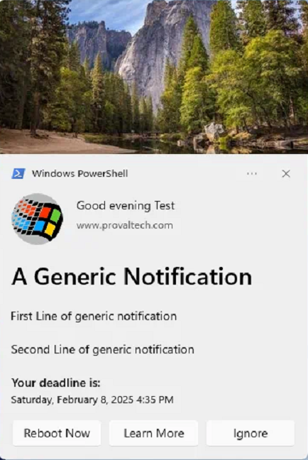
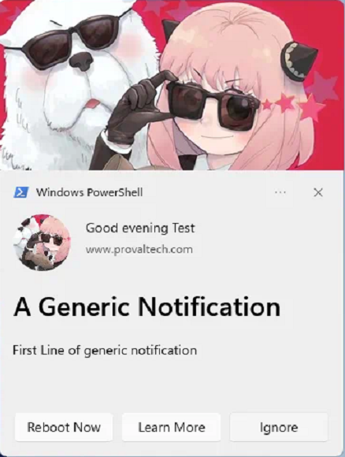
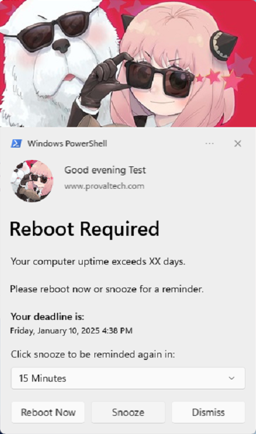
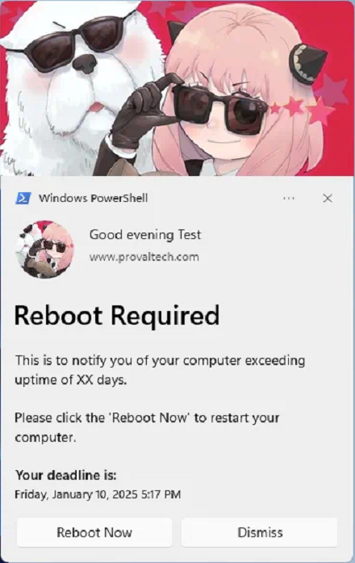
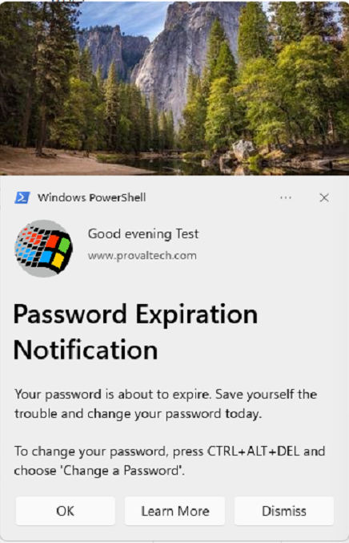
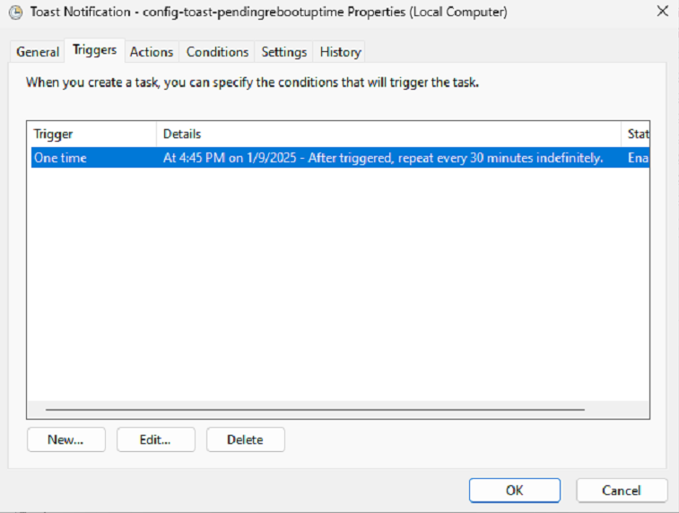
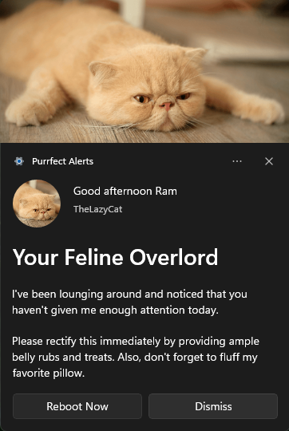

## Overview

A PowerShell script to create and manage toast notifications with customizable options, including images, buttons, and scenarios for different use cases. This script is a wrapper for executing the `New-ToastNotification.ps1` script, which is sourced from [imabdk's Toast-Notification-Script](https://github.com/imabdk/Toast-Notification-Script).

A special thanks to [imabdk](https://github.com/imabdk).

## Requirements

- PowerShell version 5.0 or later.
- Windows 10 or later.
- Access to [ToastNotificationScript2.3.0.zip](https://raw.githubusercontent.com/imabdk/Toast-Notification-Script/refs/heads/master/ToastNotificationScript2.3.0.zip).

## Process

This script downloads and executes the `New-ToastNotification.ps1` script from the [ToastNotificationScript2.3.0.zip](https://raw.githubusercontent.com/imabdk/Toast-Notification-Script/refs/heads/master/ToastNotificationScript2.3.0.zip), providing a customizable interface to display toast notifications. It supports scenarios such as system reboots, password expiration warnings, and general user notifications. Users can add custom titles, images, buttons, and deadlines to their notifications. A scheduled task is created for repetitive notifications.

**Key Features:**

1. **Toast Notification Customization**:
    - Customize title, body text, attribution text, images (logo and hero), and buttons (e.g., "Reboot Now," "Learn More").
    - Supports scenarios like pending reboots, password expiration, and generic notifications.

2. **Scheduling and Repetition**:
    - Create scheduled tasks to display notifications at specified intervals (e.g., once, hourly, daily, weekly).
    - Supports custom repetition intervals (e.g., every 30 minutes, every 2 hours).

3. **Automatic Task Removal**:
    - Automatically removes scheduled tasks after a specified number of notifications have been sent.
    - Includes a secondary script to manage task removal.

4. **Configuration Management**:
    - Generates an XML configuration file for each notification, storing all relevant settings.
    - Supports custom application names for notifications.

5. **Error Handling and Logging**:
    - Logs all actions, including task creation, notification occurrences, and task removal.
    - Handles errors gracefully and provides detailed error messages.

## Payload Usage

This script allows users to configure toast notifications using parameters. Below are usage examples:

### Example 1

Creates a generic notification with a reboot button, a "Learn More" button linking to a specified URL, and custom dismiss button text. Includes a deadline and a repeat setting of "Once."

```powershell
.\Invoke-ToastNotification.ps1 -Generic -RebootButton -LearnMoreButton -LearnMoreUrl 'https://www.provaltech.com' -DismissButtonText 'Ignore' -TitleText 'A Generic Notification' -AttributionText 'www.provaltech.com' -BodyText1 "First Line of generic notification" -BodyText2 "Second Line of generic notification" -Deadline $((Get-Date).AddDays(30)) -Repeat 'Once'
```

**Screenshot:**



### Example 2

Creates a generic notification with a reboot button, a "Learn More" button, custom images for the logo and hero image sections.

```powershell
.\Invoke-ToastNotification.ps1 -Generic -RebootButton -LearnMoreButton -LearnMoreUrl 'https://www.provaltech.com' -DismissButtonText 'Ignore' -TitleText 'A Generic Notification' -AttributionText 'www.provaltech.com' -BodyText1 "First Line of generic notification" -LogoImage 'https://labtech.provaltech.com/labtech/transfer/images/alogo.jpg' -HeroImage 'https://labtech.provaltech.com/labtech/transfer/images/alogo.jpg'
```

**Screenshot:**



### Example 3

Displays a notification for systems exceeding a maximum uptime of 14 days, with a "Reboot Now" button, a snooze option, and custom images.

```powershell

.\Invoke-ToastNotification.ps1 -PendingRebootUptime -RebootButton -MaxUptimeDays 14 -TitleText 'Reboot Required' -AttributionText 'www.provaltech.com' -BodyText1 "Your computer uptime exceeds XX days." -BodyText2 "Please reboot now or snooze for a reminder." -Deadline $((Get-Date).AddDays(1)) -LogoImage "https://labtech.provaltech.com/labtech/transfer/images/alogo.jpg" -HeroImage 'https://labtech.provaltech.com/labtech/transfer/images/alogo.jpg' -SnoozeButton
```

**Screenshot:**



### Example 4

Displays a notification reminding users to reboot their system after exceeding 14 days of uptime. Notification repeats every 30 minutes.

```powershell
.\Invoke-ToastNotification.ps1 -PendingRebootUptime -MaxUptimeDays 14 -TitleText 'Reboot Required' -AttributionText 'www.provaltech.com' -BodyText1 "This is to notify you of your computer exceeding uptime of XX days." -BodyText2 "Please click the 'Reboot Now' to restart your computer." -Deadline $((Get-Date).AddDays(1)) -HeroImage "https://labtech.provaltech.com/labtech/transfer/images/alogo.jpg" -LogoImage "https://labtech.provaltech.com/labtech/transfer/images/alogo.jpg" -RebootButton -Repeat '30Minutes'
```

**Screenshot:**

  


### Example 5

Sends a notification about an upcoming password expiration 60 days in advance. Notification includes a "Learn More" button and repeats every 7 days.

```powershell
.\Invoke-ToastNotification.ps1 -ADPasswordExpiration -LearnMoreButton -LearnMoreUrl 'https://www.provaltech.com' -TitleText 'Password Expiration Notification' -AttributionText 'www.provaltech.com' -BodyText1 "Your password is about to expire. Save yourself the trouble and change your password today." -BodyText2 "To change your password, press CTRL+ALT+DEL and choose 'Change a Password'." -ADPasswordExpirationDays 60 -Repeat '7Days'
```

**Screenshot:**

  


### Example 6

Creates a generic notification with a custom application name and other parameters for a cat-themed notification.

```powershell
.\Invoke-ToastNotification.ps1 -Generic -RebootButton -TitleText 'Your Feline Overlord' -AttributionText 'TheLazyCat' -BodyText1 'I''ve been lounging around and noticed that you haven''t given me enough attention today.' -BodyText2 'Please rectify this immediately by providing ample belly rubs and treats. Also, don''t forget to fluff my favorite pillow.' -NotificationAppName 'Purrfect Alerts' -LogoImage 'lazyCat.jpg' -HeroImage 'lazyCat.jpg'
```

**Screenshot:**



### Example 7

Creates a generic notification that repeats hourly and automatically stops after being displayed 5 times.

```powershell
.\Invoke-ToastNotification.ps1 -Generic -RebootButton -TitleText 'Your Feline Overlord' -AttributionText 'TheLazyCat' -BodyText1 'I''ve been lounging around and noticed that you haven''t given me enough attention today.' -BodyText2 'Please rectify this immediately by providing ample belly rubs and treats. Also, don''t forget to fluff my favorite pillow.' -NotificationAppName 'Purrfect Alerts' -LogoImage 'lazyCat.jpg' -HeroImage 'lazyCat.jpg' -Repeat '15Minutes' -MaxOccurrences 5
```

## Parameters

| Parameter                | ParameterSetName      | Required | Default     | Type     | Description                                                                 |
|--------------------------|-----------------------|----------|-------------|----------|-----------------------------------------------------------------------------|
| Generic                  | Generic               | True     |             | Switch   | Enables a static, generic toast notification.                               |
| PendingRebootUptime      | PendingRebootUptime   | True     |             | Switch   | Displays a toast notification reminding users to restart their system after exceeding the specified maximum uptime. |
| PendingRebootCheck       | PendingRebootCheck    | True     |             | Switch   | Displays a toast notification when a pending reboot is detected through the system registry or WMI. |
| ADPasswordExpiration     | ADPasswordExpiration  | True     |             | Switch   | Sends a toast notification to users when their Active Directory password is nearing expiration. |
| RebootButton             | Generic, PendingRebootUptime, PendingRebootCheck | False    |             | Switch   | Adds a "Reboot Now" button.                                                 |
| LearnMoreButton          | All                   | False    |             | Switch   | Adds a "Learn More" button. Requires `LearnMoreUrl`.                        |
| LearnMoreUrl             | All                   | False    |             | String   | URL for the "Learn More" button.                                            |
| SnoozeButton             | All                   | False    |             | Switch   | Adds a "Snooze" button, allowing users to postpone the notification. Both `LearnMoreButton` and `SnoozeButton` cannot be used together. |
| DismissButtonText        | All                   | False    | Dismiss     | Switch   | Customizes the text of the dismiss button. Default is "Dismiss."            |
| TitleText                | All                   | True     |             | String   | Sets the title of the notification.                                         |
| AttributionText          | All                   | True     |             | String   | Displays attribution text, such as a company name or website, for authenticity. |
| BodyText1                | All                   | True     |             | String   | The main text content of the notification body.                             |
| BodyText2                | All                   | False    |             | String   | Secondary text content displayed below `BodyText1`.                         |
| LogoImage                | All                   | False    |             | String   | Specifies the URL or path for the logo image in the notification.           |
| HeroImage                | All                   | False    |             | String   | Specifies the URL or path for the hero image displayed at the top of the notification. |
| Deadline                 | All                   | False    | Current +14d | DateTime | Sets the deadline for the notification. Format: yyyy-MM-dd HH:mm:ss.        |
| NotificationAppName      | All                   | False    | Windows PowerShell | String | Specifies the name of the application that will display the notification. |
| MaxUptimeDays            | PendingRebootUptime   | False    | 30          | Int      | Defines the maximum uptime (in days) for the PendingRebootUptime parameter. Default is 30 days. |
| ADPasswordExpirationDays | ADPasswordExpiration  | False    | 7           | Int      | Number of days before password expiration when reminders should start. Default is 7 days. |
| Repeat                   | All                   | False    | Once        | String   | Specifies how frequently the notification should repeat. Options: Once, Hourly, XXMinutes, XXHours, Daily, XXDays. |
| MaxOccurrences           | All                   | False    |             | Int32    | Specifies the maximum number of notifications to send before the scheduled task is automatically removed. This works in conjunction with the `Repeat` parameter, except when `Repeat` is set to `Once`. |

## Output

- .\Invoke-ToastNotification-log.txt
- .\Invoke-ToastNotification-error.txt
- $env:ProgramData\_automation\Script\New-ToastNotification\Stop-ToastNotification-log.txt
- $env:ProgramData\_automation\Script\New-ToastNotification\Stop-ToastNotification-error.txt