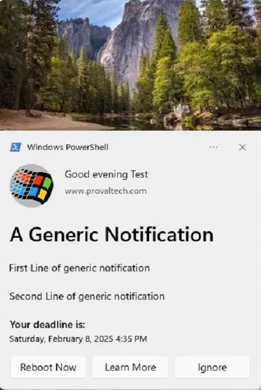
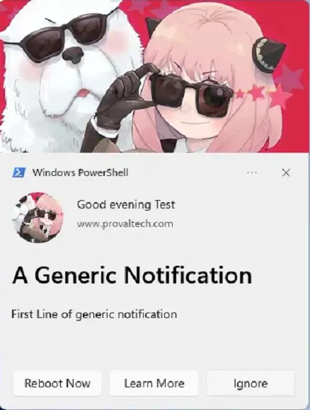
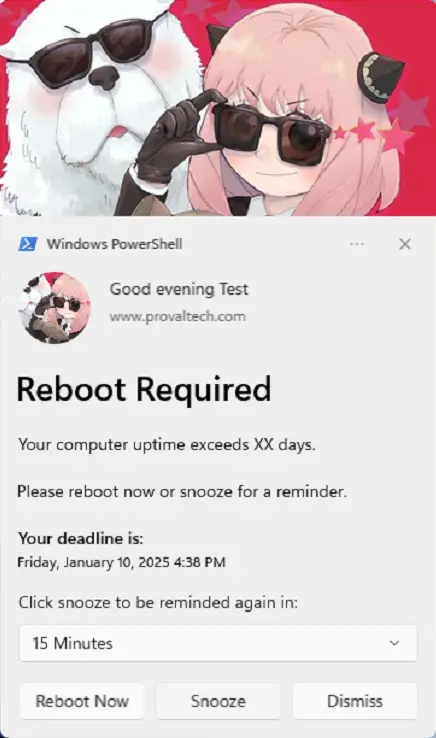
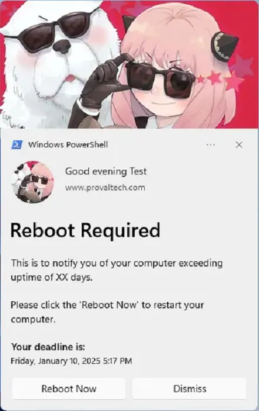
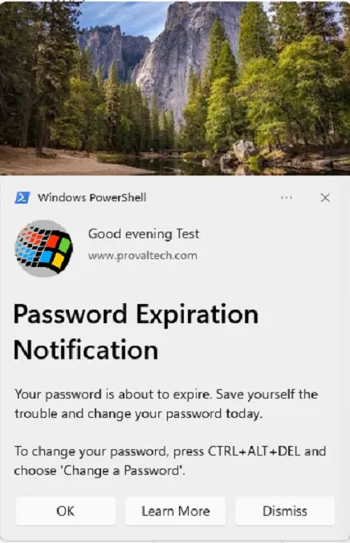
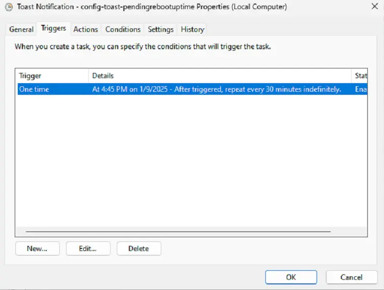
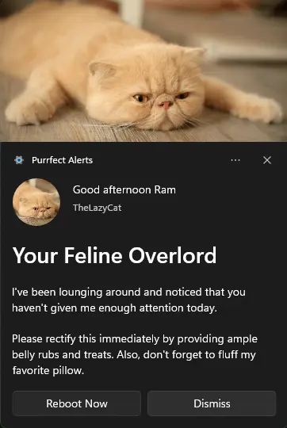
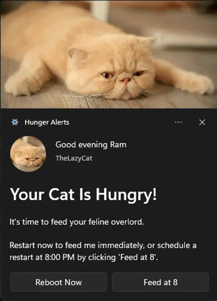
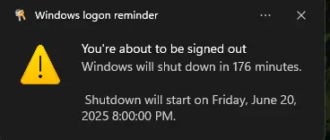

## Overview

A PowerShell script to create and manage Windows toast notifications with customizable options, including images, buttons, and scenarios for different use cases. This script acts as a wrapper and deployment engine for the `New-ToastNotification.ps1` notification engine, which is downloaded directly from **ProVal's File Server**.

**Key Features:**

- **Zero Window Flashing:** Utilizes a custom, compiled Go executable (`SilentLauncher.exe`) to guarantee that no console windows flash on the user's screen during task execution or button clicks.
- Script monitors for button clicks for 600 seconds (10 minutes) after displaying the notification.
- Automatically re-displays the notification exactly once if the "Learn More" button is clicked within the timeout period.
- Deploys **signed, static helper scripts** to ensure integrity and security. Because these helpers are parameterized and encoded, their on-disk content remains byte-identical across deployments, allowing them to be Authenticode signed.
- Downloads logo and hero images from URLs to local disk before passing them to the engine, ensuring the notification renders reliably regardless of network state at display time.
- Provisions the Strapper logging module via **`Install-PSGalleryModule`**, bypassing the PackageManagement engine and avoiding dynamic .NET DLL compilation or NuGet provider bootstrapping.
- Recommended minimum interval between two consecutive prompts is 30 minutes.

**Acknowledgement:** Original engine concept sourced from [imabdk's Toast-Notification-Script](https://github.com/imabdk/Toast-Notification-Script).

## Requirements

- PowerShell version 5.0 or later.
- Windows 10 or later.
- Network access to **ProVal's File Server** to download the notification engine package ([New-ToastNotification.zip](https://contentrepo.net/repo/share/ToastNotificationScript.zip)), the silent launcher ([SilentLauncher.exe](https://contentrepo.net/repo/app/SilentLauncher.exe)), and the module installer ([Install-PSGalleryModule.ps1](https://contentrepo.net/repo/script/Install-PSGalleryModule.ps1)).
- Network access to **www.powershellgallery.com** (queried by `Install-PSGalleryModule` to resolve and download the Strapper module).
- Administrative privileges (the script requires `-RunAsAdministrator` to create scheduled tasks and write to `$env:ProgramData`).

## Payload Usage

This script allows users to configure toast notifications using parameters. Below are usage examples:

### Example 1

Creates a generic notification with a reboot button, a "Learn More" button linking to a specified URL, and custom dismiss button text. Includes a deadline and a repeat setting of "Once."

```powershell
.\Invoke-ToastNotification.ps1 -Generic -RebootButton -LearnMoreButton -LearnMoreUrl 'https://www.provaltech.com' -DismissButtonText 'Ignore' -TitleText 'A Generic Notification' -AttributionText 'www.provaltech.com' -BodyText1 'First Line of generic notification' -BodyText2 'Second Line of generic notification' -Deadline $((Get-Date).AddDays(30)) -Repeat 'Once'
```

**Screenshot:**



### Example 2

Creates a generic notification with a reboot button, a "Learn More" button, custom images for the logo and hero image sections. Images are supplied as URLs and downloaded locally before the notification is rendered.

```powershell
.\Invoke-ToastNotification.ps1 -Generic -RebootButton -LearnMoreButton -LearnMoreUrl 'https://www.provaltech.com' -DismissButtonText 'Ignore' -TitleText 'A Generic Notification' -AttributionText 'www.provaltech.com' -BodyText1 'First Line of generic notification' -LogoImage 'https://labtech.provaltech.com/labtech/transfer/images/alogo.jpg' -HeroImage 'https://labtech.provaltech.com/labtech/transfer/images/alogo.jpg'
```

**Screenshot:**



### Example 3

Displays a notification for systems exceeding a maximum uptime of 14 days, with a "Reboot Now" button, a snooze option, and custom images.

```powershell
.\Invoke-ToastNotification.ps1 -PendingRebootUptime -RebootButton -MaxUptimeDays 14 -TitleText 'Reboot Required' -AttributionText 'www.provaltech.com' -BodyText1 'Your computer uptime exceeds XX days.' -BodyText2 'Please reboot now or snooze for a reminder.' -Deadline $((Get-Date).AddDays(1)) -LogoImage 'https://labtech.provaltech.com/labtech/transfer/images/alogo.jpg' -HeroImage 'https://labtech.provaltech.com/labtech/transfer/images/alogo.jpg' -SnoozeButton
```

**Screenshot:**



### Example 4

Displays a notification reminding users to reboot their system after exceeding 14 days of uptime. Notification repeats every 30 minutes.

```powershell
.\Invoke-ToastNotification.ps1 -PendingRebootUptime -MaxUptimeDays 14 -TitleText 'Reboot Required' -AttributionText 'www.provaltech.com' -BodyText1 'This is to notify you of your computer exceeding uptime of XX days.' -BodyText2 'Please click the ''Reboot Now'' to restart your computer.' -Deadline $((Get-Date).AddDays(1)) -HeroImage 'https://labtech.provaltech.com/labtech/transfer/images/alogo.jpg' -LogoImage 'https://labtech.provaltech.com/labtech/transfer/images/alogo.jpg' -RebootButton -Repeat '30Minutes'
```

**Screenshot:**

  


### Example 5

Sends a notification about an upcoming password expiration 60 days in advance. Notification includes a "Learn More" button and repeats every 7 days.

```powershell
.\Invoke-ToastNotification.ps1 -ADPasswordExpiration -LearnMoreButton -LearnMoreUrl 'https://www.provaltech.com' -TitleText 'Password Expiration Notification' -AttributionText 'www.provaltech.com' -BodyText1 'Your password is about to expire. Save yourself the trouble and change your password today.' -BodyText2 'To change your password, press CTRL+ALT+DEL and choose ''Change a Password''.' -ADPasswordExpirationDays 60 -Repeat '7Days'
```

**Screenshot:**

  


### Example 6

Creates a generic notification with a custom application name and other parameters for a cat-themed notification.

```powershell
.\Invoke-ToastNotification.ps1 -Generic -RebootButton -TitleText 'Your Feline Overlord' -AttributionText 'TheLazyCat' -BodyText1 'I''ve been lounging around and noticed that you haven''t given me enough attention today.' -BodyText2 'Please rectify this immediately by providing ample belly rubs and treats. Also, don''t forget to fluff my favorite pillow.' -NotificationAppName 'Purrfect Alerts' -LogoImage 'lazyCat.jpg' -HeroImage 'lazyCat.jpg'
```

**Screenshot:**



### Example 7

Creates a generic notification that repeats hourly and automatically stops after being displayed 5 times.

```powershell
.\Invoke-ToastNotification.ps1 -Generic -RebootButton -TitleText 'Your Feline Overlord' -AttributionText 'TheLazyCat' -BodyText1 'I''ve been lounging around and noticed that you haven''t given me enough attention today.' -BodyText2 'Please rectify this immediately by providing ample belly rubs and treats. Also, don''t forget to fluff my favorite pillow.' -NotificationAppName 'Purrfect Alerts' -LogoImage 'lazyCat.jpg' -HeroImage 'lazyCat.jpg' -Repeat '15Minutes' -MaxOccurrences 5
```

### Example 8

Creates a cat-themed notification with two options:  

- "Restart Now" (reboot button) to feed the cat immediately by restarting the computer.  
- "Feed at 8" (custom button) to run a script that schedules a forced restart at 8:00 PM.  
The dismiss button is hidden, so the user must choose one of the two actions.

```PowerShell
$scriptContent = @"
`$now = Get-Date
`$eightPMToday = Get-Date -Hour 20 -Minute 0 -Second 0

if (`$now -lt `$eightPMToday) {
    `$targetTime = `$eightPMToday
} else {
    `$targetTime = `$eightPMToday.AddDays(1)
}

`$secondsUntil8PM = [int](`$targetTime - `$now).TotalSeconds
Shutdown -f -r -t `$secondsUntil8PM
"@
$scriptPath = 'C:\Temp\TimeToFeedCat.ps1'

(mkdir 'C:\Temp') 2>&1 1>$Null

$Utf8NoBomEncoding = New-Object System.Text.UTF8Encoding $False
[System.IO.File]::WriteAllLines($scriptPath, $scriptContent, $Utf8NoBomEncoding)

.\Invoke-ToastNotification.ps1 -Generic -TitleText 'Your Cat Is Hungry!' -AttributionText 'TheLazyCat' -BodyText1 'It''s time to feed your feline overlord.' -BodyText2 'Restart now to feed me immediately, or schedule a restart at 8:00 PM by clicking ''Feed at 8''.' -NotificationAppName 'Hunger Alerts' -LogoImage 'lazyCat.jpg' -HeroImage 'lazyCat.jpg' -RebootButton -RunScriptButton -RunScriptButtonText 'Feed at 8' -ScriptPath 'C:\Temp\TimeToFeedCat.ps1' -ScriptContext 'System' -ScriptStyle 'Hidden' -HideDismissButton
```

**Screenshot:**

  

Windows notification when you click `Feed at 8`:  


## Generated Files and Scenario Breakdown

When the script runs, it orchestrates several files and scheduled tasks within the working directory (`C:\ProgramData\_Automation\Script\New-ToastNotification\`). Below is an end-to-end breakdown of what is created and why:

1. **Engine Package**  
   - `New-ToastNotification.zip`: The downloaded package from ProVal's File Server.  
   - `New-ToastNotification\New-ToastNotification.ps1`: The core engine that renders the toast.  
   - `New-ToastNotification\Images\`: Default logo and hero images.
2. **Silent Launcher**  
   - `SilentLauncher.exe`: A compiled Go executable that runs scripts with the Windows API `CREATE_NO_WINDOW` flag. All scheduled tasks and protocol handlers launch their targets through it to guarantee zero window flashing, completely replacing the legacy `Hidden.vbs` wrapper.
3. **Downloaded Images** *(only when `LogoImage` or `HeroImage` is a URL)*  
   - `ToastLogoImage.jpg`: The logo image downloaded from the supplied URL.  
   - `ToastHeroImage.jpg`: The hero image downloaded from the supplied URL.  
   - If a download fails, the engine falls back to the default image packaged in `New-ToastNotification\Images\`.
4. **Toast Configuration**  
   - `config-toast-<scenario>.xml`: The generated XML configuration consumed by the notification engine. All image references in this file are local paths.
5. **Notification Task**  
   - *Scheduled Task*: `Toast Notification - config-toast-<scenario>` (runs as the logged-on user).  
   - Action: Executes `SilentLauncher.exe`, passing `New-ToastNotification.ps1` and the XML config as arguments. *(Note: The previous `.cmd` wrapper file is no longer generated or used).*
6. **Run Script Plumbing** *(Only if `RunScriptButton` is used)*  
   - `<config>-Run-Now.ps1`: A signed, static signal writer. When "Run Now" is clicked, it stamps the signal file below.  
   - `<config>-Run-Now.txt`: The signal file, written at the exact moment the button is clicked.  
   - `Toast_Notification_<config>_Run_Now.ps1`: A signed, static waiter script. It watches the signal file and, once stamped, launches the target `ScriptPath` via `SilentLauncher.exe` (if Hidden) or directly (if Interactive), then exits immediately.  
   - *Scheduled Task*: `Toast Notification - <config> - Run-Now`.  
   - Action: Executes `SilentLauncher.exe`, passing the waiter `.ps1` script and parameters. *(Note: The previous `.cmd` launcher is no longer generated or used).*
7. **Automatic Removal** *(Only if `MaxOccurrences` is set or `Repeat` is 'Once')*  
   - `Stop-ToastNotification.ps1`: A signed, static helper that removes the tasks once the notification has been shown the maximum number of times.  
   - *Scheduled Task*: `Remove - Toast Notification - <config>` (runs as `NT AUTHORITY\SYSTEM`).  
   - Action: Executes `SilentLauncher.exe`, passing `Stop-ToastNotification.ps1` and parameters. *(Note: The previous `.cmd` launcher is no longer generated or used).*
8. **Engine-Generated Files** *(Created dynamically when the notification task fires)*  
   - `ToastNotification.log`: Engine execution log.  
   - `ToastReboot.cmd`: Reboot protocol handler (launched via `SilentLauncher.exe` to prevent console flash).  
   - `ToastRunPSScript.cmd`: Run Script protocol handler (launched via `SilentLauncher.exe`).  
   - `ToastLearnMore.cmd`: Learn More protocol handler (launched via `SilentLauncher.exe`).  
   - `learn-more.txt`: A stamp file. The engine polls this for up to 600 seconds. If updated, it re-displays the toast exactly once, then stops watching.
9. **Strapper Module Logs**  
   - `Stop-ToastNotification-log.txt` / `Stop-ToastNotification-error.txt`: Written when the cleanup script runs.  
   - `Invoke-ToastNotification-log.txt` / `Invoke-ToastNotification-error.txt`: Written by the Strapper module in the directory from which the main script was launched.

> **Note on Signed Static Helpers:**  
> The helper PowerShell scripts deployed by this tool (the Run Script signal writer, `Stop-ToastNotification.ps1`, and the Run Script waiter) are written from a fixed, parameterized source. Their on-disk content never changes between runs, allowing them to be securely Authenticode signed. All varying data (like file paths) is passed to these helpers as parameters at call time, ensuring the signed content remains byte-identical. Every deployed `.ps1` file is written as UTF-8 without a byte order mark (BOM).

## Parameters

| Parameter                | ParameterSetName      | Required | Default         | Type     | Description                                                                 |
|--------------------------|----------------------|----------|-----------------|----------|-----------------------------------------------------------------------------|
| `Generic`                | Generic              | True     |                 | Switch   | Enables a static, generic toast notification.                               |
| `PendingRebootUptime`    | PendingRebootUptime  | True     |                 | Switch   | Displays a toast notification reminding users to restart after exceeding max uptime. |
| `PendingRebootCheck`     | PendingRebootCheck   | True     |                 | Switch   | Displays a toast notification when a pending reboot is detected via Registry/WMI. |
| `ADPasswordExpiration`   | ADPasswordExpiration | True     |                 | Switch   | Sends a toast notification when the user's Active Directory password is nearing expiration. |
| `RebootButton`           | Generic, PendingRebootUptime, PendingRebootCheck | False | None | Switch | Adds a "Reboot Now" button.                                                 |
| `RunScriptButton`        | All                  | False    |                 | Switch   | Adds a custom button to run a specified PowerShell script when clicked.     |
| `RunScriptButtonText`    | All                  | False    | RunScript       | String   | Sets the label for the custom script execution button.                      |
| `ScriptPath`             | All                  | False    |                 | String   | Full path to a PowerShell script (.ps1) to execute when the custom button is clicked. Must end in `.ps1`. |
| `ScriptContext`          | All                  | False    | User            | String   | Context in which the custom script runs: `User` or `System`.                |
| `ScriptStyle`            | All                  | False    | Hidden          | String   | Script execution style: `Interactive` or `Hidden`.                          |
| `LearnMoreButton`        | All                  | False    |                 | Switch   | Adds a "Learn More" button. Requires `LearnMoreUrl`.                        |
| `LearnMoreUrl`           | All                  | False    |                 | String   | URL to open when the "Learn More" button is clicked.                        |
| `SnoozeButton`           | All                  | False    |                 | Switch   | Adds a "Snooze" button. Cannot be used together with `LearnMoreButton`.     |
| `DismissButtonText`      | All                  | False    | Dismiss         | String   | Customizes the text of the dismiss button.                                  |
| `HideDismissButton`      | All                  | False    |                 | Switch   | Hides the dismiss/close button on the toast notification.                   |
| `TitleText`              | All                  | True     |                 | String   | Sets the title of the notification.                                         |
| `AttributionText`        | All                  | True     |                 | String   | Displays attribution text, such as a company name or website.               |
| `BodyText1`              | All                  | True     |                 | String   | The main text content of the notification body.                             |
| `BodyText2`              | All                  | False    |                 | String   | Secondary text content displayed below `BodyText1`.                         |
| `LogoImage`              | All                  | False    |                 | String   | URL or local path for the logo image. URLs are downloaded to the working directory before use. |
| `HeroImage`              | All                  | False    |                 | String   | URL or local path for the hero image. URLs are downloaded to the working directory before use. |
| `Deadline`               | All                  | False    | Current +14d    | DateTime | Deadline for the notification. Format: `yyyy-MM-dd HH:mm:ss`.               |
| `NotificationAppName`    | All                  | False    | Windows PowerShell | String | Name of the application that displays the notification.                     |
| `MaxUptimeDays`          | PendingRebootUptime  | False    | 30              | Int      | Maximum uptime (in days) for the `PendingRebootUptime` scenario.            |
| `ADPasswordExpirationDays`| ADPasswordExpiration| False    | 7               | Int      | Days before password expiration when reminders should start.                |
| `Repeat`                 | All                  | False    | Once            | String   | Frequency of repetition. Options: `Once`, `Hourly`, `<n>Minutes`, `<n>Hours`, `Daily`, `<n>Days`, `Weekly`, `Monthly`, `AtLogon`. |
| `MaxOccurrences`         | All                  | False    |                 | Int32    | Max notifications to send before the scheduled task is automatically removed. Works with `Repeat` (except when `Repeat` is `Once`). |

## Output

The script generates log files for troubleshooting and auditing purposes:

- `.\Invoke-ToastNotification-log.txt`
- `.\Invoke-ToastNotification-error.txt`
- `$env:ProgramData\_Automation\Script\New-ToastNotification\Stop-ToastNotification-log.txt`
- `$env:ProgramData\_Automation\Script\New-ToastNotification\Stop-ToastNotification-error.txt`
- `$env:ProgramData\_Automation\Script\New-ToastNotification\ToastNotification.log`

## Changelog

### 2026-07-30

- Updated image handling: when `LogoImage` or `HeroImage` is a URL, the image is now downloaded to the working directory (`ToastLogoImage.jpg` / `ToastHeroImage.jpg`) and the local path is written to the XML configuration. The notification engine always receives a local file path, never a URL. A failed download logs an error and falls back to the packaged default image without terminating the script.
- Replaced the `Install-Module` / `Update-Module` / `Find-Module` Strapper provisioning logic with the [Install-PSGalleryModule](/docs/858fa597-2e08-4da4-ad6d-27ca62858547) script, retrieved at runtime from the content repository. This bypasses the PackageManagement engine entirely, eliminating dynamic .NET DLL compilation, NuGet provider bootstrapping, and the associated failure modes in constrained environments.
- Added `www.powershellgallery.com` as an explicit network requirement (queried by [Install-PSGalleryModule](/docs/858fa597-2e08-4da4-ad6d-27ca62858547) to resolve and download the Strapper module).

### 2026-07-22

- Replaced legacy `Hidden.vbs` and `.cmd` scheduled task wrappers with a custom, compiled Go executable (`SilentLauncher.exe`).
- Guaranteed zero console window flashing for all scheduled tasks and protocol handler executions using the Windows API `CREATE_NO_WINDOW` flag.
- Updated the Run Script waiter logic to launch target scripts silently (when configured as Hidden) and exit immediately, preventing lingering PowerShell windows.
- Removed the generation of intermediate `.cmd` launcher files for primary, secondary, and run-script scheduled tasks.

### 2026-07-16

- Removed obsolete and unused code.
- Eliminated the dependency on `css.exe`.
- Applied code signing to the `New-ToastNotification.ps1` script.
- Updated the script to generate code-signed `.ps1` files.
- Modified the download process to retrieve the `.zip` package from our file server instead of GitHub.

### 2025-04-10

- Initial version of the document.
