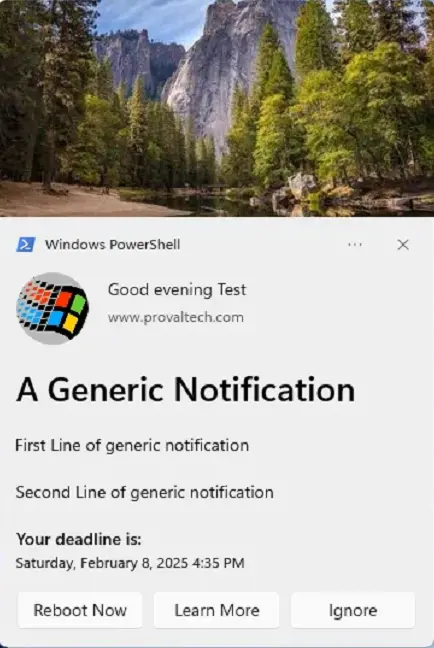

## Overview

A PowerShell script to create and manage toast notifications with customizable options, including images, buttons, and scenarios for different use cases. This script is a wrapper for executing the `New-ToastNotification.ps1` script, which is sourced from [imabdk's Toast-Notification-Script](https://github.com/imabdk/Toast-Notification-Script).

**Acknowledgement:** [imabdk](https://github.com/imabdk)

## Requirements

- PowerShell version 5.0 or later.
- Windows 10 or later.
- Access to [ToastNotificationScript3.0.zip](https://github.com/ProVal-Tech/Toast-Notification-Script/raw/master/ToastNotificationScript3.0.zip).

## Process

1. **Parameter Handling**
    - Accepts and validates user-supplied parameters to determine the notification scenario, appearance, actions, and scheduling.

2. **Environment Preparation**
    - Bootstraps the environment using the Strapper module for consistent error handling and logging.
    - Ensures secure TLS settings and trusted PowerShell Gallery repository configuration.

3. **Working Directory Setup**
    - Creates a dedicated working directory under `$env:ProgramData` for storing resources and extracted files.
    - Sets appropriate permissions to allow all users full control of the directory.

4. **Component Download and Extraction**
    - Downloads the latest notification script package (ZIP) from GitHub.
    - Extracts the package contents to the working directory for use by the notification engine.

5. **XML Configuration Preparation**
    - Translates PowerShell parameters into XML-compatible values.
    - Selects and customizes the appropriate XML template based on the chosen notification scenario and user options.
    - Handles localization, image paths, deadlines, and button/action logic.

6. **Notification Scheduling**
    - Creates a scheduled task to display the toast notification according to the specified recurrence (`Repeat` parameter).
    - If `MaxOccurrences` is set, creates an additional scheduled task to automatically remove the notification task after the specified number of runs.

7. **Custom Script Execution (Optional)**
    - If the `RunScriptButton` is enabled, creates a scheduled task that waits for user interaction and then executes the specified PowerShell script (`ScriptPath`).

8. **Notification Delivery**
    - When triggered by the scheduled task, the notification is displayed to the user with all configured options and actions.

9. **Cleanup and Logging**
    - Logs all actions and errors for troubleshooting.
    - Cleans up scheduled tasks and temporary files as needed, especially when `MaxOccurrences` or custom script execution

## Payload Usage

This script allows users to configure toast notifications using parameters. Below are usage examples:

### Example 1

Creates a generic notification with a reboot button, a "Learn More" button linking to a specified URL, and custom dismiss button text. Includes a deadline and a repeat setting of "Once."

```powershell
.\Invoke-ToastNotification.ps1 -Generic -RebootButton -LearnMoreButton -LearnMoreUrl 'https://www.provaltech.com' -DismissButtonText 'Ignore' -TitleText 'A Generic Notification' -AttributionText 'www.provaltech.com' -BodyText1 "First Line of generic notification" -BodyText2 "Second Line of generic notification" -Deadline $((Get-Date).AddDays(30)) -Repeat 'Once'
```

**Screenshot:**



### Example 2

Creates a generic notification with a reboot button, a "Learn More" button, custom images for the logo and hero image sections.

```powershell
.\Invoke-ToastNotification.ps1 -Generic -RebootButton -LearnMoreButton -LearnMoreUrl 'https://www.provaltech.com' -DismissButtonText 'Ignore' -TitleText 'A Generic Notification' -AttributionText 'www.provaltech.com' -BodyText1 "First Line of generic notification" -LogoImage 'https://labtech.provaltech.com/labtech/transfer/images/alogo.jpg' -HeroImage 'https://labtech.provaltech.com/labtech/transfer/images/alogo.jpg'
```

**Screenshot:**


### Example 3

Displays a notification for systems exceeding a maximum uptime of 14 days, with a "Reboot Now" button, a snooze option, and custom images.

```powershell

.\Invoke-ToastNotification.ps1 -PendingRebootUptime -RebootButton -MaxUptimeDays 14 -TitleText 'Reboot Required' -AttributionText 'www.provaltech.com' -BodyText1 "Your computer uptime exceeds XX days." -BodyText2 "Please reboot now or snooze for a reminder." -Deadline $((Get-Date).AddDays(1)) -LogoImage "https://labtech.provaltech.com/labtech/transfer/images/alogo.jpg" -HeroImage 'https://labtech.provaltech.com/labtech/transfer/images/alogo.jpg' -SnoozeButton
```

**Screenshot:**


### Example 4

Displays a notification reminding users to reboot their system after exceeding 14 days of uptime. Notification repeats every 30 minutes.

```powershell
.\Invoke-ToastNotification.ps1 -PendingRebootUptime -MaxUptimeDays 14 -TitleText 'Reboot Required' -AttributionText 'www.provaltech.com' -BodyText1 "This is to notify you of your computer exceeding uptime of XX days." -BodyText2 "Please click the 'Reboot Now' to restart your computer." -Deadline $((Get-Date).AddDays(1)) -HeroImage "https://labtech.provaltech.com/labtech/transfer/images/alogo.jpg" -LogoImage "https://labtech.provaltech.com/labtech/transfer/images/alogo.jpg" -RebootButton -Repeat '30Minutes'
```

**Screenshot:**

  


### Example 5

Sends a notification about an upcoming password expiration 60 days in advance. Notification includes a "Learn More" button and repeats every 7 days.

```powershell
.\Invoke-ToastNotification.ps1 -ADPasswordExpiration -LearnMoreButton -LearnMoreUrl 'https://www.provaltech.com' -TitleText 'Password Expiration Notification' -AttributionText 'www.provaltech.com' -BodyText1 "Your password is about to expire. Save yourself the trouble and change your password today." -BodyText2 "To change your password, press CTRL+ALT+DEL and choose 'Change a Password'." -ADPasswordExpirationDays 60 -Repeat '7Days'
```

**Screenshot:**

  


### Example 6

Creates a generic notification with a custom application name and other parameters for a cat-themed notification.

```powershell
.\Invoke-ToastNotification.ps1 -Generic -RebootButton -TitleText 'Your Feline Overlord' -AttributionText 'TheLazyCat' -BodyText1 'I''ve been lounging around and noticed that you haven''t given me enough attention today.' -BodyText2 'Please rectify this immediately by providing ample belly rubs and treats. Also, don''t forget to fluff my favorite pillow.' -NotificationAppName 'Purrfect Alerts' -LogoImage 'lazyCat.jpg' -HeroImage 'lazyCat.jpg'
```

**Screenshot:**


### Example 7

Creates a generic notification that repeats hourly and automatically stops after being displayed 5 times.

```powershell
.\Invoke-ToastNotification.ps1 -Generic -RebootButton -TitleText 'Your Feline Overlord' -AttributionText 'TheLazyCat' -BodyText1 'I''ve been lounging around and noticed that you haven''t given me enough attention today.' -BodyText2 'Please rectify this immediately by providing ample belly rubs and treats. Also, don''t forget to fluff my favorite pillow.' -NotificationAppName 'Purrfect Alerts' -LogoImage 'lazyCat.jpg' -HeroImage 'lazyCat.jpg' -Repeat '15Minutes' -MaxOccurrences 5
```

### Example 8

Creates a cat-themed notification with two options:  

- "Restart Now" (reboot button) to feed the cat immediately by restarting the computer.  
- "Feed at 8" (custom button) to run a script that schedules a forced restart at 8:00 PM.  
The dismiss button is hidden, so the user must choose one of the two actions.

```PowerShell
$scriptContent = @"
`$now = Get-Date
`$eightPMToday = Get-Date -Hour 20 -Minute 0 -Second 0

if (`$now -lt `$eightPMToday) {
    `$targetTime = `$eightPMToday
} else {
    `$targetTime = `$eightPMToday.AddDays(1)
}

`$secondsUntil8PM = [int](`$targetTime - `$now).TotalSeconds
Shutdown -f -r -t `$secondsUntil8PM
"@
$scriptPath = 'C:\Temp\TimeToFeedCat.ps1'

(mkdir 'C:\Temp') 2>&1 1>$Null

$Utf8NoBomEncoding = New-Object System.Text.UTF8Encoding $False
[System.IO.File]::WriteAllLines($scriptPath, $scriptContent, $Utf8NoBomEncoding)

.\Invoke-ToastNotification.ps1 -Generic -TitleText 'Your Cat Is Hungry!' -AttributionText 'TheLazyCat' -BodyText1 'It''s time to feed your feline overlord.' -BodyText2 'Restart now to feed me immediately, or schedule a restart at 8:00 PM by clicking ''Feed at 8''.' -NotificationAppName 'Hunger Alerts' -LogoImage 'lazyCat.jpg' -HeroImage 'lazyCat.jpg' -RebootButton -RunScriptButton -RunScriptButtonText 'Feed at 8' -ScriptPath 'C:\Temp\TimeToFeedCat.ps1' -ScriptContext 'System' -ScriptStyle 'Hidden' -HideDismissButton
```

**Screenshot:**

  

Windows notification when you click `Feed at 8`:  


## Parameters

| Parameter                | ParameterSetName      | Required | Default         | Type     | Description                                                                 |
|--------------------------|----------------------|----------|-----------------|----------|-----------------------------------------------------------------------------|
| Generic                  | Generic              | True     |                 | Switch   | Enables a static, generic toast notification.                               |
| PendingRebootUptime      | PendingRebootUptime  | True     |                 | Switch   | Displays a toast notification reminding users to restart their system after exceeding the specified maximum uptime. |
| PendingRebootCheck       | PendingRebootCheck   | True     |                 | Switch   | Displays a toast notification when a pending reboot is detected through the system registry or WMI. |
| ADPasswordExpiration     | ADPasswordExpiration | True     |                 | Switch   | Sends a toast notification to users when their Active Directory password is nearing expiration. |
| RebootButton             |  Generic, PendingRebootUptime, PendingRebootCheck | False    |                 | Switch   | Adds a "Reboot Now" button.                                                 |
| RunScriptButton          | All | False    |                 | Switch   | Adds a custom button to run a specified PowerShell script when clicked.     |
| RunScriptButtonText      | All | False    | RunScript        | String   | Sets the label for the custom script execution button.                      |
| ScriptPath               | All | False    |                 | String   | Full path to a PowerShell script (.ps1) to execute when the custom button is clicked. |
| ScriptContext            | All | False    | User             | String   | Context in which the custom script runs: 'User' or 'System'.                |
| ScriptStyle              | All | False    | Hidden           | String   | Script execution style: 'Interactive' or 'Hidden'.                          |
| LearnMoreButton          | All                  | False    |                 | Switch   | Adds a "Learn More" button. Requires `LearnMoreUrl`.                        |
| LearnMoreUrl             | All                  | False    |                 | String   | URL for the "Learn More" button.                                            |
| SnoozeButton             | All                  | False    |                 | Switch   | Adds a "Snooze" button, allowing users to postpone the notification. Both `LearnMoreButton` and `SnoozeButton` cannot be used together. |
| DismissButtonText        | All                  | False    | Dismiss         | String   | Customizes the text of the dismiss button. Default is "Dismiss."            |
| HideDismissButton        | All                  | False    |                 | Switch   | When this switch is present, users will not see a dismiss or close button on the notification. |
| TitleText                | All                  | True     |                 | String   | Sets the title of the notification.                                         |
| AttributionText          | All                  | True     |                 | String   | Displays attribution text, such as a company name or website, for authenticity. |
| BodyText1                | All                  | True     |                 | String   | The main text content of the notification body.                             |
| BodyText2                | All                  | False    |                 | String   | Secondary text content displayed below `BodyText1`.                         |
| LogoImage                | All                  | False    |                 | String   | Specifies the URL or path for the logo image in the notification. For best experience, keep the ratio 1:1 (Horizontal:Vertical) ; Example - 300px:300px (Horizontal:Vertical)            |
| HeroImage                | All                  | False    |                 | String   | Specifies the URL or path for the hero image displayed at the top of the notification. For best experience, keep the ratio 2:1 (Horizontal:Vertical); Example - 600px:300px (Horizontal:Vertical)   |
| Deadline                 | All                  | False    | Current +14d    | DateTime | Sets the deadline for the notification. Format: yyyy-MM-dd HH:mm:ss.        |
| NotificationAppName      | All                  | False    | Windows PowerShell | String | Specifies the name of the application that will display the notification.   |
| MaxUptimeDays            | PendingRebootUptime  | False    | 30              | Int      | Defines the maximum uptime (in days) for the PendingRebootUptime parameter. Default is 30 days. |
| ADPasswordExpirationDays | ADPasswordExpiration | False    | 7               | Int      | Number of days before password expiration when reminders should start. Default is 7 days. |
| Repeat                   | All                  | False    | Once            | String   | Specifies how frequently the notification should repeat. Options: Once, Hourly, XXMinutes, XXHours, Daily, XXDays, Weekly, Monthly, AtLogon. |
| MaxOccurrences           | All                  | False    |                 | Int32    | Specifies the maximum number of notifications to send before the scheduled task is automatically removed. This works in conjunction with the `Repeat` parameter, except when `Repeat` set to `Once`. |

## Output

- .\Invoke-ToastNotification-log.txt
- .\Invoke-ToastNotification-error.txt
- $env:ProgramData\_automation\Script\New-ToastNotification\Stop-ToastNotification-log.txt
- $env:ProgramData\_automation\Script\New-ToastNotification\Stop-ToastNotification-error.txt
