## Overview

Upgrade Windows 10 and older Windows 11 devices to Windows 11 24H2 (build 26100) without surprise restarts. The script asks users to postpone or schedule the upgrade, upgrades the device, and confirms the result after the restart.

Designed for RMM platforms, it needs a single deployment. Self-managing Windows Scheduled Tasks handle every prompt, the upgrade, and the check after the restart. Prompts appear in English or Dutch, based on the user's display language.

Devices that cannot run Windows 11 are never prompted. Hardware compatibility, disk space, and BitLocker are checked before the first prompt. See [Compatibility and Safety Checks](#compatibility-and-safety-checks).

By default, the script installs the Windows 11 24H2 image hosted by ProVal. Need a device upgraded right away? `-WithoutPrompt` skips every prompt. See [Upgrade Without Prompting](#upgrade-without-prompting).

Every prompt title and message can be replaced with your own wording, and prompts can carry your own icon and header image. See [Customize the Prompt Text](#customize-the-prompt-text).

## Requirements

| Requirement | Details |
| --- | --- |
| **Operating System** | Windows 10, or Windows 11 earlier than 24H2. Workstation editions only |
| **Hardware** | Meets the Windows 11 hardware requirements (TPM 2.0, supported processor, Secure Boot capable) |
| **Free Disk Space** | 24 GB on the system drive (configurable) |
| **PowerShell** | Version 5.1 or later |
| **Execution Context** | Administrator / SYSTEM (via RMM) |
| **Internet Access** | Required to download the prompt interface, the upgrade tool, and the Windows 11 image |

*Note: All dependencies, including the prompt engine and the upgrade tool, are automatically downloaded on the first run.*

## Dependencies

- [OmniPrompt](/docs/8ead1ffd-dade-4e17-9958-3313da9a7aa8)
- [SilentLauncher](/docs/b0b9f423-eee3-4148-b8a0-e99400c45698)
- [windows-upgrader](/docs/8c083d5d-a464-4937-91ef-980a062b26fd)
- [Microsoft Windows 11 Hardware Readiness script](https://download.microsoft.com/download/e/1/e/e1e682c2-a2ee-46c7-ad1e-d0e38714a795/HardwareReadiness.ps1)

## Before You Deploy

### How it runs

* **Single Deployment:** Run this script once per device via your RMM. Scheduled tasks handle all later prompts, the upgrade, and the check after the restart.
* **Script Location:** The script copies itself to a `Scheduled` subfolder and its tasks run that copy. You can redeploy or replace the original at any time without affecting a cycle in progress.
* **RMM Timeout:** The first prompt appears during the RMM job. Allow at least 30 minutes (45 minutes with `-MaxPostpone 0`). The upgrade itself always runs from a scheduled task, so it never hits the RMM timeout.
* **Restarts:** The upgrade takes an hour or more and restarts the device, sometimes more than once.
* **Restarting the Cycle:** Use `-Force` to remove existing tasks and start the prompt cycle from zero. It is refused while an upgrade is running.
* **Offline Devices:** Without internet access, the script quietly tries again at the next interval.

### Who gets prompted, and when

* **Compatibility First:** Devices that fail the hardware, disk space, or BitLocker checks are never prompted. Devices already on 24H2 or later are left unchanged.
* **User Presence:** Prompts only show when a user is logged in and unlocked. Use `-IfNotLoggedIn` to upgrade unattended devices, or `-MaxMissedPromptsBeforeForce` to upgrade devices that stay locked too long.
* **Business Hours:** Pair `-SkipWeekends` with `-SuppressPopupTimeWindows '1800-0900'` to hide prompts during nights and weekends.
* **Chosen Times Are Kept:** A time the user picks is honoured, even if the screen is locked or the time is outside your prompt hours.
* **No Surprise Upgrades:** If the device is off at the chosen time, the upgrade does not start later by surprise. The user is asked to pick a new time instead. See [If the Device Was Off at the Chosen Time](#if-the-device-was-off-at-the-chosen-time).

### Protecting the device

* **BitLocker:** Handled automatically. Protection is suspended for the upgrade and turned back on afterwards, so users never see a recovery screen.
* **Laptops:** The upgrade never starts on battery. It waits and tries again, and the built-in prompts ask the user to connect to power.
* **Custom Images:** `-Uri` installs your own Windows 11 ISO or ZIP file instead of the ProVal image. **ProVal is not responsible for any issue caused by a custom ISO or ZIP file.**
* **Prompt Hiccups:** A prompt that fails to display is retried automatically and never counts against the user's postponements.

## Deployment Examples

**Standard deployment (5 postponements, 4-hour intervals):**

```powershell
.\Invoke-Windows11InstallerWithPrompt.ps1
```

**Respect business hours and weekends:**

```powershell
.\Invoke-Windows11InstallerWithPrompt.ps1 -MaxPostpone 3 -IntervalMinutes 120 -SkipWeekends -SuppressPopupTimeWindows '1800-0900'
```

**Upgrade unattended and locked devices:**

```powershell
.\Invoke-Windows11InstallerWithPrompt.ps1 -IfNotLoggedIn -MaxMissedPromptsBeforeForce 3 -UpgradeDuringSuppress
```

**Ask only once for a new time after a missed upgrade:**

```powershell
.\Invoke-Windows11InstallerWithPrompt.ps1 -MaxMissedScheduledUpgrades 1
```

**Reset a stuck prompt cycle:**

```powershell
.\Invoke-Windows11InstallerWithPrompt.ps1 -Force
```

**Upgrade immediately without any prompts:**

```powershell
.\Invoke-Windows11InstallerWithPrompt.ps1 -WithoutPrompt
```

**Keep the user informed while the upgrade runs:**

```powershell
.\Invoke-Windows11InstallerWithPrompt.ps1 -ShowProgressPrompt -ProgressPromptInterval 10 -ProgressPromptTimeout 300
```

**Keep a notification on screen for the whole upgrade:**

```powershell
.\Invoke-Windows11InstallerWithPrompt.ps1 -KeepProgressPromptVisible
```

**Require more free space and allow one battery retry:**

```powershell
.\Invoke-Windows11InstallerWithPrompt.ps1 -MinimumFreeSpaceGB 40 -MaxACPowerRetries 1
```

**Use your own wording and a light prompt window:**

```powershell
.\Invoke-Windows11InstallerWithPrompt.ps1 -Title 'Windows upgrade' -RegularPromptMessage 'IT will upgrade ComputerName to Windows 11 24H2. You have PromptsLeft reminder(s) left.\n\nSave your work and click Upgrade Now.' -Theme Light
```

**Use your own branding:**

```powershell
.\Invoke-Windows11InstallerWithPrompt.ps1 -Icon 'https://example.com/icon.png' -HeaderImage '\\fileserver\share\header.png'
```

**Install your own Windows 11 image (ProVal is not responsible for custom images):**

```powershell
.\Invoke-Windows11InstallerWithPrompt.ps1 -Uri 'https://files.example.com/win11/Win11_24H2_English_x64.iso'
```

## Prompt Cycle Walkthrough

### Standard Cycle (English)

1. **Prompts 1 to 5:** The user sees a notice and clicks **Postpone**. The script checks back in 4 hours.
2. **Final Prompt:** The user picks a time within the next 48 hours. If ignored for 15 minutes, the upgrade starts 10 minutes later.
3. **Reminder:** 10 minutes before the chosen time, a "Starting Soon" warning appears.
4. **Upgrade:** Power, disk space, and BitLocker are checked again. Windows 11 then downloads, installs, and restarts the device.
5. **Check After Restart:** About 5 minutes after the device starts, the script confirms Windows 11 24H2 and turns BitLocker protection back on.
6. **Completion:** The user sees a confirmation. If nobody is signed in, it appears at the next sign-in.

### If the Device Was Off at the Chosen Time

Example: the user picks 8:00 PM, shuts the laptop down at 6:00 PM, and turns it on the next day at 10:00 AM.

1. The upgrade does not start. An upgrade never starts more than 30 minutes late.
2. About a minute later, the user is asked to pick a new time.
3. If the user ignores that prompt, no upgrade starts. The prompt returns after `IntervalMinutes`.
4. After `MaxMissedScheduledUpgrades` (default 3) missed or unanswered times, the cycle ends as a failure. Nothing changes on the device.

The same applies when a user clicks **Upgrade Now** and closes the lid before the upgrade begins.

### While the Upgrade Runs

The upgrade runs in the background for an hour or more. Two optional modes keep the user informed; both are off by default:

- **Interval mode (`-ShowProgressPrompt`):** every `ProgressPromptInterval` minutes a notice appears for `ProgressPromptTimeout` seconds, then closes itself.
- **Stay mode (`-KeepProgressPromptVisible`):** the notice appears when the upgrade starts and stays on screen. Clicking OK only hides it until the next check brings it back.

Stay mode wins when both are set. The notice only appears while a user is logged in and unlocked. The restart closes it.

### Automatic Localization

If the user's Windows display language is Dutch (`nl-NL` or `nl-BE`), all prompts and buttons are shown in Dutch (*Uitstellen*, *Nu upgraden*, *Upgrade plannen*). No extra parameters are needed.

### Suppression & Unattended

If `-SkipWeekends` and `-SuppressPopupTimeWindows '1800-0900'` are used:

- Prompts are hidden on weekends and between 6 PM and 9 AM.
- With `-IfNotLoggedIn`, devices with nobody logged in are upgraded during allowed hours.
- With `-UpgradeDuringSuppress`, unattended and forced upgrades may also run during those hidden hours.

### Upgrade Without Prompting

With `-WithoutPrompt`, the prompt cycle is skipped:

1. Any cycle already running is cancelled. `-Force` is not needed. It is refused while an upgrade is running.
2. The compatibility and safety checks still run.
3. The upgrade starts from a scheduled task one minute later, and the RMM job ends straight away.
4. No prompt of any kind is shown, including the in-progress and completion prompts.
5. On battery, the upgrade waits and retries silently.

`-WithoutPrompt` overrides every prompt, suppression, and scheduling parameter. Only `-Uri`, `-MinimumFreeSpaceGB`, `-MinimumReservedPartitionFreeMB`, `-SkipBitLockerSafetyCheck`, and `-MaxACPowerRetries` still apply.

*Note: Setting `-MaxPostpone 0` is not the same thing. It still shows the final scheduling prompt.*

## Compatibility and Safety Checks

These checks run before the first prompt. All but the hardware check run again at the upgrade time.

| Check | Requirement | If it fails |
| --- | --- | --- |
| Windows version | Windows 10, or Windows 11 earlier than 24H2 | Already on 24H2 or later: nothing changes, reported as success |
| Hardware | Windows 11 requirements, checked with Microsoft's Hardware Readiness script | Not compatible: no prompt, reported as failure |
| Free disk space | `MinimumFreeSpaceGB` (24 GB) on the system drive | No prompt, reported as failure |
| System reserved partition | `MinimumReservedPartitionFreeMB` (15 MB) free. Freed automatically on GPT disks | No prompt, reported as failure |
| BitLocker | TPM ready, plus a TPM and a recovery password protector | No prompt, reported as failure (unless `-SkipBitLockerSafetyCheck`) |
| Power (upgrade time only) | Laptops on AC power | Waits `IntervalMinutes` and retries, up to `MaxACPowerRetries` times |

*Note: If Microsoft's check cannot confirm compatibility, the script continues. Windows Setup checks again during the upgrade and stops it if the device is not compatible.*

Your BitLocker recovery key is never read or logged.

## Customize the Prompt Text

Leave the text parameters empty and users see the built-in wording in their own language. Set one and your wording is used instead, exactly as written.

| Parameter | Replaces |
| --- | --- |
| `Title` | Title on the regular, final, and missed upgrade prompts |
| `RegularPromptMessage` | Body of the postponable prompts |
| `FinalPromptMessage` | Body of the final scheduling prompt |
| `MissedUpgradePromptMessage` | Body of the prompt that asks for a new time after a missed upgrade |
| `ReminderPromptTitle` / `ReminderPromptMessage` | The 10-minute warning |
| `CompletionPromptTitle` / `CompletionPromptMessage` | The confirmation after the upgrade |
| `ProgressPromptTitle` / `ProgressPromptMessage` | The notice shown while the upgrade runs |

### Default messages

These are the messages users see when the text parameters are left empty. Wording follows the display language of the logged-in user.

Names such as `PromptsLeft` and `ScheduledUpgradeTime` are replaced with live values before the prompt appears. `\n` produces a line break.

#### Titles

| Parameter | English | Dutch |
| --- | --- | --- |
| `Title` | Windows 11 Upgrade | Windows 11-upgrade |
| `ReminderPromptTitle` | Windows 11 Upgrade - Starting Soon | Windows 11-upgrade - Start binnenkort |
| `CompletionPromptTitle` | Windows 11 Upgrade - Complete | Windows 11-upgrade - Voltooid |
| `ProgressPromptTitle` | Windows 11 Upgrade - In Progress | Windows 11-upgrade - Bezig |

#### Messages

**Regular prompt** — `RegularPromptMessage`

*English*

```text
An upgrade to Windows 11 24H2 is available for your computer. The upgrade can take an hour or more and restarts your computer, so please save your work first. You will receive PromptsLeft more prompt(s) with an interval of PromptIntervalMinutes minutes. After the last prompt the upgrade will proceed automatically.\n\nPlease save your work and click Upgrade Now to proceed.
```

*Dutch*

```text
Er is een upgrade naar Windows 11 24H2 beschikbaar voor uw computer. De upgrade kan een uur of langer duren en start uw computer opnieuw op, dus sla eerst uw werk op. U ontvangt nog PromptsLeft herinnering(en) met een interval van PromptIntervalMinutes minuten. Na de laatste herinnering wordt de upgrade automatisch uitgevoerd.\n\nSla uw werk op en klik op Nu upgraden om door te gaan.
```

**Final prompt** — `FinalPromptMessage`

*English*

```text
An upgrade to Windows 11 24H2 is required on your computer. This is the final prompt. Please select a time within the next 48 hours for the upgrade to begin. If no action is taken within FinalTimeoutMinutes minutes the upgrade will proceed automatically in DelayAfterFinalMinutes minutes.\n\nChoose a time and click Schedule Upgrade.
```

*Dutch*

```text
Er is een upgrade naar Windows 11 24H2 vereist op uw computer. Dit is de laatste herinnering. Selecteer een tijdstip binnen de komende 48 uur voor de upgrade. Als er geen actie wordt ondernomen binnen FinalTimeoutMinutes minuten, wordt de upgrade automatisch uitgevoerd na DelayAfterFinalMinutes minuten.\n\nKies een tijdstip en klik op Upgrade plannen.
```

**Missed upgrade prompt** — `MissedUpgradePromptMessage`

*English*

```text
Your Windows 11 upgrade was planned for MissedUpgradeTime, but it could not start because your computer was turned off or not connected at that time. Please select a new time within the next 48 hours for the upgrade to begin. If no time is selected, you will be asked again in PromptIntervalMinutes minutes.\n\nChoose a time and click Schedule Upgrade.
```

*Dutch*

```text
Uw Windows 11-upgrade stond gepland voor MissedUpgradeTime, maar kon niet starten omdat uw computer op dat moment uit stond of niet verbonden was. Selecteer een nieuw tijdstip binnen de komende 48 uur voor de upgrade. Als er geen tijdstip wordt gekozen, wordt het u over PromptIntervalMinutes minuten opnieuw gevraagd.\n\nKies een tijdstip en klik op Upgrade plannen.
```

**Reminder prompt** — `ReminderPromptMessage`

*English*

```text
Your Windows 11 upgrade is scheduled to begin at ScheduledUpgradeTime.\n\nPlease save all your work now. The upgrade will start in MinutesUntilUpgrade minute(s).\n\nClick OK to acknowledge.
```

*Dutch*

```text
Uw Windows 11-upgrade staat gepland om te beginnen om ScheduledUpgradeTime.\n\nSla al uw werk nu op. De upgrade begint over MinutesUntilUpgrade minuten.\n\nKlik op OK om te bevestigen.
```

**Completion prompt** — `CompletionPromptMessage`

*English*

```text
Your computer has been upgraded to Windows 11 24H2 successfully.\n\nYour computer is ready to use.\n\nClick OK to acknowledge.
```

*Dutch*

```text
Uw computer is succesvol bijgewerkt naar Windows 11 24H2.\n\nUw computer is klaar voor gebruik.\n\nKlik op OK om te bevestigen.
```

**In-progress notice** — `ProgressPromptMessage`

*English*

```text
Windows 11 24H2 is being downloaded and installed on your computer. The upgrade is running in the background.\n\nYour computer will restart automatically, possibly more than once, so please save your work and leave the computer switched on.\n\nNo action is needed from you.
```

*Dutch*

```text
De upgrade naar Windows 11 24H2 wordt op uw computer gedownload en uitgevoerd. De upgrade loopt op de achtergrond.\n\nUw computer wordt automatisch opnieuw opgestart, mogelijk meerdere keren. Sla uw werk op en laat de computer ingeschakeld.\n\nU hoeft verder niets te doen.
```

#### Extra line on laptops

On laptops, notebooks, and tablets the following line is added before the closing sentence of these five prompts. Desktops do not see it.

| Prompt | English | Dutch |
| --- | --- | --- |
| Regular prompt | Please connect your laptop to power before the upgrade begins. The upgrade does not start while the laptop runs on battery. | Sluit uw laptop aan op de netstroom voordat de upgrade begint. De upgrade start niet zolang de laptop op de accu werkt. |
| Final prompt | Please make sure your laptop is connected to power at the time you select. | Zorg ervoor dat uw laptop op het gekozen tijdstip op de netstroom is aangesloten. |
| Missed upgrade prompt | Please make sure your laptop is connected to power at the time you select. | Zorg ervoor dat uw laptop op het gekozen tijdstip op de netstroom is aangesloten. |
| Reminder prompt | Please make sure your laptop is connected to power now. | Zorg ervoor dat uw laptop nu op de netstroom is aangesloten. |
| In-progress notice | Please keep your laptop connected to power until the upgrade has finished. | Laat uw laptop aangesloten op de netstroom totdat de upgrade is voltooid. |

### Insert live values

Type any of these names into your message as a plain word. The script swaps in the real value before the prompt appears.

| Name | Shows |
| --- | --- |
| `PromptsToSend` | Total prompts the user will receive |
| `PromptsSent` | Prompts shown so far, including this one |
| `PromptsLeft` | Prompts still to come after this one |
| `PromptIntervalMinutes` / `PromptIntervalHours` | Time between prompts |
| `RegularTimeoutSeconds` / `RegularTimeoutMinutes` | Regular prompt timeout |
| `FinalTimeoutSeconds` / `FinalTimeoutMinutes` | Final prompt timeout |
| `DelayAfterFinalSeconds` / `DelayAfterFinalMinutes` | Grace period after the final prompt |
| `ScheduledUpgradeTime` | Time the upgrade starts (reminder prompt only) |
| `MinutesUntilUpgrade` | Minutes until the upgrade starts (reminder prompt only) |
| `MissedUpgradeTime` | Time the missed upgrade was planned for (missed upgrade prompt only) |
| `ProgressIntervalMinutes` | Minutes between in-progress notices |
| `ProgressTimeoutSeconds` / `ProgressTimeoutMinutes` | How long each in-progress notice stays on screen |
| `UpgradeElapsedMinutes` | Minutes the upgrade has been running (in-progress notice only) |
| `ComputerName` | Machine name |
| `UserName` | Logged-in username |

Use `\n` for a line break. Minutes and hours are converted for you, so no manual maths is needed.

**Example:**

```powershell
-RegularPromptMessage 'IT will upgrade ComputerName to Windows 11 24H2. You have PromptsLeft reminder(s) left, one every PromptIntervalHours hour(s).\n\nSave your work and click Upgrade Now.'
```

On `WKS-014`, with three prompts remaining and a four-hour interval, the user sees:

> IT will upgrade WKS-014 to Windows 11 24H2. You have 3 reminder(s) left, one every 4 hour(s).

**Example with the in-progress notice:**

```powershell
-ProgressPromptMessage 'IT is upgrading ComputerName to Windows 11. This has been running for UpgradeElapsedMinutes minute(s).\n\nPlease leave the machine switched on.'
```

### Things to know

* These names are reserved words. If a message needs the literal word `ComputerName`, reword it.
* Button labels are not configurable. They always follow the user's language.
* The in-progress notice always carries an OK button. In stay mode, clicking it only hides the notice until the next check.
* Custom text is not translated and does not receive the automatic connect-to-power line for laptops. Include that wording yourself if your fleet has laptops.

## Parameters

| Parameter | Alias | Default | Description |
| --- | --- | --- | --- |
| `MaxPostpone` | | `5` | Maximum postponements before the final scheduling prompt appears. |
| `IntervalMinutes` | | `240` | Minutes between prompt attempts. Also the wait before any retry. |
| `RegularPromptTimeout` | | `600` | Seconds before an ignored prompt closes and counts as missed. Also used for the completion prompt. |
| `FinalPromptTimeout` | | `900` | Seconds before the final scheduling prompt and the missed upgrade prompt close. |
| `DelayAfterFinalPrompt` | | `600` | Grace period (in seconds) before the upgrade starts after an ignored final prompt. |
| `SuppressPopupTimeWindows` | | | 24-hour time window to hide prompts (e.g., `1800-0900`). |
| `SkipWeekends` | | `False` | Hides prompts on Saturdays and Sundays. |
| `IfNotLoggedIn` | | `False` | Upgrades without a prompt if no user is logged in. |
| `MaxMissedPromptsBeforeForce` | | `0` | Upgrades without a prompt after this many consecutive missed prompts on locked devices. `0` turns this off. |
| `UpgradeDuringSuppress` | `UpdateDuringSuppress` | `False` | Lets unattended or forced upgrades run during suppression windows and weekends. |
| `Force` | | `False` | Clears active tasks and restarts the prompt cycle from zero. |
| `WithoutPrompt` | | `False` | Skips every prompt and starts the upgrade right away, cancelling any cycle in progress. |
| `Uri` | | | Direct `https://` link to your own Windows 11 ISO or ZIP file. Empty installs the ProVal image. **ProVal is not responsible for custom images.** |
| `MinimumFreeSpaceGB` | | `24` | Free space required on the system drive, in GB. |
| `MinimumReservedPartitionFreeMB` | | `15` | Free space required on the system reserved partition, in MB. |
| `SkipBitLockerSafetyCheck` | | `False` | Continues when BitLocker lacks the recommended protectors or cannot be suspended. |
| `MaxACPowerRetries` | | `3` | Times the upgrade waits for a laptop to be connected to power before the cycle ends as a failure. |
| `MaxMissedScheduledUpgrades` | | `3` | Missed or unanswered upgrade times allowed before the cycle ends as a failure. `0` ends it at the first missed time. |
| `Icon` | | | Web URL, local, or UNC path for the prompt window icon. Copied locally and verified before use. |
| `HeaderImage` | | | Web URL, local, or UNC path for the prompt window header banner. Copied locally and verified before use. |
| `Title` | | | Title for the regular, final, and missed upgrade prompts. Empty uses the built-in title. |
| `RegularPromptMessage` | | | Body of the postponable prompts. Empty uses the built-in wording. |
| `FinalPromptMessage` | | | Body of the final scheduling prompt. Empty uses the built-in wording. |
| `MissedUpgradePromptMessage` | | | Body of the prompt that asks for a new time after a missed upgrade. Empty uses the built-in wording. |
| `ReminderPromptTitle` | | | Title of the 10-minute warning. Empty uses the built-in title. |
| `ReminderPromptMessage` | | | Body of the 10-minute warning. Empty uses the built-in wording. |
| `CompletionPromptTitle` | | | Title of the completion confirmation. Empty uses the built-in title. |
| `CompletionPromptMessage` | | | Body of the completion confirmation. Empty uses the built-in wording. |
| `PromptDisplayRetryCount` | | `1` | Extra attempts to display a prompt when it fails to appear or returns unreadable output. `0` gives it a single attempt. |
| `PromptDisplayRetryDelay` | | `30` | Seconds to wait between prompt display attempts. |
| `ShowProgressPrompt` | | `False` | Shows a notice on the user's desktop while the upgrade runs. |
| `ProgressPromptInterval` | | `10` | Minutes between in-progress notices. `0` turns them off. Ignored in stay mode. |
| `ProgressPromptTimeout` | | `300` | Seconds each in-progress notice stays on screen. Ignored in stay mode. |
| `KeepProgressPromptVisible` | | `False` | Keeps the in-progress notice on screen for the whole upgrade and brings it back if dismissed. Overrides the interval settings. |
| `ProgressPromptTitle` | | | Title of the in-progress notice. Empty uses the built-in title. |
| `ProgressPromptMessage` | | | Body of the in-progress notice. Empty uses the built-in wording. |
| `Theme` | | `Dark` | Prompt window theme. `Dark` or `Light`. |

## Logs and Artifacts

### Log Locations

Logs are written next to the copy of the script that runs.

- **Initial RMM Run:** `C:\ProgramData\_Automation\Script\Invoke-Windows11InstallerWithPrompt\Invoke-Windows11InstallerWithPrompt-log.txt` (or the folder your RMM runs the script from).
- **Scheduled Runs:** `C:\ProgramData\_Automation\Script\Invoke-Windows11InstallerWithPrompt\Scheduled\Invoke-Windows11InstallerWithPrompt-log.txt`
- **Upgrade Tool Output:** `windows-upgrader-stdout.txt` and `windows-upgrader-stderr.txt` in the same `Scheduled` folder.
- **Windows Setup Logs:** `C:\$WINDOWS.~BT\Sources\Panther\setuperr.log`. When an upgrade fails, the end of this log is copied into the script log.

Every run ends with one line that starts with `Success:` or `Failure:`, so your RMM can report the result.

### Scheduled Tasks Created

- `Scheduled Task - Invoke-Windows11InstallerWithPrompt - Prompt` (Displays the regular, final, and missed upgrade prompts)
- `Scheduled Task - Invoke-Windows11InstallerWithPrompt - Reminder` (Displays the 10-minute warning)
- `Scheduled Task - Invoke-Windows11InstallerWithPrompt - Progress` (Displays the in-progress notice)
- `Scheduled Task - Invoke-Windows11InstallerWithPrompt - Completion` (Displays the completion confirmation)
- `Scheduled Task - Invoke-Windows11InstallerWithPrompt - Reschedule` (Manages the background cycle and starts the upgrade)
- `Post Reboot - Scheduled Task - Invoke-Windows11InstallerWithPrompt` (Checks the upgrade after the restart)

All tasks are removed when the cycle ends, whatever the result.

### Sample Prompts - English

**Desktops:**

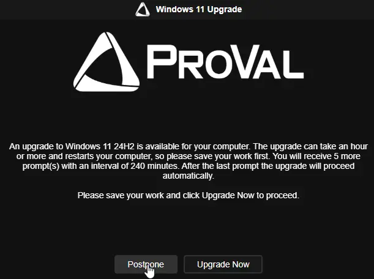  
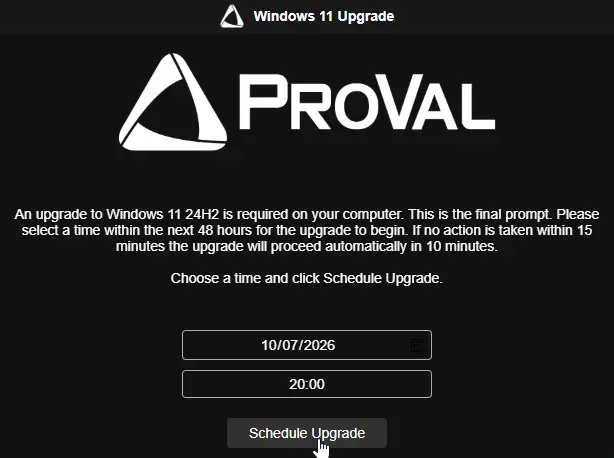  
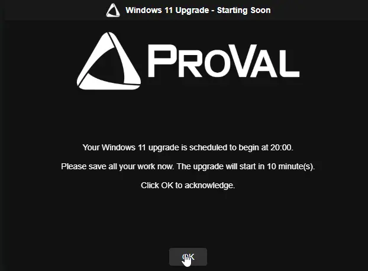  

**Laptops:**

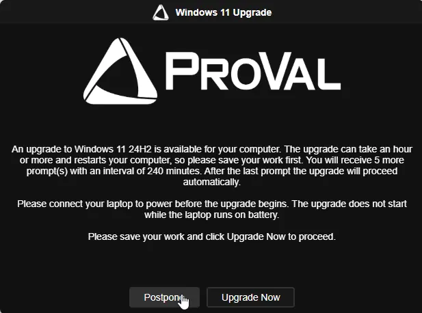  
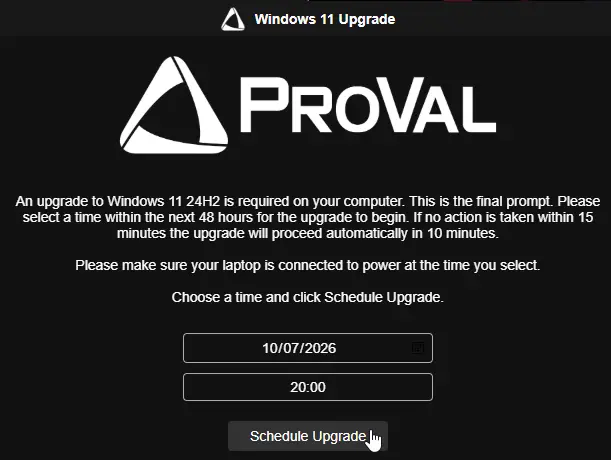  
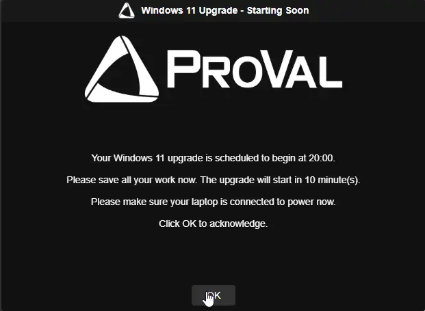

### Missed Upgrade Prompt - English

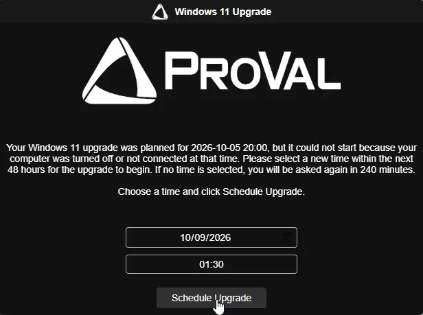  

### Upgrade In Progress Notification - English

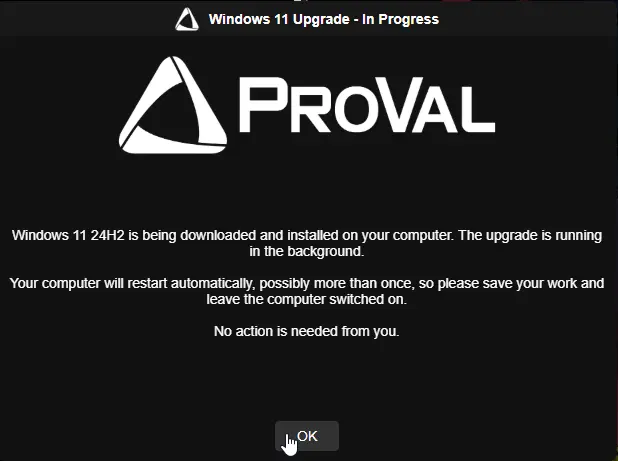  

### Completion Prompt - English

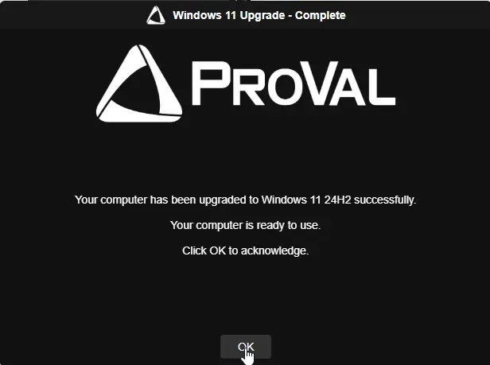  

### Sample Prompts - Dutch

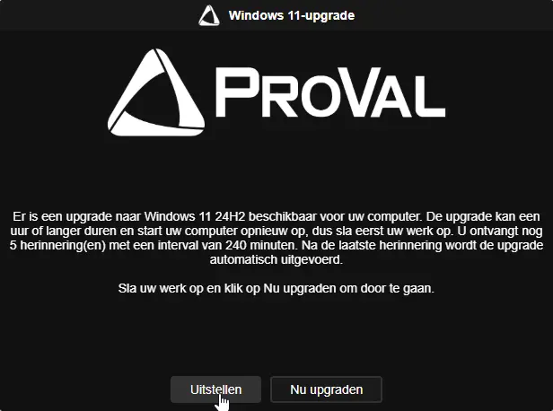  
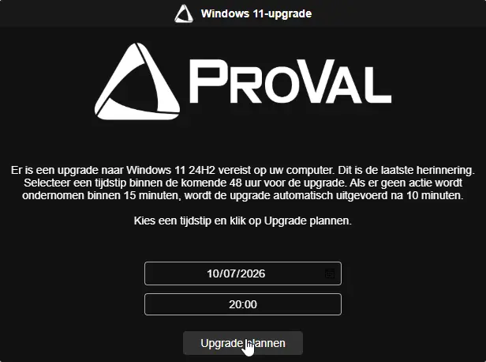  
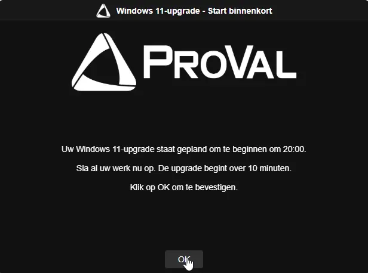  

#### Missed Upgrade Prompt - Dutch

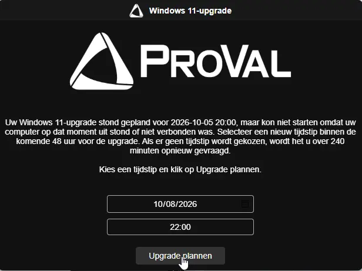  

#### Upgrade In Progress Notification - Dutch

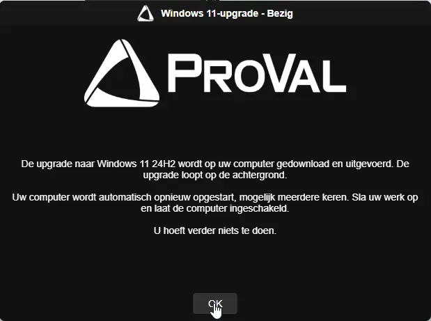  

#### Completion Prompt - Dutch

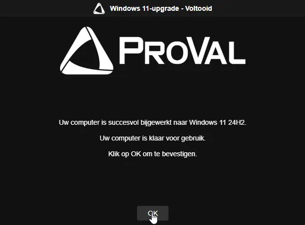  

## Changelog

### 2026-10-07

- Initial version of the document
