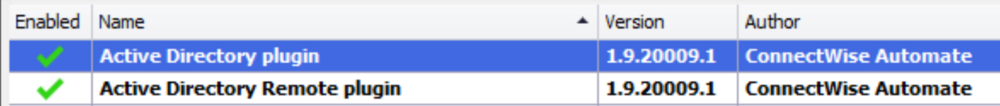
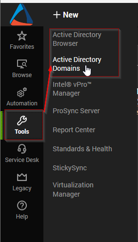
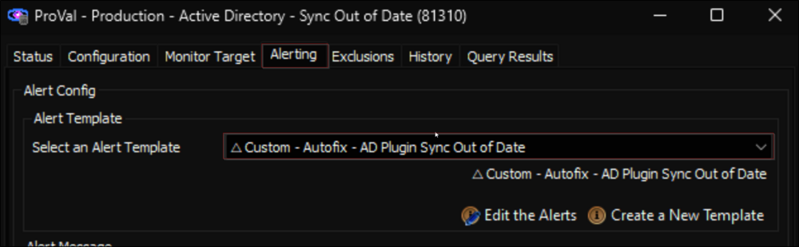
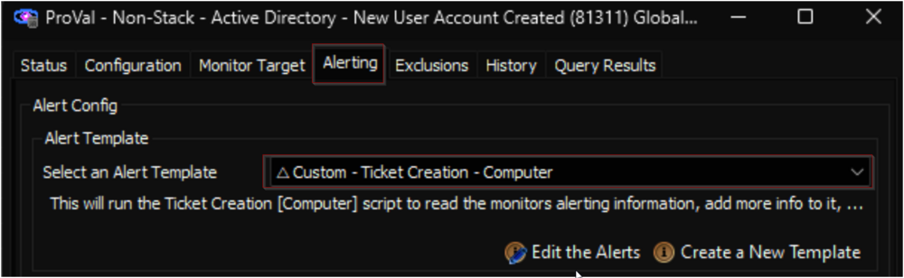
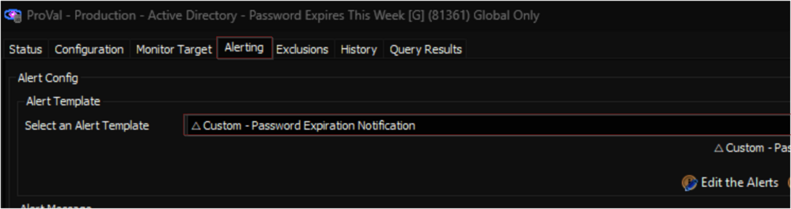
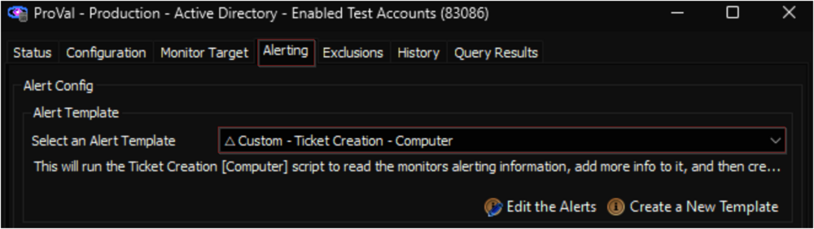
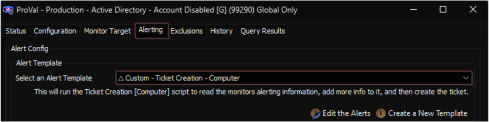
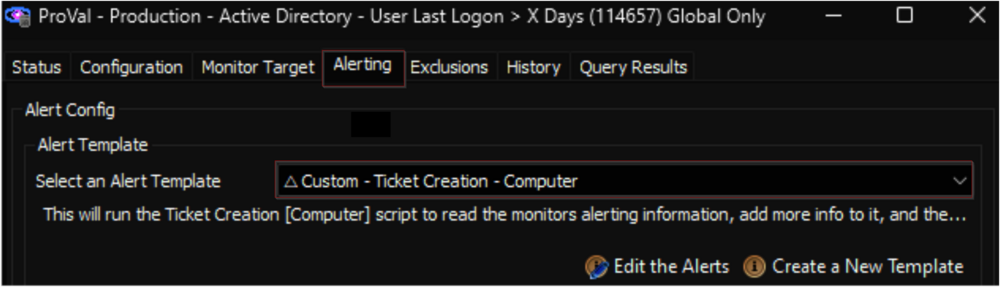
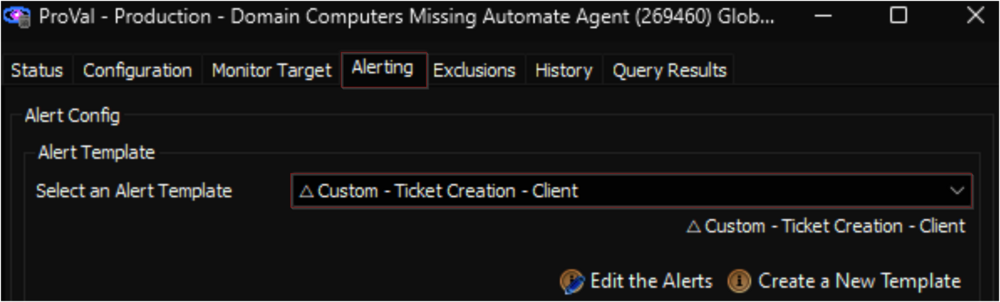
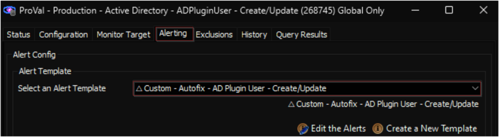

## Purpose

This solution document delineates the contents applicable for monitoring the Active Directory Domain environment. Please review the implementation steps meticulously as a significant portion of the content relies on the **`Active Directory`** plugin.

This article encompasses multiple components and contents. Please import and implement only the required components.

## Associated Content

#### Internal Monitor

| Content                                                                                                                                      | Type            | Function                                                                                                                                                                            |
|---------------------------------------------------------------------------------------------------------------------------------------------|-----------------|-------------------------------------------------------------------------------------------------------------------------------------------------------------------------------------|
| [CWM - Automate - Internal Monitor - Active Directory - Sync Out of Date](<../cwa/monitors/Active Directory - Sync Out of Date.md>)                   | Internal Monitor | This monitor looks for the AD server that has been onboarded for more than 30 days and is experiencing a credential issue in the Active Directory Plugin.                         |
| [RSM - Active Directory - Monitor - Active Directory - New User Account Created](<../cwa/monitors/Active Directory - New User Account Created.md>)             | Internal Monitor | This monitor looks for new domain user accounts that have a creation date within the past day. A ticket is created for each new account discovered.                                |
| [RSM - Active Directory - Monitor - Password Expires This Week [G]](<../cwa/monitors/Password Expires This Week G.md>)                          | Internal Monitor | Detects the domain users whose password is going to expire within a week.                                                                                                         |
| [RSM - Active Directory - Monitor - Active Directory - Enabled Test Accounts](<../cwa/monitors/Active Directory - Enabled Test Accounts.md>)                | Internal Monitor | This monitor will look for any account with the name **`Test`** in the account name and will flag that account if it is enabled on the domain.                                     |
| [RSM - Active Directory - Monitor - Account Disabled](<../cwa/monitors/Account Disabled.md>)                                       | Internal Monitor | This monitor looks for the disabled accounts on Active Directory servers through the Active Directory plugin and creates a ticket for each one found.                               |
| [RSM - Active Directory - Monitor - Active Directory - User Last Logon > X Days](<../cwa/monitors/Active Directory - User Last Logon  X Days.md>)            | Internal Monitor | This monitor will check for users who have not logged in for more than X days and are not administrator accounts.                                                                  |
| [CWM - Automate - Internal Monitor - Active Computers in AD with No Agent](<../cwa/monitors/Active Computers in AD with No Agent.md>)                  | Internal Monitor | The monitor set generates a client-level ticket containing details of domain-joined computers active within the domain, which have been joined to the domain for at least 7 days but do not have the Automate agent installed. |
| [CWM - Automate - Internal Monitor - Active Directory - ADPluginUser - Create/Update](<../cwa/monitors/Active Directory - ADPluginUser - CreateUpdate.md>)       | Internal Monitor | The purpose of this monitor set is to create an 'ADPluginUser' account for the domain controllers detected in AD Plugin.                                                           |
| [RSM - Active Directory - Monitor - GPO Modified](<../cwa/monitors/GPO Modified.md>)                                          | Internal Monitor | This Custom RAWSQL monitor shows GPO modified time on the computer if the GPO was modified in the last day.                                                                    |

#### Remote Monitor

| Content                                                                                                                                      | Type            | Function                                                                                                                                                                            |
|---------------------------------------------------------------------------------------------------------------------------------------------|-----------------|-------------------------------------------------------------------------------------------------------------------------------------------------------------------------------------|
| [EPM - User Management - Remote Monitor - Reset AD Users Password Age](<../cwa/monitors/Reset AD Users Password Age.md>)                     | Remote Monitor   | This remote monitor checks AD user's login password age to see if the age is set to unlimited, and if so it will change the user password from never expire to expire and will also change the Default domain policy password age to 90 days. |
| [RSM - Active Directory - Remote Monitor - New Domain Admin](<../cwa/monitors/New Domain Admin.md>)                               | Remote Monitor   | The purpose of the remote monitor is to detect the newly created/promoted domain admins and create a ticket.                                                                         |
| [CWM - Automate - Remote Monitor - AD Recycle Bin State Check](<../cwa/monitors/AD Recycle Bin State Check.md>)                             | Remote Monitor   | This is a remote PowerShell monitor which detects whether the AD Recycle Bin is enabled or disabled on Windows Active Directory servers.                                             |
| [RSM - Active Directory - Remote Monitor - AD Account Lockout Detection](<../cwa/monitors/AD Account LockOut Detection.md>)                   | Remote Monitor   | The monitoring system is set up to gather data on event ID 4740 that occurred within the last 15 minutes and to generate an alert with the relevant information.                     |
| [RSM - Active Directory - Remote Monitor - Active Directory Replication Anomaly Monitoring](<../cwa/monitors/Active Directory Replication Anomaly Monitoring.md>) | Remote Monitor   | The monitor set operates on a cluster of Primary Domain Controllers (Infrastructure Masters) for each domain, triggering a failure alert upon detecting any Active Directory Replication Failure. |

#### Script

| Content                                                                                                                                      | Type            | Function                                                                                                                                                                            |
|---------------------------------------------------------------------------------------------------------------------------------------------|-----------------|-------------------------------------------------------------------------------------------------------------------------------------------------------------------------------------|
| [CWM - Automate - Script - AD - Enable AD Recycle Bin](<../cwa/scripts/AD - Enable AD Recycle Bin.md>)                                   | Script          | This script enables the AD Recycle Bin. [Microsoft TechNet Article](https://techcommunity.microsoft.com/t5/ask-the-directory-services-team/the-ad-recycle-bin-understanding-implementing-best-practices-and/ba-p/396944) |
| [RSM - Active Directory - Script - Weak Passwords - AD Test](<../cwa/scripts/Weak Passwords - AD Test.md>)                               | Script          | The script tests the hashed credentials in AD against a known compromised or weak list.                                                                                             |
| [CWM - Automate - Script - Active Directory - Plugin User Account - Create/Update](<../cwa/scripts/Active Directory - Plugin User Account - CreateUpdate.md>)        | Script          | This script will create/update a domain admin account to be used with the AD plugin with a random password.                                                                          |
| [RSM - Active Directory - Script - Group Policy - Audit](<../cwa/scripts/Group Policy - Audit.md>)                                   | Script          | This process will execute PowerShell to gather GPO data.                                                                                                                            |
| [AD - Create Views/Table/Schedule for AD Reporting Solution](<../cwa/scripts/AD - Create ViewsTableSchedule for AD Reporting Solution.md>)                               | Script          | This creates all of the needed items in the Database to ensure the [Active Directory Reporting Solution](<../cwa/reports/Active Directory Reporting Solution.md>) functions correctly.       |
| [CWM - Automate - Script - ScreenConnect - RMM+ Autofix - AD Plugin - Sync Out of Date [Ticket]*](<../cwa/scripts/ScreenConnect - RMM+ Autofix - AD Plugin - Sync Out of Date Ticket.md>) | Script          | This script is intended to be used as an auto fix for the [CWM - Automate - Internal Monitor - Active Directory - Sync Out of Date](<../cwa/monitors/Active Directory - Sync Out of Date.md>) monitor. This script will not function if run manually. |
| [CWM - Automate - Script - Active Directory - Alerting - Password Expires This Week [Global,Autofix]*](https://proval.itglue.com/DOC-6075716-11713518) | Script          | The script covers the alerting section of the [RSM - Active Directory - Monitor - Password Expires This Week [G]](<../cwa/monitors/Password Expires This Week G.md>) monitor set. |

#### Dataview

| Content                                                                                                                                      | Type            | Function                                                                                                                                                                            |
|---------------------------------------------------------------------------------------------------------------------------------------------|-----------------|-------------------------------------------------------------------------------------------------------------------------------------------------------------------------------------|
| [RSM - Active Directory - Dataview - Active Directory - AD Users](<../cwa/dataviews/Active Directory - AD Users.md>)                           | Dataview        | This dataview displays all users associated with a domain and general information about all the users.                                                                                |
| [RSM - Active Directory - Dataview - Active Directory - Domain Groups and Members](<../cwa/dataviews/Active Directory - Domain Groups and Members.md>)          | Dataview        | This dataview shows you all domains and their respective groups and a corresponding list of members.                                                                                 |
| [RSM - Active Directory - Dataview - Windows - Group Policy Objects](<../cwa/dataviews/Windows - Group Policy Objects.md>)                       | Dataview        | This dataview shows information about GPOs, their applied policies, where they are linked to, and to what trustees they are applied to.                                             |
| [RSM - Active Directory - Dataview - Windows - Group Policy Settings](<../cwa/dataviews/Windows - Group Policy Settings.md>)                       | Dataview        | This dataview shows information about GPOs, their applied policies, and settings.                                                                                                   |
| [RSM - Active Directory - Dataview - Windows - Group Policy Object Links](<../cwa/dataviews/Windows - Group Policy Object Links.md>)                  | Dataview        | This dataview shows information about GPOs, their applied policies, and where they are linked to.                                                                                   |
| [RSM - Active Directory - Dataview - Windows - Group Policy Object Security Filtering](<../cwa/dataviews/Windows - Group Policy Object Security Filtering.md>)     | Dataview        | This dataview displays information related to Group Policy Objects in Active Directory, specifically related to security policies.                                                   |

#### Report

| Content                                                                                                                                      | Type            | Function                                                                                                                                                                            |
|---------------------------------------------------------------------------------------------------------------------------------------------|-----------------|-------------------------------------------------------------------------------------------------------------------------------------------------------------------------------------|
| [Report - Active Directory User Assessment](<../cwa/reports/Active Directory User Assessment.md>)                                               | Report          | Displays an overall health view of the Client's Active Directory along with a full user report.                                                                                     |
| [Report - Active Directory User Groups - Detail](<../cwa/reports/Active Directory User Groups - Detail.md>)                                          | Report          | Displays a complete user list with all groups that each user is in, along with an overall view of what groups are used the most.                                                  |
| [Report - Computers in Active Directory - No Agent](<../cwa/reports/Computers in Active Directory - No Agent.md>)                                      | Report          | Displays a list of all computers that are in Active Directory but not in Automate. Can be used to clean up Client Active Directories.                                              |
| SubPageHeaderLandscape                                                                                                                    | Subreport       | Used as the template for the page header on these reports.                                                                                                                          |

## Implementation (Active Directory Plugin Dependent Solutions)

1. The solutions presented in this section rely on the functionality provided by the **`Active Directory`** plugin. Therefore, it is imperative to verify that both the **`Active Directory`** and **`Active Directory Remote`** plugins are correctly installed and operational within the environment.

   
   

2. ### Active Directory Reporting Solution

   Follow the steps outlined in the [EPM - Accounts - Report - Active Directory Reporting Solution](<../cwa/reports/Active Directory Reporting Solution.md>) document to import and configure the following reports:

   - [Report - Active Directory User Assessment](<../cwa/reports/Active Directory User Assessment.md>)
   - [Report - Active Directory User Groups - Detail](<../cwa/reports/Active Directory User Groups - Detail.md>)
   - [Report - Computers in Active Directory - No Agent](<../cwa/reports/Computers in Active Directory - No Agent.md>)
   - SubPageHeaderLandscape

3. ### Active Directory - Sync Out of Date

   - Import the [CWM - Automate - Internal Monitor - Active Directory - Sync Out of Date](<../cwa/monitors/Active Directory - Sync Out of Date.md>) internal monitor set from the `ProSync` plugin.
   - Import the [CWM - Automate - Script - ScreenConnect - RMM+ Autofix - AD Plugin - Sync Out of Date [Ticket]*](<../cwa/scripts/ScreenConnect - RMM+ Autofix - AD Plugin - Sync Out of Date Ticket.md>) script from the `ProSync` plugin.
   - Import the **`△ Custom - Autofix - AD Plugin Sync Out of Date`** alert template from the `ProSync` plugin.
   - Reload the system cache.
   - Ensure that the RMM+ Plugin is correctly configured and operational within the environment, as this solution relies on the proper configuration of the [CWM - Automate - RMM+ Plugin Configuration](<../cwa/scripts/CWM - Automate - RMM+ Plugin Configuration.md>).
   - Assign the **`△ Custom - Autofix - AD Plugin Sync Out of Date`** alert template to the [CWM - Automate - Internal Monitor - Active Directory - Sync Out of Date](<../cwa/monitors/Active Directory - Sync Out of Date.md>) monitor set.

   

4. ### Active Directory - New User Account

   - Import the [RSM - Active Directory - Monitor - Active Directory - New User Account Created](<../cwa/monitors/Active Directory - New User Account Created.md>) internal monitor from the `ProSync` plugin.
   - Import the **`△ Custom - Ticket Creation - Computer`** alert template from the `ProSync` plugin, if it's not already present in the environment.
   - Import the [CWM - Automate - Script - Ticket Creation - Computer](<../cwa/scripts/Ticket Creation - Computer.md>) script from the `ProSync` plugin, if it's not already present in the environment.
   - Reload the System Cache.
   - Assign the **`△ Custom - Ticket Creation - Computer`** alert template to the [RSM - Active Directory - Monitor - Active Directory - New User Account Created](<../cwa/monitors/Active Directory - New User Account Created.md>) monitor set.

   

5. ### Active Directory - Password Expires This Week

   - Import the [RSM - Active Directory - Monitor - Password Expires This Week [G]](<../cwa/monitors/Password Expires This Week G.md>) internal monitor from the `ProSync` plugin.
   - Import the [CWM - Automate - Script - Active Directory - Alerting - Password Expires This Week [Global,Autofix]*](https://proval.itglue.com/DOC-6075716-11713518) script from the `ProSync` plugin.
   - Import the **`△ Custom - Password Expiration Notification`** alert template from the `ProSync` plugin.
   - Reload the System Cache.
   - Go through the [script's](https://proval.itglue.com/DOC-6075716-11713518) document and perform the customization if necessary.
   - Assign the **`△ Custom - Password Expiration Notification`** alert template to the [RSM - Active Directory - Monitor - Password Expires This Week [G]](<../cwa/monitors/Password Expires This Week G.md>) monitor set.

   

6. ### Active Directory - Enabled Test Accounts

   - Import the [RSM - Active Directory - Monitor - Active Directory - Enabled Test Accounts](<../cwa/monitors/Active Directory - Enabled Test Accounts.md>) internal monitor from the `ProSync` plugin.
   - Import the **`△ Custom - Ticket Creation - Computer`** alert template from the `ProSync` plugin, if it's not already present in the environment.
   - Import the [CWM - Automate - Script - Ticket Creation - Computer](<../cwa/scripts/Ticket Creation - Computer.md>) script from the `ProSync` plugin, if it's not already present in the environment.
   - Reload the System Cache.
   - Assign the **`△ Custom - Ticket Creation - Computer`** alert template to the [RSM - Active Directory - Monitor - Active Directory - Enabled Test Accounts](<../cwa/monitors/Active Directory - Enabled Test Accounts.md>) monitor set.

   

7. ### Active Directory - Account Disabled

   - Import the [RSM - Active Directory - Monitor - Account Disabled](<../cwa/monitors/Account Disabled.md>) internal monitor from the `ProSync` plugin.
   - Import the **`△ Custom - Ticket Creation - Computer`** alert template from the `ProSync` plugin, if it's not already present in the environment.
   - Import the [CWM - Automate - Script - Ticket Creation - Computer](<../cwa/scripts/Ticket Creation - Computer.md>) script from the `ProSync` plugin, if it's not already present in the environment.
   - Reload the System Cache.
   - Assign the **`△ Custom - Ticket Creation - Computer`** alert template to the [RSM - Active Directory - Monitor - Account Disabled](<../cwa/monitors/Account Disabled.md>) monitor set.

   

8. ### Active Directory - User Last Logon > X Days

   - Import the [RSM - Active Directory - Monitor - Active Directory - User Last Logon > X Days](<../cwa/monitors/Active Directory - User Last Logon  X Days.md>) internal monitor from the `ProSync` plugin.
   - Import the **`△ Custom - Ticket Creation - Computer`** alert template from the `ProSync` plugin, if it's not already present in the environment.
   - Import the [CWM - Automate - Script - Ticket Creation - Computer](<../cwa/scripts/Ticket Creation - Computer.md>) script from the `ProSync` plugin, if it's not already present in the environment.
   - Reload the System Cache.
   - Assign the **`△ Custom - Ticket Creation - Computer`** alert template to the [RSM - Active Directory - Monitor - Active Directory - User Last Logon > X Days](<../cwa/monitors/Active Directory - User Last Logon  X Days.md>) monitor set.

   

9. ### Active Directory - Domain Computers Missing Automate Agent

   - Import the [CWM - Automate - Internal Monitor - Domain Computers Missing Automate Agent](<../cwa/monitors/Active Computers in AD with No Agent.md>) internal monitor from the `ProSync` plugin.
   - Import the **`△ Custom - Ticket Creation - Client`** alert template from the `ProSync` plugin, if it's not already present in the environment.
   - Import the [CWM - Automate - Ticket Creation - Client](<../cwa/scripts/CWM - Automate - Ticket Creation - Client.md>) script from the `ProSync` plugin, if it's not already present in the environment.
   - Reload the System Cache.
   - Assign the **`△ Custom - Ticket Creation - Client`** alert template to the [CWM - Automate - Internal Monitor - Domain Computers Missing Automate Agent](<../cwa/monitors/Active Computers in AD with No Agent.md>) monitor set.

   

10. ### Active Directory - ADPluginUser - Create/Update

    - Import the [CWM - Automate - Internal Monitor - Active Directory - ADPluginUser - Create/Update](<../cwa/monitors/Active Directory - ADPluginUser - CreateUpdate.md>) monitor set from the `ProSync` plugin.
    - Import and implement the [CWM - Automate - Script - Active Directory - Plugin User Account - Create/Update](<../cwa/scripts/Active Directory - Plugin User Account - CreateUpdate.md>) script as instructed in the **`Implementation`** section of the [script's](<../cwa/scripts/Active Directory - Plugin User Account - CreateUpdate.md>) document.
    - Import the **`△ Custom - Autofix - AD Plugin User - Create/Update`** alert template from the `ProSync` plugin, if it's not already present in the environment.
    - Assign the **`△ Custom - Autofix - AD Plugin User - Create/Update`** alert template to the [CWM - Automate - Internal Monitor - Active Directory - ADPluginUser - Create/Update](<../cwa/monitors/Active Directory - ADPluginUser - CreateUpdate.md>) monitor set.

    

11. ### Active Directory - AD Users

    - Import the [RSM - Active Directory - Dataview - Active Directory - AD Users](<../cwa/dataviews/Active Directory - AD Users.md>) dataview from the `ProSync` plugin.

12. ### Active Directory - Domain Group and Members

    - Import the [RSM - Active Directory - Dataview - Active Directory - Domain Groups and Members](<../cwa/dataviews/Active Directory - Domain Groups and Members.md>) dataview from the `ProSync` plugin.

## Implementation (Independent Solutions)

1. The solutions presented in this section do not rely on any plugin.

2. ### Group Policy Audit

   - Import the [RSM - Active Directory - Script - Group Policy - Audit](<../cwa/scripts/Group Policy - Audit.md>) script from the `ProSync` plugin.
   - Import the following dataviews from the `ProSync` plugin:
     - [RSM - Active Directory - Dataview - Windows - Group Policy Objects](<../cwa/dataviews/Windows - Group Policy Objects.md>)
     - [RSM - Active Directory - Dataview - Windows - Group Policy Settings](<../cwa/dataviews/Windows - Group Policy Settings.md>)
     - [RSM - Active Directory - Dataview - Windows - Group Policy Object Links](<../cwa/dataviews/Windows - Group Policy Object Links.md>)
     - [RSM - Active Directory - Dataview - Windows - Group Policy Object Security Filtering](<../cwa/dataviews/Windows - Group Policy Object Security Filtering.md>)
   - Schedule the [RSM - Active Directory - Script - Group Policy - Audit](<../cwa/scripts/Group Policy - Audit.md>) script to run once per day against the domain controllers group.
   - Import the [RSM - Active Directory - Monitor - GPO Modified](<../cwa/monitors/GPO Modified.md>) internal monitor from the `ProSync` plugin.
   - Implement the monitor set as explained in the **`Implementation`** section of the [monitor's](<../cwa/monitors/GPO Modified.md>) document.
   - Import the **`△ Custom - Ticket Creation - Computer`** alert template from the `ProSync` plugin, if it's not already present in the environment.
   - Import the [CWM - Automate - Script - Ticket Creation - Computer](<../cwa/scripts/Ticket Creation - Computer.md>) script from the `ProSync` plugin, if it's not already present in the environment.
   - Reload the System Cache.
   - Assign the **`△ Custom - Ticket Creation - Computer`** alert template to the [RSM - Active Directory - Script - Group Policy - Audit](<../cwa/scripts/Group Policy - Audit.md>) monitor set.

   

3. ### Reset AD Users Password Age

   - Import the **`△ Custom - Ticket Creation - Computer`** alert template from the `ProSync` plugin, if it's not already present in the environment.
   - Import the [CWM - Automate - Script - Ticket Creation - Computer](<../cwa/scripts/Ticket Creation - Computer.md>) script from the `ProSync` plugin, if it's not already present in the environment.
   - Import the [EPM - User Management - Remote Monitor - Reset AD Users Password Age](<../cwa/monitors/Reset AD Users Password Age.md>) remote monitor by following the instructions outlined in the [Import - Remote Monitor - Reset AD Users Password Age](<../cwa/monitors/Import - Remote Monitor - Reset AD Users Password Age.md>) document.
   - Reload the System Cache.
   - Locate the [EPM - User Management - Remote Monitor - Reset AD Users Password Age](<../cwa/monitors/Reset AD Users Password Age.md>) remote monitor by opening the relevant group(s) and apply the **`△ Custom - Ticket Creation - Computer`** alert template to the group monitor.

4. ### New Domain Admin

   - Import the **`△ Custom - Ticket Creation Computer - Failures Only`** alert template from the `ProSync` plugin, if it's not already present in the environment.
   - Import the [CWM - Automate - Script - Ticket Creation - Computer [Failures Only]*](<../cwa/scripts/Ticket Creation - Computer Failures Only.md>) script from the `ProSync` plugin, if it's not already present in the environment.
   - Import the [RSM - Active Directory - Remote Monitor - New Domain Admin](<../cwa/monitors/New Domain Admin.md>) remote monitor by following the instructions outlined in the [Implement - Remote Monitor - New Domain Admin](<../cwa/monitors/New Domain Admin.md>) document.
   - Reload the System Cache.
   - Locate the [RSM - Active Directory - Remote Monitor - New Domain Admin](<../cwa/monitors/New Domain Admin.md>) remote monitor by opening the **`Domain Controllers`** group.

5. ### Enable AD Recycle Bin

   - Import the [CWM - Automate - Script - AD - Enable AD Recycle Bin](<../cwa/scripts/AD - Enable AD Recycle Bin.md>) script from the `ProSync` plugin.
   - Import the **`△ Custom - Execute Script - AD - Enable AD Recycle Bin`** alert template from the `ProSync` plugin.
   - Import the [RSM - Active Directory - Role - AD Domain Recycle Bin Feature](<../cwa/roles/AD Domain Recycle Bin Feature.md>) role and the [CWM - Automate - Remote Monitor - AD Recycle Bin State Check](<../cwa/monitors/AD Recycle Bin State Check.md>) remote monitor by following the instructions outlined in the [Import - Remote Monitor - AD Recycle Bin State Check](<../cwa/monitors/AD Recycle Bin State Check.md>) document.
   - Reload the System Cache.
   - Locate the [EPM - User Management - Remote Monitor - Reset AD Users Password Age](<../cwa/monitors/Reset AD Users Password Age.md>) remote monitor by opening the **`Domain Controllers`** group and apply the **`△ Custom - Execute Script - AD - Enable AD Recycle Bin`** alert template to the group monitor.

6. ### AD Account Lockout Detection

   - Import the **`△ Custom - Ticket Creation Computer - Failures Only`** alert template from the `ProSync` plugin, if it's not already present in the environment.
   - Import the [CWM - Automate - Script - Ticket Creation - Computer [Failures Only]*](<../cwa/scripts/Ticket Creation - Computer Failures Only.md>) script from the `ProSync` plugin, if it's not already present in the environment.
   - Import the [RSM - Active Directory - Remote Monitor - AD Account Lockout Detection](<../cwa/monitors/AD Account LockOut Detection.md>) remote monitor by following the instructions outlined in the [Implement - Remote Monitor - AD Account LockOut Detection](<../cwa/monitors/AD Account LockOut Detection.md>) document.
   - Reload the System Cache.
   - Locate the [RSM - Active Directory - Remote Monitor - AD Account Lockout Detection](<../cwa/monitors/AD Account LockOut Detection.md>) remote monitor by opening the **`Domain Controllers`** group and apply the **`△ Custom - Ticket Creation Computer - Failures Only`** alert template to the group monitor.

7. ### Active Directory Replication Anomaly Monitoring

   - Import the **`△ Custom - Ticket Creation - Computer`** alert template from the `ProSync` plugin, if it's not already present in the environment.
   - Import the [CWM - Automate - Script - Ticket Creation - Computer](<../cwa/scripts/Ticket Creation - Computer.md>) script from the `ProSync` plugin, if it's not already present in the environment.
   - Import the [RSM - Active Directory - Remote Monitor - Active Directory Replication Anomaly Monitoring](<../cwa/monitors/Active Directory Replication Anomaly Monitoring.md>) remote monitor by following the instructions outlined in the [Implement - Remote Monitor - Active Directory Replication Anomaly Monitoring](<../cwa/monitors/Active Directory Replication Anomaly Monitoring.md>) document.
   - Reload the System Cache.
   - Locate the [RSM - Active Directory - Remote Monitor - Active Directory Replication Anomaly Monitoring](<../cwa/monitors/Active Directory Replication Anomaly Monitoring.md>) remote monitor by opening the **`Domain Controllers`** group and apply the **`△ Custom - Ticket Creation - Computer`** alert template to the group monitor.

