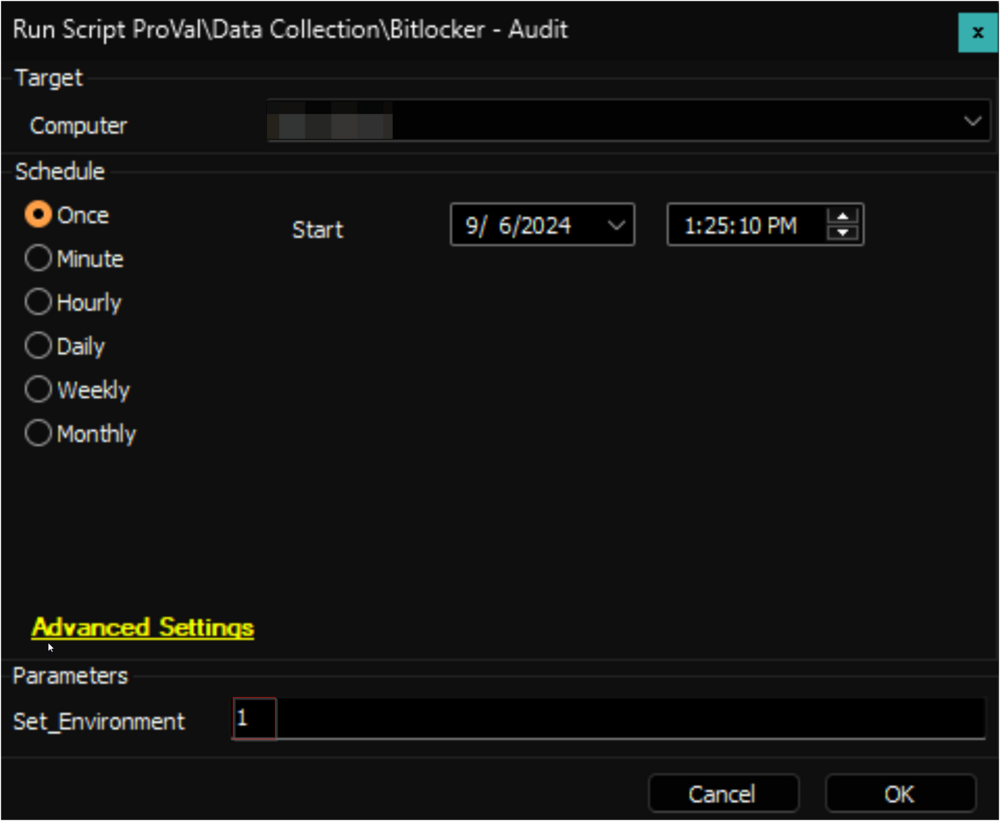
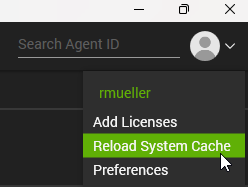

## Purpose

To manage Bitlocker protection on endpoints.

## Update Notice: 6-Sept-2024

- The solution has been updated to store and display the data even if the computer is retired. However, the data cannot be displayed if the computer is also deleted from the retired assets.
- Modified Content:
  - [Script - Bitlocker - Audit](/docs/d7d933e3-9668-4de9-9f44-7452198ab85a)
  - [Script - Bitlocker - AD Key Protector - Audit](/docs/d533538b-8b00-425e-849f-434518296b2d)
  - [Custom Table - plugin_proval_bitlocker_audit](/docs/bb3eaac8-80f6-43b9-90f1-75886c06bf14)
  - [Custom Table - plugin_proval_tpm_audit](/docs/82144ad7-4cff-4883-8389-1180052ab156)
- New Content:
  - [Dataview - Bitlocker Status - Retired Computers](/docs/2a93ccc8-7de0-4107-9251-747b55905734)
- Sync the modified scripts from the `Prosync` plugin and run the [Bitlocker - Audit](/docs/d7d933e3-9668-4de9-9f44-7452198ab85a) script against any online Windows computer with the `Set_Environment` parameter set to `1` to modify the custom tables.

## Associated Content

### Auditing Content

| Content | Type | Function |
|---------|------|----------|
| [Script - Bitlocker - Audit](/docs/d7d933e3-9668-4de9-9f44-7452198ab85a) | Script | Gathers Bitlocker information from the target endpoint and stores it in the [Custom Table - plugin_proval_bitlocker_audit](/docs/bb3eaac8-80f6-43b9-90f1-75886c06bf14). |
| [Script - Bitlocker - AD Key Protector - Audit](/docs/d533538b-8b00-425e-849f-434518296b2d) | Script | Audits the existing backup Bitlocker key protectors from an Active Directory server. |
| [Script - Bitlocker Recovery Password - AD Backup](/docs/cd4cedee-cd92-4198-83d6-e7c596a6a01b) | Script | This script backs up Bitlocker Recovery Passwords to the associated Active Directory instance. |
| [Dataview - Bitlocker Status](/docs/6442955a-0264-44ce-aad1-9e2f973e40ec) | Dataview | Displays information from the [Custom Table - plugin_proval_bitlocker_audit](/docs/bb3eaac8-80f6-43b9-90f1-75886c06bf14) filled by the [Script - Bitlocker - Audit](/docs/d7d933e3-9668-4de9-9f44-7452198ab85a). Additionally, it displays information about the Active Directory backup status of each key protector. |
| [Dataview - Bitlocker Status - Retired Computers](/docs/2a93ccc8-7de0-4107-9251-747b55905734) | Dataview | Displays the Bitlocker data stored in the [Custom Table - plugin_proval_bitlocker_audit](/docs/bb3eaac8-80f6-43b9-90f1-75886c06bf14) for the retired computers. |
| [SEC - Encryption - Dataview - Bitlocker - AD Backup Audit](/docs/1bd41d12-c68a-4e68-a7eb-ac2d58538187) | Dataview | Displays Bitlocker key protectors backed up to Active Directory. |
| [Internal Monitor - ProVal - Production - Security - Stale Bitlocker Data](/docs/b6bf288a-a1f5-4d76-9973-1ecfca5521a5) | Internal Monitor | Detects Windows computers where the [Script - Bitlocker - Audit](/docs/d7d933e3-9668-4de9-9f44-7452198ab85a) script has not executed within the last 30 days and triggers the audit script to run. |
| [CWM - Automate - Roles - Bitlocker](/docs/1650f6a6-2a4b-4c8c-9818-3f91ffe1805f) | Role | These roles determine whether the Windows server is eligible for Bitlocker. They are also used in the [Internal Monitor - ProVal - Production - Security - Stale Bitlocker Data](/docs/b6bf288a-a1f5-4d76-9973-1ecfca5521a5). |
| [CWA Dataview - Bitlocker Initialize Failure Audit [Script]](/docs/3c6d0ec7-4954-4116-b8ba-329c13cd2143) | Dataview (Optional) | This dataview contains records of computers where the BitLocker initialization failed twice due to the Autofix script "[Script - Bitlocker - Volume - Initialize [Autofix, Param] - Wrapper](/docs/85513764-8240-40fb-be86-7be910ea62cf)". |

### Automation

| Content | Type | Function |
|---------|------|----------|
| [Script - Bitlocker - Initialize Volume](/docs/759a5a88-17ef-42e0-9145-4760aff7a3c9) | Script | Encrypts a drive with Bitlocker disk encryption. |
| [Script - Bitlocker - Remove Volume](/docs/710777f0-5c3f-4582-96e9-3beacaf085eb) | Script | Disables Bitlocker protection on one (or all) volumes. |
| [Internal Monitor - Bitlocker - Missing Key Protectors](/docs/2609502c-8a9d-4e8d-98cb-e1b6f7fb2fdb) | Internal Monitor | Detects computers where Bitlocker is enabled, and the drive is fully encrypted but does not have any key protectors. |
| [Bitlocker - Volume - Add Recovery Password [Autofix]](/docs/c2c817db-9667-4e18-864c-11ef0775282c) | Script | Adds a recovery password to the drive where BitLocker is enabled but a key protector is not found. It is an autofix script for the [Internal Monitor - Bitlocker - Missing Key Protectors](/docs/2609502c-8a9d-4e8d-98cb-e1b6f7fb2fdb) monitor set. |
| △ Custom - Execute Script - Bitlocker - Volume - Add Recovery Password | Alert Template | This will be used with the [Internal Monitor - Bitlocker - Missing Key Protectors](/docs/2609502c-8a9d-4e8d-98cb-e1b6f7fb2fdb) and should execute the script [Bitlocker - Volume - Add Recovery Password [Autofix]](/docs/c2c817db-9667-4e18-864c-11ef0775282c). |
| [Script - Bitlocker - Volume - Initialize [Autofix,Param] - Wrapper](/docs/85513764-8240-40fb-be86-7be910ea62cf) | Script (Optional) | This script runs as an autofix to deploy the BitLocker initialization to the agents detected by the monitor [Internal Monitor - Bitlocker - Initialize Volume Deployment](/docs/925adfc5-e119-4c56-937a-a31c3e171371). |
| [Internal Monitor - Bitlocker - Initialize Volume Deployment](/docs/925adfc5-e119-4c56-937a-a31c3e171371) | Internal Monitor (Optional) | This internal monitor detects online supported Windows OS (Windows 10/11, Windows Server 2016, 2019, and 2022) that have not been updated in the `plugin_proval_bitlocker_audit` table in the last 7 days and do not have the keyprotectorid and protectionstatus set. It also checks if the location-EDF 'BitLocker Enable List' is set to either "AllDrive" or "SystemDrive" from the dropdown option and the computer-EDF 'BitLocker Enable Exclude' is not checked. It ensures running the [Script - Bitlocker - Volume - Initialize [Autofix,Param] - Wrapper](/docs/85513764-8240-40fb-be86-7be910ea62cf) once every 7 days on the detected agents to avoid multiple reiterate attempts. |
| △ Custom - Execute Script - Bitlocker - Volume - Initialize [Autofix] - Wrapper | Alert Template (Optional) | This alert template needs to be applied to [Internal Monitor - Bitlocker - Initialize Volume Deployment](/docs/925adfc5-e119-4c56-937a-a31c3e171371) and should execute the [Script - Bitlocker - Volume - Initialize [Autofix,Param] - Wrapper](/docs/85513764-8240-40fb-be86-7be910ea62cf). |
| [Remote Monitor - Enable Bitlocker Feature](/docs/1a32292b-df11-46ef-997f-7ad70f59061f) | Remote Monitor | Enables the following Bitlocker features on the Windows server if they are not already installed: <ul><li>BitLocker Drive Encryption Administration Utilities</li><li>BitLocker Recovery Password Viewer</li><li>BitLocker Drive Encryption Tools</li></ul> |

### Other Content

| Content | Type | Function |
|---------|------|----------|
| [Agnostic - Initialize-BitLockerVolume](/docs/2ce835a2-3ac1-4291-baaf-8d3cac76869f) | Agnostic | Encrypts a drive with Bitlocker disk encryption. |
| [Agnostic - Unprotect-BitLockerVolume](/docs/22114d12-c60e-479e-93a5-50d3450b6631) | Agnostic | Disables Bitlocker protection on one (or all) volumes. |
| [Agnostic - Get-ADBitlockerStores](/docs/c3f8637a-bc38-4709-a626-d59d9111d621) | Agnostic | Returns objects from AD representing backed up Bitlocker key protectors. |
| [Custom Table - plugin_proval_bitlocker_audit](/docs/bb3eaac8-80f6-43b9-90f1-75886c06bf14) | Custom Table | Stores information about Bitlocker configuration on target machines. |
| [Custom Table - plugin_proval_ad_bitlocker_keyprotectors](/docs/23777e5f-2cdd-414c-9938-2293223df3ac) | Custom Table | Stores information about Bitlocker key protectors backed up to Active Directory. |
| [Custom Table - plugin_proval_tpm_audit](/docs/82144ad7-4cff-4883-8389-1180052ab156) | Custom Table | This table will be populated by the [Script - Bitlocker - Audit](/docs/d7d933e3-9668-4de9-9f44-7452198ab85a). It holds all data from the Get-TPM command. |

## Implementation

1. Import the following scripts using the ProSync plugin:
   - [Script - Bitlocker - Initialize Volume](/docs/759a5a88-17ef-42e0-9145-4760aff7a3c9)
   - [Script - Bitlocker - Remove Volume](/docs/710777f0-5c3f-4582-96e9-3beacaf085eb)
   - [Script - Bitlocker - Audit](/docs/d7d933e3-9668-4de9-9f44-7452198ab85a)
   - [Script - Bitlocker - AD Key Protector - Audit](/docs/d533538b-8b00-425e-849f-434518296b2d)

2. Import the following Dataviews using the ProSync Plugin:
   - [Dataview - Bitlocker Status](/docs/6442955a-0264-44ce-aad1-9e2f973e40ec)
   - [Dataview - Bitlocker Status - Retired Computers](/docs/2a93ccc8-7de0-4107-9251-747b55905734)

3. Import the following monitors using the ProSync Plugin:
   - [Internal Monitor - ProVal - Production - Security - Stale Bitlocker Data](/docs/b6bf288a-a1f5-4d76-9973-1ecfca5521a5)

4. Import the following Alert Templates using the ProSync plugin:
   - △ Custom - Execute Script - Bitlocker - Audit

5. Import the following roles using the SQL provided in the [CWM - Automate - Roles - Bitlocker](/docs/1650f6a6-2a4b-4c8c-9818-3f91ffe1805f):
   - Windows Server Bitlocker
   - Windows Server Bitlocker-Utilities
   - Windows Server BitLocker-RemoteAdminTool

6. Reload the System Cache  
   

7. Execute the [Script - Bitlocker - Audit](/docs/d7d933e3-9668-4de9-9f44-7452198ab85a) against any online Windows computer with the `Set_Environment` parameter set to `1` to create the custom tables used by the solution.  
   

8. Configure the solution as follows:
   - Navigate to Automation --> Monitors within the CWA Control Center and set up the following:
     - [Internal Monitor - ProVal - Production - Security - Stale Bitlocker Data](/docs/b6bf288a-a1f5-4d76-9973-1ecfca5521a5)
       - Configure with the alert template: `△ Custom - Execute Script - Bitlocker - Audit`
       - Right-click and Run Now to start the monitor
   - Use the implementation instructions in the document below to set up this remote monitor:
     - [Remote Monitor - Enable Bitlocker Feature](/docs/1a32292b-df11-46ef-997f-7ad70f59061f)
       - Import this monitor to the Domain Controllers group
       - **Do NOT** assign any alert template to the monitor.

### Optional

#### Auto Encryption

1. If the partner would like to perform the auto-deployment of the Bitlocker - Initialize volume, then only get the document below imported and implemented as mentioned:
   - Import the internal monitor:  
     [Internal Monitor - Bitlocker - Initialize Volume Deployment](/docs/925adfc5-e119-4c56-937a-a31c3e171371)
   - Import the dataview:  
     [CWA Dataview - Bitlocker Initialize Failure Audit [Script]](/docs/3c6d0ec7-4954-4116-b8ba-329c13cd2143)
   - Import the script:  
     [Script - Bitlocker - Volume - Initialize [Autofix, Param] - Wrapper](/docs/85513764-8240-40fb-be86-7be910ea62cf)
   - Import the alert template:  
     △ Custom - Execute Script - Bitlocker - Volume - Initialize [Autofix] - Wrapper
   - Configure the monitor [Internal Monitor - Bitlocker - Initialize Volume Deployment](/docs/925adfc5-e119-4c56-937a-a31c3e171371) with the alert template: `△ Custom - Execute Script - Bitlocker - Volume - Initialize [Autofix] - Wrapper`
   - Right-click and Run Now to start the monitor.

#### Bitlocker - AD Backup

1. If the partner would like their **recovery keys backed up into Active Directory**, a GPO must be created to support this.  
   - Import the script:  
     [Script - Bitlocker Recovery Password - AD Backup](/docs/cd4cedee-cd92-4198-83d6-e7c596a6a01b)  
     [Bitlocker - AD Key Protector - Audit](/docs/d533538b-8b00-425e-849f-434518296b2d)
   - Import the Dataview:  
     [Dataview - Bitlocker AD Backups](/docs/1bd41d12-c68a-4e68-a7eb-ac2d58538187)  
   - Use the following document to implement this:
     - After the GPO has been created, run the [Script - Bitlocker Recovery Password - AD Backup](/docs/cd4cedee-cd92-4198-83d6-e7c596a6a01b) on a single domain-joined workstation at that client to validate the settings.
     - [Bitlocker - AD Key Protector - Audit](/docs/d533538b-8b00-425e-849f-434518296b2d) (Tutorial at the bottom of the document)

#### Missing Key Protectors

1. If the partner would like to ensure the monitor set detects the computer where Bitlocker is enabled, and the drive is fully encrypted but does not have any key protectors, follow the steps below to set this up:
   - Import the internal monitor:  
     [Internal Monitor - Bitlocker - Missing Key Protectors](/docs/2609502c-8a9d-4e8d-98cb-e1b6f7fb2fdb)  
   - Import the script:  
     [Bitlocker - Volume - Add Recovery Password [Autofix]](/docs/c2c817db-9667-4e18-864c-11ef0775282c).  
   - Configure with the alert template: `△ Custom - Execute Script - Bitlocker - Volume - Add Recovery Password`
     - Right-click and Run Now to start the monitor.

