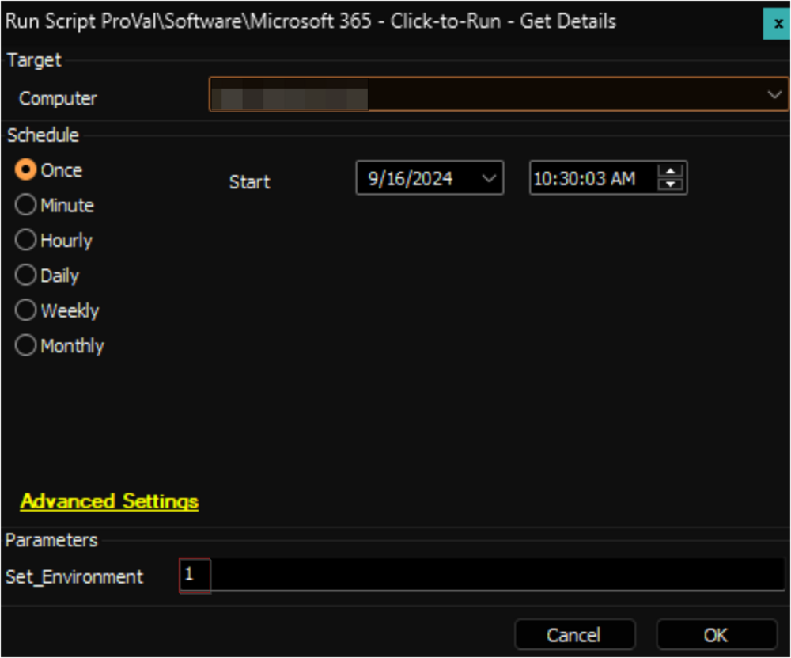

## Purpose

This solution aims to acquire the Click-to-Run Configuration on a Windows machine, initiate the necessary data retrieval scripts, and configure the Update Channel.

## Update Notice: 16 - September - 2024

**New Content:**

- **Custom Table:** [pvl_m365_update_channel_audit](<../unsorted/SWM - Software Configuration - Custom Table - pvl_m365_update_channel_audit.md>)
- **Script:** [Microsoft 365 - Click-to-Run - Set Update Channel](<../cwa/scripts/Microsoft 365 - Click-to-Run - Set Update Channel.md>)
- **Internal Monitor:** [Microsoft 365 - Click-to-Run - Set Update Channel](<../cwa/monitors/Microsoft 365 - Click-to-Run - Set Update Channel.md>)
- **Alert Template:** `△ Custom - Microsoft 365 - Click-to-Run - Set Update Channel`

**Modified Content:**

- **Script:** [Microsoft 365 - Click-to-Run - Get Details](<../cwa/scripts/Microsoft 365 - Click-to-Run - Get Details.md>)
- **Internal Monitor:** [Execute Script - Microsoft 365 - Click-to-Run - Get Details](<../cwa/monitors/Execute Script - Microsoft 365 - Click-to-Run - Get Details.md>)
- **Alert Template:** `△ Custom - Execute Script - Microsoft 365 - Click-to-Run - Get Details`
- **Dataview:** [C2R Office Version Audit](<../cwa/dataviews/C2R Office Version Audit.md>)

Update the [Microsoft 365 - Click-to-Run - Get Details](<../cwa/scripts/Microsoft 365 - Click-to-Run - Get Details.md>) script from the `ProSync` plugin and execute it against any online Windows machine with the `Set_Environment` parameter set to `1` to create the newly introduced custom table and EDFs used by the solution.

## Associated Content

### Auditing

| Content                                                                 | Type            | Function                                                                                                                                                      |
|-------------------------------------------------------------------------|-----------------|---------------------------------------------------------------------------------------------------------------------------------------------------------------|
| [Microsoft 365 - Click-to-Run - Get Details](<../cwa/scripts/Microsoft 365 - Click-to-Run - Get Details.md>) | Script          | This script retrieves the installed Click-to-Run Office version on the machine, verifies whether auto-update is enabled, and obtains the Update channel.   |
| [Execute Script - Microsoft 365 - Click-to-Run - Get Details](<../cwa/monitors/Execute Script - Microsoft 365 - Click-to-Run - Get Details.md>) | Internal Monitor | Executes the [Microsoft 365 - Click-to-Run - Get Details](<../cwa/scripts/Microsoft 365 - Click-to-Run - Get Details.md>) script once every 14 days against the agents with Managed Mode. |
| `△ Custom - Execute Script - Microsoft 365 - Click-to-Run - Get Details` | Alert Template   | Executes the [Microsoft 365 - Click-to-Run - Get Details](<../cwa/scripts/Microsoft 365 - Click-to-Run - Get Details.md>) against the agents detected by [Execute Script - Microsoft 365 - Click-to-Run - Get Details](<../cwa/monitors/Execute Script - Microsoft 365 - Click-to-Run - Get Details.md>) |
| [C2R Office Version Audit](<../cwa/dataviews/C2R Office Version Audit.md>) | Dataview        | Displays the Click-to-Run Office version, auto-update status, and Update channel obtained by [Microsoft 365 - Click-to-Run - Get Details](<../cwa/scripts/Microsoft 365 - Click-to-Run - Get Details.md>) |
| [pvl_m365_update_channel_audit](<../unsorted/SWM - Software Configuration - Custom Table - pvl_m365_update_channel_audit.md>) | Custom Table    | Stores the data fetched by the [Microsoft 365 - Click-to-Run - Get Details](<../cwa/scripts/Microsoft 365 - Click-to-Run - Get Details.md>) script                         |

### Automation

| Content                                                                 | Type            | Function                                                                                                                                                      |
|-------------------------------------------------------------------------|-----------------|---------------------------------------------------------------------------------------------------------------------------------------------------------------|
| [Microsoft 365 - Click-to-Run - Set Update Channel](<../cwa/scripts/Microsoft 365 - Click-to-Run - Set Update Channel.md>) | Script          | Makes changes in the registry to set the update channel for Microsoft 365 products to the value set in the Client or Computer level EDF `Update Channel`.   |
| [Microsoft 365 - Click-to-Run - Set Update Channel](<../cwa/monitors/Microsoft 365 - Click-to-Run - Set Update Channel.md>) | Internal Monitor | Detects computers where the Microsoft 365 update channel is different from what is set in the Client or Computer Level 'Update Channel'.                    |
| `△ Custom - Microsoft 365 - Click-to-Run - Set Update Channel`         | Alert Template   | Executes the [Microsoft 365 - Click-to-Run - Set Update Channel](<../cwa/scripts/Microsoft 365 - Click-to-Run - Set Update Channel.md>) script against the machines detected by the [Microsoft 365 - Click-to-Run - Set Update Channel](<../cwa/monitors/Microsoft 365 - Click-to-Run - Set Update Channel.md>) internal monitor. |

## Implementation

### Auditing

1. Import the following content from the `ProSync` plugin:
   - [Script - Microsoft 365 - Click-to-Run - Get Details](<../cwa/scripts/Microsoft 365 - Click-to-Run - Get Details.md>)
   - [Internal Monitor - Execute Script - Microsoft 365 - Click-to-Run - Get Details](<../cwa/monitors/Execute Script - Microsoft 365 - Click-to-Run - Get Details.md>)
   - [Dataview - C2R Office Version Audit](<../cwa/dataviews/C2R Office Version Audit.md>)
   - Alert Template - `△ Custom - Execute Script - Microsoft 365 - Click-to-Run - Get Details`

2. Reload the system cache:
   

3. Execute the script [Microsoft 365 - Click-to-Run - Get Details](<../cwa/scripts/Microsoft 365 - Click-to-Run - Get Details.md>) against any online Windows machine with the `Set_Environment` parameter set to `1` to create the custom table and EDFs used by the solution.
   

4. Configure the solution as outlined below:
   - Navigate to Automation → Monitors within the CWA Control Center and set up the following:
     - [Internal Monitor - Execute Script - Microsoft 365 - Click-to-Run - Get Details](<../cwa/monitors/Execute Script - Microsoft 365 - Click-to-Run - Get Details.md>)
       - Right-click and Run Now to start the monitor
       - Set up with `△ Custom - Execute Script - Microsoft 365 - Click-to-Run - Get Details` Alert Template

### Automation

Confirm with a consultant before enabling the Automation.

1. Import the following content from the `ProSync` plugin:
   - [Script - Microsoft 365 - Click-to-Run - Set Update Channel](<../cwa/scripts/Microsoft 365 - Click-to-Run - Set Update Channel.md>)
   - [Internal Monitor - Microsoft 365 - Click-to-Run - Set Update Channel](<../cwa/monitors/Microsoft 365 - Click-to-Run - Set Update Channel.md>)
   - `△ Custom - Microsoft 365 - Click-to-Run - Set Update Channel`

2. Reload the system cache:
   

3. Configure the solution as outlined below:
   - Navigate to Automation → Monitors within the CWA Control Center and set up the following:
     - [Internal Monitor - Microsoft 365 - Click-to-Run - Set Update Channel](<../cwa/monitors/Microsoft 365 - Click-to-Run - Set Update Channel.md>)
       - Set up with `△ Custom - Microsoft 365 - Click-to-Run - Set Update Channel` Alert Template
       - Right-click and Run Now to start the monitor

4. Set the appropriate value for the Client or Computer Level EDF [Update Channel](https://proval.itglue.com/5078775/docs/17164646#version=published&documentMode=edit:~:text=Run%20%2D%20Get%20Details-,Client%20Level%20EDF,-Name) to initiate the Automation.

## Deprecated Content

- **Script:** [Microsoft 365 - Update Channel - Set - Current](<../cwa/scripts/Microsoft 365 - Set Update Channel - Current.md>)
- **Script:** [Microsoft 365 - Update Channel - Set - Monthly Enterprise](<../cwa/scripts/Microsoft 365 - Set Update Channel - Monthly Enterprise.md>)
- **Internal Monitor:** [ProVal - Production - Execute Script - Update Channel - Set - Current Channel](<../cwa/monitors/Execute Script - Update Channel - Set - Current Channel.md>)
- **Internal Monitor:** [ProVal - Production - Execute Script - Update Channel - Set - Monthly Enterprise](<../cwa/monitors/Execute Script - Update Channel - Set - Monthly Enterprise.md>)
- **Alert Template:** `△ Custom - Execute Script - Microsoft 365 - Update Channel - Set - Current`
- **Alert Template:** `△ Custom - Execute Script - Microsoft 365 - Update Channel - Set - Monthly Enterprise`

