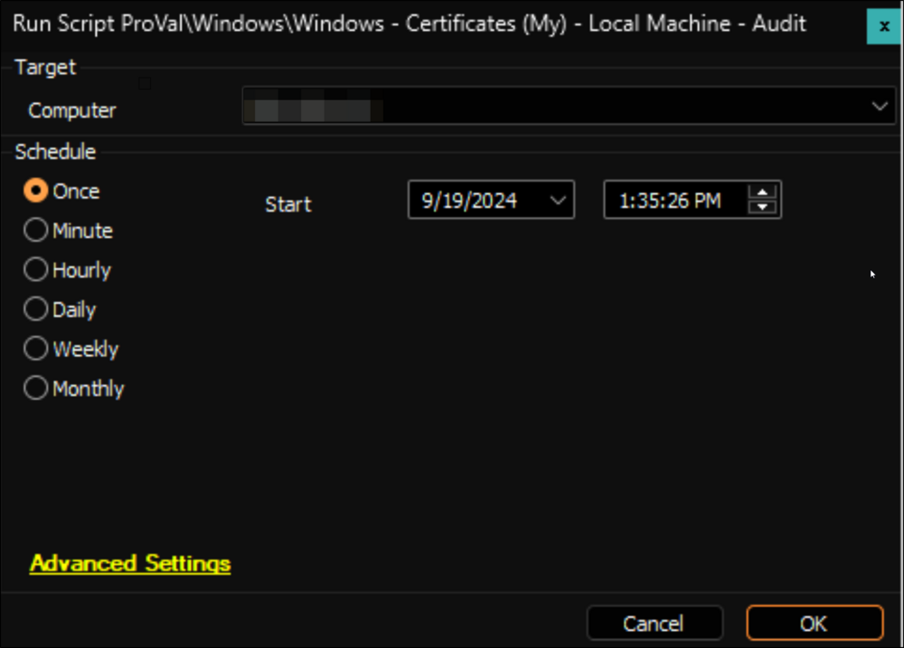
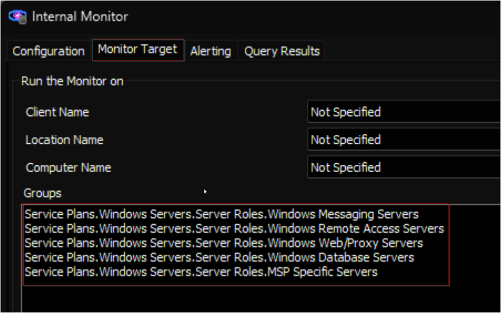

## Purpose

The purpose of this solution is to pull certificate information that is meaningful into automate to be monitored, reported on, or stored for periodic checkups in a dataview.

## Update Notice 19-Sept-2024

**New Content:**
- Internal Monitor: [ProVal - Production - Local Machine Certificate Audit](https://proval.itglue.com/DOC-5078775-17232926)
- Alert Template: △ Custom - Local Machine Certificate Audit

**Modified Content:**
- Script: [Windows - Certificates (My) - Local Machine - Audit](https://proval.itglue.com/DOC-5078775-9256568)
- Dataview: [SSL Certificate Audit [Script]](https://proval.itglue.com/DOC-5078775-9382198)
- Internal Monitor: [ProVal - Production - Certificate Expiration \< 30 Days](https://proval.itglue.com/DOC-5078775-9256567)

**Modifications:**
- The [Windows - Certificates (My) - Local Machine - Audit](https://proval.itglue.com/DOC-5078775-9256568) script is modified to use the Shell function instead of the `Execute PowerShell` function, as Threatlocker was flagging it.
- With the introduction of the [ProVal - Production - Local Machine Certificate Audit](https://proval.itglue.com/DOC-5078775-17232926) internal monitor the [Windows - Certificates (My) - Local Machine - Audit](https://proval.itglue.com/DOC-5078775-9256568) script doesn't have to be scheduled against the group anymore.

**Note:**
- It is suggested to use the [Local Machine Certificate Audit](https://proval.itglue.com/DOC-5078775-17232926) internal monitor to execute the script instead of scheduling it against groups.

## Associated Content

### Auditing

| Content | Type | Function |
|---------|------|----------|
| [Certificates (My) - Local Machine - Audit](https://proval.itglue.com/DOC-5078775-9256568) | Script | Gathers/sorts/imports SSL Certificate information into a custom table in the DB. |
| [plugin_proval_certs](https://proval.itglue.com/DOC-5078775-9262931) | Custom Table | Custom table made to hold the SSL Certificate information. |
| [Local Machine Certificate Audit](https://proval.itglue.com/DOC-5078775-17232926) | Internal Monitor | Detects the computers where [Certificates (My) - Local Machine - Audit](https://proval.itglue.com/DOC-5078775-9256568) has not been executed in the past 7 days. |
| △ Custom - Local Machine Certificate Audit | Alert Template | Execute [Certificates (My) - Local Machine - Audit](https://proval.itglue.com/DOC-5078775-9256568) script against the computers detected by the [Local Machine Certificate Audit](https://proval.itglue.com/DOC-5078775-17232926) internal monitor. |
| [SSL Certificate Audit](https://proval.itglue.com/DOC-5078775-9382198) | Dataview | Displays a Comprehensive list of all certificates found with Expiration Status. |

### Alerting

| Content | Type | Function |
|---------|------|----------|
| [Certificate Expiration \< 30 Days](https://proval.itglue.com/DOC-5078775-9256567) | Internal Monitor | This monitor looks at the [plugin_proval_certs](https://proval.itglue.com/DOC-5078775-9262931) table for any SSL certs that have an expiration date of less than 30 days. |
| [Ticket Creation - Computer](https://proval.itglue.com/DOC-5078775-9098338) | Script | Creates a ticket using the alerting info in the monitor. Adds more detailed information to the ticket. |
| △ Custom - Ticket Creation - Computer | Alert Template | Executes [Ticket Creation - Computer](https://proval.itglue.com/DOC-5078775-9098338) script |

## Implementation

1. Import/Update the following content using the `Prosync` plugin:  
   **For Auditing Only:**
   - [Script - Certificates (My) - Local Machine - Audit](https://proval.itglue.com/DOC-5078775-9256568)
   - [Internal Monitor - Local Machine Certificate Audit](https://proval.itglue.com/DOC-5078775-17232926)
   - [Dataview - SSL Certificate Audit](https://proval.itglue.com/DOC-5078775-9382198)
   - Alert Template - △ Custom - Local Machine Certificate Audit

   **For Alerting:**
   - [Internal Monitor - Certificate Expiration \< 30 Days](https://proval.itglue.com/DOC-5078775-9256567)
   - [Script - Ticket Creation - Computer](https://proval.itglue.com/DOC-5078775-9098338)
   - Alert Template - △ Custom - Ticket Creation - Computer

2. Reload the system cache:  
   

3. Execute the [Certificates (My) - Local Machine - Audit](https://proval.itglue.com/DOC-5078775-9256568) script against any online Windows computer to create the [plugin_proval_certs](https://proval.itglue.com/DOC-5078775-9262931) custom table.  
   

4. Skip this step for new implementation.  
   Run this SQL query from a RAWSQL monitor set to remove the script's schedule:  
   ```
   DELETE FROM groupscripts WHERE scriptid = (SELECT scriptid FROM lt_scripts WHERE scriptGUID = '4f7fd3ff-3732-11e9-b7e5-005056a614c6')
   ```

5. Configure the auditing solution as outlined below:  
   Navigate to Automation → Monitors within the CWA Control Center and setup the following:
   - [Internal Monitor - Local Machine Certificate Audit](https://proval.itglue.com/DOC-5078775-17232926)  
     - `Alert Template: △ Custom - Local Machine Certificate Audit`
     - The monitor should be targeting the following groups:
       - Service Plans.Windows Servers.Server Roles.Windows Messaging Servers
       - Service Plans.Windows Servers.Server Roles.Windows Remote Access Servers
       - Service Plans.Windows Servers.Server Roles.Windows Web/Proxy Servers
       - Service Plans.Windows Servers.Server Roles.Windows Database Servers
       - Service Plans.Windows Servers.Server Roles.MSP Specific Servers  
       
     - Right-click and Run Now to start the monitor

### If Requested

6. Please ensure that the alerting solution is implemented only after the consultant has confirmed it.  
   Configure the alerting solution as outlined below:  
   Navigate to Automation → Monitors within the CWA Control Center and setup the following:
   - [Internal Monitor - Certificate Expiration \< 30 Days](https://proval.itglue.com/DOC-5078775-9256567)  
     - `Alert Template: △ Custom - Ticket Creation - Computer`
     - Right-click and Run Now to start the monitor


