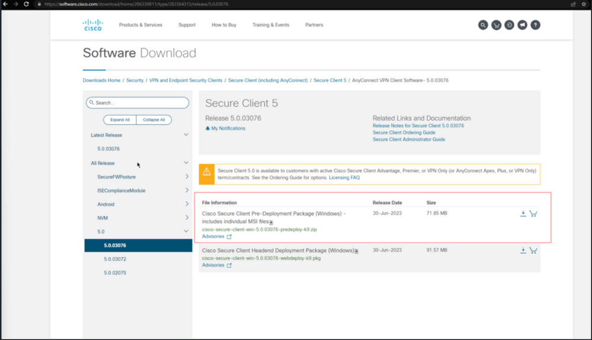
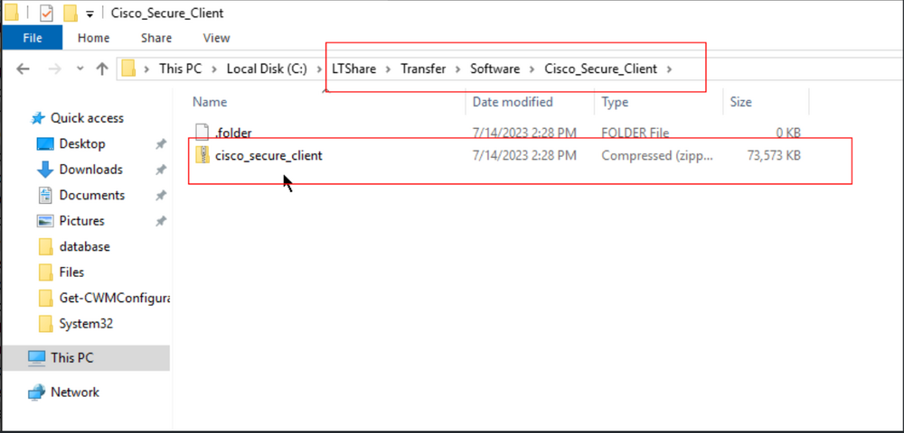

## Purpose

This document outlines the installation process for the Cisco Secure Client and selected modules for both Windows and Macintosh operating systems.

## Associated Content

| Content                                                                                                   | Type              | Function                                                                                                   |
|-----------------------------------------------------------------------------------------------------------|-------------------|------------------------------------------------------------------------------------------------------------|
| [Agnostic - Install-CiscoSecureClient](<../powershell/Install-CiscoSecureClient.md>)                  | Agnostic Script    | Installs the Cisco Secure Client and selected modules.                                                    |
| [Script - Cisco Secure Client - Package Installation [Wrapper]](<../cwa/scripts/Cisco Secure Client - Package Installation Wrapper.md>) | Wrapper Script     | This is a wrapper script that executes the [Script - Cisco Secure Client - Package Installation [Windows]](<../cwa/scripts/Cisco Secure Client - Package Installation Windows.md>) for Windows machines and the [Script - Cisco Secure Client - Package Installation [Macintosh]](<../cwa/scripts/Cisco Secure Client - Package Installation Macintosh.md>) for Mac machines. It was designed to be used as an autofix with the [Internal Monitor - Missing Cisco Secure Client Modules](<../cwa/monitors/Missing Cisco Secure Client Modules.md>). |
| [Script - Cisco Secure Client - Package Installation [Windows]](<../cwa/scripts/Cisco Secure Client - Package Installation Windows.md>) | Script            | Installs the Cisco Secure Client and selected modules on Windows machines.                             |
| [Script - Cisco Secure Client - Package Installation [Macintosh]](<../cwa/scripts/Cisco Secure Client - Package Installation Macintosh.md>) | Script            | Provides an option to install different Cisco Secure Client modules on a Mac machine.                     |
| [Internal Monitor - Missing Cisco Secure Client Modules](<../cwa/monitors/Missing Cisco Secure Client Modules.md>) | Internal Monitor   | The internal monitor executes the `Cisco Secure Client - Package Installation [Wrapper]` script hourly on online machines where Cisco Secure Client's EDFs (For Module Installation) are selected, but selected modules are not installed for Windows and Mac machines. |
| `△ Custom - Execute Script - Cisco Secure Client - Package Installation [Wrapper]`                       | Alert Template     | This alert template executes [Script - Cisco Secure Client - Package Installation [Wrapper]](<../cwa/scripts/Cisco Secure Client - Package Installation Wrapper.md>). |

## Implementation

1. Import the following script using the ProSync plugin:
   - [Script - Cisco Secure Client - Package Installation [Wrapper]](<../cwa/scripts/Cisco Secure Client - Package Installation Wrapper.md>) 
     - This will import both of the following scripts:
       - [Script - Cisco Secure Client - Package Installation [Windows]](<../cwa/scripts/Cisco Secure Client - Package Installation Windows.md>)
       - [Script - Cisco Secure Client - Package Installation [Macintosh]](<../cwa/scripts/Cisco Secure Client - Package Installation Macintosh.md>)

2. Import the following monitor using the ProSync plugin:
   - [Internal Monitor - Agent - Missing Cisco Secure Client Modules](<../cwa/monitors/Missing Cisco Secure Client Modules.md>)

3. Import the following Alert Templates using the ProSync plugin:
   - `△ Custom - Execute Script - Cisco Secure Client - Package Installation [Wrapper]`

4. Reload the System Cache  
   

5. Configure the Windows Installation Script as outlined below:
   - Go to Ltshare (WebDAV for hosted partners) and create `LTShare/Transfer/Software/Cisco_Secure_Client` if it doesn't already exist.
   - Go to [Software Download - Cisco Systems](https://software.cisco.com/download/home/286330811/type/282364313/release/5.1.3.62)
   - Download the latest version of `Cisco Secure Client Pre-Deployment Package (Windows) - includes individual MSI files` and place it in LTShare (WebDAV for hosted partners) at `LTShare/Transfer/Software/Cisco_Secure_Client` as `Cisco_Secure_Client.zip`.  
       
     
   - Navigate to Automation → Scripts to perform the following task:
     - Open [SWM - Software Install - Script - Cisco Secure Client - Package Installation [Windows]](<../cwa/scripts/Cisco Secure Client - Package Installation Windows.md>) and debug it against any machine with "Set Environment" = 1 to create all the EDFs.

6. Configure the Macintosh Installation Script as outlined below:
   - Go to Ltshare (WebDAV for hosted partners) and create `LTShare/Transfer/Software/Cisco_Secure_Client` if it doesn't already exist.
   - Go to [Software Download - Cisco Systems](https://software.cisco.com/download/home/286330811/type/282364313/release/5.1.3.62)
   - Download the latest version of `Cisco Secure Client Pre-Deployment Package (Mac OS)` and place it in LTShare (WebDAV for hosted partners) at `LTShare/Transfer/Software/Cisco_Secure_Client` as `Cisco_Secure_Client.dmg`.  
       
     
   - Navigate to Automation → Scripts to perform the following task:
     - Open [SWM - Software Install - Script - Cisco Secure Client - Package Installation [Macintosh]](<../cwa/scripts/Cisco Secure Client - Package Installation Macintosh.md>) and debug it against any machine with "Set Environment" = 1 to create all EDFs.

7. Navigate to Automation → Monitors within the CWA Control Center.
   - [Internal Monitor - Missing Cisco Secure Client Modules](<../cwa/monitors/Missing Cisco Secure Client Modules.md>) 
     - Configure with the alert template: `△ Custom - Execute Script - Cisco Secure Client - Package Installation [Wrapper]`
     - Right-click and Run Now to start the monitor.

8. Work with the partner on the Cisco Secure Client modules they would like to install for both Mac and Windows. Set the Cisco Secure Client EDFs accordingly. For more information on these modules and EDFs, refer to [Script - Cisco Secure Client - Package Installation [Macintosh]](<../cwa/scripts/Cisco Secure Client - Package Installation Macintosh.md>) and [Script - Cisco Secure Client - Package Installation [Windows]](<../cwa/scripts/Cisco Secure Client - Package Installation Windows.md>).
