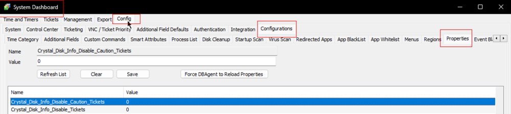

## Purpose

The purpose of the content is to monitor the disk health of the physical machines using the [crystal disk info tool](https://crystalmark.info/en/software/crystaldiskinfo/).

**Note:** If you have installed the solution before **`2023-07-21`** then you'll need to update it to the latest version and run the script once against any online physical Windows machine to create the system properties and configure them as needed. Refer to the [Script's](https://proval.itglue.com/DOC-5078775-12960045) document for more information on the system properties.

## Associated Content

| Content                                                                                 | Type                | Function                                                                                          |
|-----------------------------------------------------------------------------------------|---------------------|---------------------------------------------------------------------------------------------------|
| [Agnostic - Get-CrystalDiskInfo](https://proval.itglue.com/DOC-5078775-12918412)      | Agnostic Scripts     | Executes the tool on the end machine and returns the result into an object.                     |
| [Script - Crystal Disk Info Report](https://proval.itglue.com/DOC-5078775-12960045)   | Script               | Executes the agnostic script on the end machines and fetches the data into Automate. Also creates a ticket for computers with unhealthy disks. |
| [Custom Table - pvl_crystal_disk_info](https://proval.itglue.com/DOC-5078775-12960038)| Custom Table        | Stores the data fetched by the script.                                                            |
| [Dataview - Crystal Disk Info Report](https://proval.itglue.com/DOC-5078775-12960042) | Dataview            | Displays the data stored in the Custom Table.                                                   |
| [Internal Monitor - Execute Script - Crystal Disk Info Report](https://proval.itglue.com/DOC-5078775-12960044) | Internal Monitor     | Executes the script once per week against the supported Windows machines.                        |
| △ CUSTOM - Execute Script - Crystal Disk Info Report                                    | Alert Template      | Executes the script against the machines detected by the alert template.                        |

## Implementation

- Read all the associated/related documents carefully to fully understand the working of the solution.
- **Before moving forward, rip out all the contents related to the [EPM - Disk - Solution - Disk - Critical Data](https://proval.itglue.com/DOC-5078775-12662585) solution from the environment.**
- Import the [EPM - Disk - Script - Crystal Disk Info Report](https://proval.itglue.com/DOC-5078775-12960045) script.
- Execute the script against an online physical Windows machine with PowerShell v5 to create the [EPM - Disk - Custom Table - pvl_crystal_disk_info](https://proval.itglue.com/DOC-5078775-12960038) table.
- Execute the script "[MySQL - Permission - Set Custom Table Permissions](https://proval.itglue.com/5078775/docs/8056027)" (Make sure this script is updated).
- Import the [EPM - Disk - Dataview - Crystal Disk Info Report](https://proval.itglue.com/DOC-5078775-12960042) dataview.
- Ensure that the dataview is displaying the data for the computer you just executed the script upon.
- Import the [EPM - Disk - Internal Monitor - Execute Script - Crystal Disk Info Report](https://proval.itglue.com/DOC-5078775-12960044) internal monitor.
- Create/Import the `△ CUSTOM - Execute Script - Crystal Disk Info Report` alert template.
- Ensure that the template is executing the [EPM - Disk - Script - Crystal Disk Info Report](https://proval.itglue.com/DOC-5078775-12960045) script on failure.
- Set the monitor set to the concerned groups.
- Apply the alert template to the monitor set and ensure that the solution is working as desired.
- Set the required values for the system properties `Crystal_Disk_Info_Disable_Caution_Tickets` and `Crystal_Disk_Info_Disable_Tickets`. Refer to the [Script's](https://proval.itglue.com/DOC-5078775-12960045) document for more information on the system properties.

## FAQ

**Q**: Why is the script not gathering any information for some servers, even running the tool manually returns `Disk Not Found`?  
**A**: `It's quite possible that the server's disk is not supported by the tool itself.`

- `CrystalDiskInfo supports only IDE (Parallel ATA) and Serial ATA disks connected internal ATA controller (Chipset included).`
- `CrystalDiskInfo supports a part of USB-HDD.`
- `CrystalDiskInfo does not support RAID disks and IDE (Parallel ATA) and Serial ATA disks connected external ATA controller.`

Reference: [Crystal Disk Info FAQ](https://crystalmark.info/en/software/crystaldiskinfo/crystaldiskinfo-faq/)

