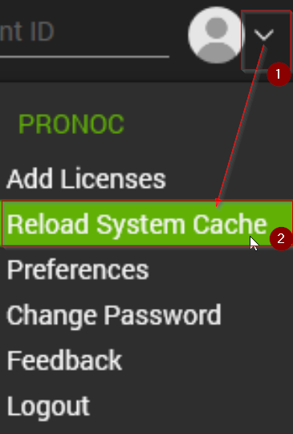

## Purpose

Execute the [Dell Command | Update CLI commands](https://www.dell.com/support/manuals/en-us/command-update/dellcommandupdate_rg/dell-command-%7C-update-cli-commands?guid=guid-92619086-5f7c-4a05-bce2-0d560c15e8ed&lang=en-us) against the Dell Workstations and display the result at one place.

## Associated Content

| Content                                                                                                                                                  | Type            | Function                                                                                                                                                                                                                                                                                                                                                                                                                                                                                                          |
|----------------------------------------------------------------------------------------------------------------------------------------------------------|-----------------|-------------------------------------------------------------------------------------------------------------------------------------------------------------------------------------------------------------------------------------------------------------------------------------------------------------------------------------------------------------------------------------------------------------------------------------------------------------------------------------------------------------------|
| [Internal Monitor - ProVal - Production - Dell Command Update Handler - Run Scan Command](https://proval.itglue.com/DOC-5078775-11434139)             | Internal Monitor | Detect the dell workstations running windows 10 or 11, where [Script - Dell Command Update - Install/Upgrade + Command Handler](https://proval.itglue.com/DOC-5078775-11434138) script had not executed once in a week.                                                                                                                                                                                                                                                                                      |
| △ Custom - Execute Script - Dell Command Update Handler [Scan]                                                                                         | Alert Template   | Execute the [Script - Dell Command Update - Install/Upgrade + Command Handler](https://proval.itglue.com/DOC-5078775-11434138) script against the machines detected by [Monitor - ProVal - Development - Dell Command Update Handler - Run Scan Command](https://proval.itglue.com/DOC-5078775-11434139) monitor set.                                                                                                                                                                                    |
| [Script - Dell Command Update - Install/Upgrade + Command Handler](https://proval.itglue.com/DOC-5078775-11434138)                                   | Script           | The "Dell Command | Update" application is used by this script to carry out commands on Dell Workstations. If the application isn't already installed, it will do it. If a version older than 4.3 is already present, it will upgrade the application to v4.6. Since only versions 4.3 and up support the "Dell Command | Update" commands.                                                                                                                                                          |
| [Dataview - Dell Command Update Handler - Audit [Script]](https://proval.itglue.com/DOC-5078775-11434140)                                            | Dataview        | Displays the last execution result of [Script - Dell Command Update - Install/Upgrade + Command Handler](https://proval.itglue.com/DOC-5078775-11434138) script for the Dell Workstations.                                                                                                                                                                                                                                                                                                                      |

## Implementation

1. Import the following Content using the ProSync Plugin:
   - [Script - Dell Command Update - Install/Upgrade + Command Handler](https://proval.itglue.com/DOC-5078775-11434138)
   - [Dataview - Dell Command Update Handler - Audit [Script]](https://proval.itglue.com/DOC-5078775-11434140)
   - [Internal Monitor - ProVal - Production - Dell Command Update Handler - Run Scan Command](https://proval.itglue.com/DOC-5078775-11434139)
   - Alert Template - `△ Custom - Execute Script - Dell Command Update Handler [Scan]`

2. Reload System Cache  
   

3. Setup the [Internal Monitor - ProVal - Production - Dell Command Update Handler - Run Scan Command](https://proval.itglue.com/DOC-5078775-11434139) with the following Alert Template:
   - `△ Custom - Execute Script - Dell Command Update Handler [Scan]`
   - Right-Click the monitor and hit 'Run Now and Reset Monitor' to start the auditing process.

**Note:** The systems must be compatible with the installation of Dell Command Update. For further details on compatible systems, please visit the compatible systems section of the below link:  
[Dell Command | Update Windows Universal Application | Driver Details | Dell US](https://www.dell.com/support/home/en-us/drivers/DriversDetails?driverId=0XNVX)

