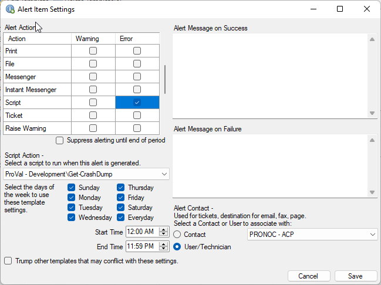
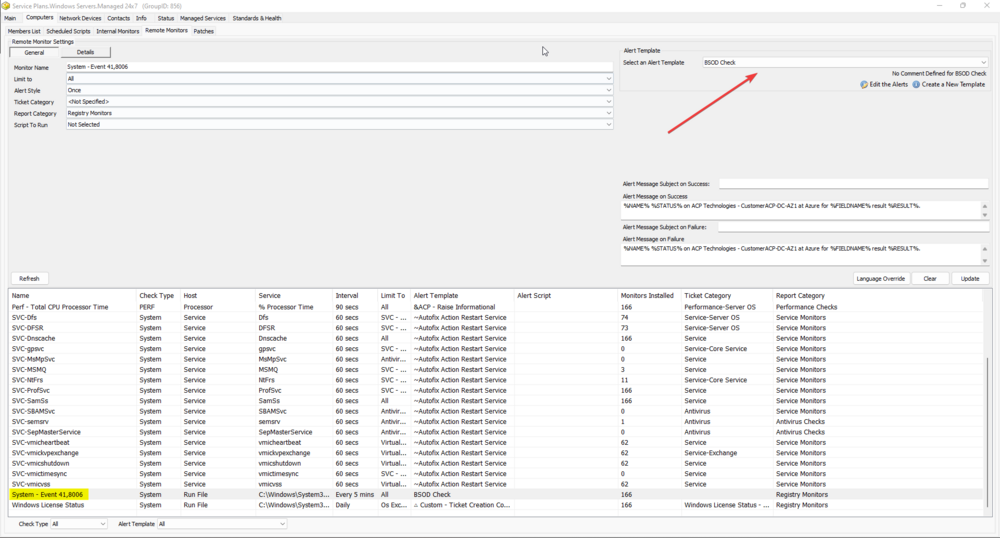

## Purpose

The Unexpected Restart Monitor generates a lot of noise, as often the shutdown is caused by a power outage rather than an actionable issue. This solution will provide a second level of verification to help reduce notifications of unexpected shutdowns due to normal power issues.

## Associated Content

| Content                                                                                                   | Type     | Function                                                                                                 |
|-----------------------------------------------------------------------------------------------------------|----------|----------------------------------------------------------------------------------------------------------|
| [EPM - Data Collection - Script - Remote Event Log Monitor - Create](<../cwa/scripts/Remote Event Log Monitor - Create.md>) | Script   | You will use this script to create a remote monitor to look for System events with an ID of 41 or 6008. |
| [EPM - Data Collection - Script - Get-CrashDump](<../cwa/scripts/Get-CrashDump.md>)          | Script   | Gathers the data from a DMP file that should have been created after a bluescreen issue.                |
| [SWM - Software Management - Powershell - Invoke-WingetProcessor](<../powershell/Invoke-WingetProcessor.md>) | Agnostic | Used by Winget - Install to install Winget packages.                                                    |
| [SWM - Software Installation - Script - Winget - Install](<../cwa/scripts/Winget - InstallUpdate.md>) | Script   | Uses an agnostic script to install BluescreenView.                                                     |
| [EPM - Data Collection - Custom Table - plugin_proval_crash_dumps](<../cwa/tables/plugin_proval_crash_dumps.md>) | Custom Table | Stores crash dump data, saving the last dump per computer.                                            |

## Implementation

### Initial Monitor Setup

1. Look through your Automate groups and find the ID of the group you wish to monitor for bluescreens.
2. Using any computer, run the [EPM - Data Collection - Script - Remote Event Log Monitor - Create](<../cwa/scripts/Remote Event Log Monitor - Create.md>) script with the `groupId` set to that ID, the `logtype` set to System, and the `eventid` set to 41,6008.
3. Import the [EPM - Data Collection - Script - Get-CrashDump](<../cwa/scripts/Get-CrashDump.md>) script.

### Alert Template Setup

1. Select Automation / Templates / Alert Templates.
2. Click New Template and name your template.
3. Click Add Alerts, then in the next box click New Alert.
4. In the Alert Actions section, select the box for Script Error.
5. In the script selection box, select the Get-CrashDump script.
6. In the Days of the Week, select Every Day.
7. Select the appropriate User/Technician.
8. Click Save.
9. Click Save and Close.

### Adding the Alert to the Monitor

1. Open the group you selected earlier.
2. Select Computers.
3. Select Remote Monitors.
4. Look for a monitor named System - Event 41,8006 and click on it once.
5. Modify the Alert Template to be the template you created in the prior step.

## FAQ

