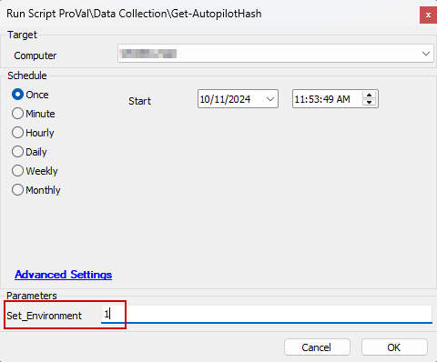

## Purpose

The purpose of this solution is to collect the Hardware Hash for autopilot device registration.

## Associated Content

| Content                                                                                                               | Type           | Function                                           |
|-----------------------------------------------------------------------------------------------------------------------|----------------|----------------------------------------------------|
| [CWA - Script - Get-AutopilotHash](<../cwa/scripts/Get-AutopilotHash.md>)                                         | Script         | Gather agents' Hardware Hash.                       |
| [CWA - Internal Monitor - ProVal - Production - Get - Autopilot Hash](<../cwa/monitors/Get - Autopilot Hash.md>) | Internal Monitor | Detects Windows agents missing Hardware Hash       |
| `△ Custom - Execute Script - Get-AutopilotHash`                                                                     | Alert Template | Execute the script [CWA - Script - Get-AutopilotHash](<../cwa/scripts/Get-AutopilotHash.md>) against the machines detected by the internal monitor. |
| [CWA - Automate - Dataview - Autopilot Hash](<../cwa/dataviews/Autopilot Hash.md>)                                 | Dataview       | Displays the Hardware Hash details of Windows agents. |

## Implementation

1. Import the following content using the ProSync Plugin:
   - [CWA - Script - Get-AutopilotHash](<../cwa/scripts/Get-AutopilotHash.md>)
   - [CWA - Internal Monitor - ProVal - Production - Get - Autopilot Hash](<../cwa/monitors/Get - Autopilot Hash.md>)
   - [CWA - Automate - Dataview - Autopilot Hash](<../cwa/dataviews/Autopilot Hash.md>)
   - `△ Custom - Execute Script - Get-AutopilotHash`

2. Reload the system cache:
   

3. Run the [Script - Get-AutopilotHash](<../cwa/scripts/Get-AutopilotHash.md>) against any machine with the Set_Environment parameter set to '1':
   

4. Configure the solution as outlined below:
   - Navigate to Automation → Monitors within the CWA Control Center and set up the following:
     - [CWA - Internal Monitor - ProVal - Production - Get - Autopilot Hash](<../cwa/monitors/Get - Autopilot Hash.md>)
       - `△ Custom - Execute Script - Get-AutopilotHash`
       - Right-click and Run Now to start the monitor.
