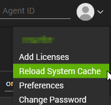
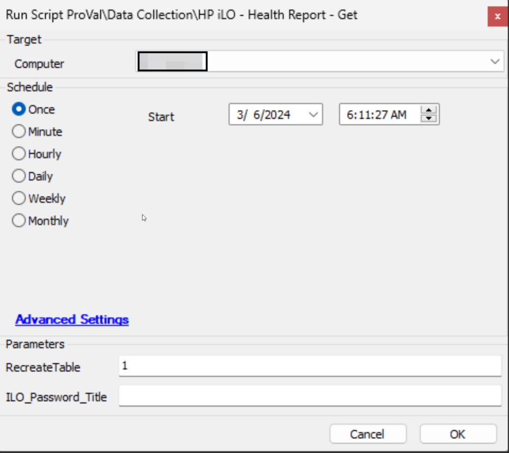

## Purpose

To gather information about and monitor the health status of HP iLO devices.

## Associated Content

#### Auditing

| Content                                                                                                     | Type            | Function                                                                                                              |
|-------------------------------------------------------------------------------------------------------------|-----------------|-----------------------------------------------------------------------------------------------------------------------|
| [Dataview - HP iLO Health Report](<../cwa/dataviews/HP iLO Health Report.md>)                            | Dataview        | Displays information gathered by the [HP iLO - Health Report - Get](<../cwa/scripts/HP iLO - Health Report - Get.md>) script. |
| [Script - HP iLO - Health Report - Get](<../cwa/scripts/HP iLO - Health Report - Get.md>)                | Script          | Calls the agnostic script and formats the data for SQL.                                                               |
| [Internal Monitor - Execute Script - HP iLO - Health Report - Get](<../cwa/monitors/Execute Script - HP iLO - Health Report - Get.md>) | Internal Monitor | Executes the [HP iLO - Health Report - Get](<../cwa/scripts/HP iLO - Health Report - Get.md>) script against the relevant computers to keep the dataview up-to-date. |
| △ CUSTOM - Execute Script - HP iLO - Health Report - Get                                                  | Alert Template   | Executes the script on the machines detected by the internal monitor.                                               |
| [Dataview - HP iLO Checks Not Running](<../cwa/dataviews/HP iLO Checks Not Running.md>)                  | Dataview        | Lists the password entries for which the HP iLO Health Check automation is not running properly.                    |

#### Automation

| Content                                                                                                     | Type               | Function                                                                                                              |
|-------------------------------------------------------------------------------------------------------------|--------------------|-----------------------------------------------------------------------------------------------------------------------|
| [Monitor - HP iLO Health Report Check](<../cwa/monitors/HP iLO Health Report Check.md>)                   | Internal Monitor    | Monitors for bad health status information stored in the [plugin_proval_ilo_health_report](<../cwa/tables/plugin_proval_ilo_health_report.md>) custom table. |
| [Script - Ticket Creation - HP iLO Health Check*](<../cwa/scripts/Ticket Creation - HP iLO Health Check.md>) | Script              | Manages ticketing for the [HP iLO Health Report Check](<../cwa/monitors/HP iLO Health Report Check.md>) monitor set.  |
| △ Custom - Ticket Creation - HP iLO Health Check                                                          | Alert Template      | Executes the script on the machines detected by the internal monitor.                                              |

#### Optional

| Content                                                                                                     | Type               | Function                                                                                                              |
|-------------------------------------------------------------------------------------------------------------|--------------------|-----------------------------------------------------------------------------------------------------------------------|
| [Script - HP iLO Credential Missing Detection](<../cwa/scripts/HP iLO Credential Missing Detection.md>)    | Client Script       | Creates a ticket for all clients that have an HP Server and have HP iLO enabled but the credentials are missing.   |
| [Dataview - HP iLO - Potentially Missing Credential](<../cwa/dataviews/HP iLO - Potentially Missing Credential.md>) | Dataview            | Displays the clients/servers for which the [HP iLO Credential Missing Detection](<../cwa/scripts/HP iLO Credential Missing Detection.md>) will create a ticket. |

#### Other

| Content                                                                                                     | Type               | Function                                                                                                              |
|-------------------------------------------------------------------------------------------------------------|--------------------|-----------------------------------------------------------------------------------------------------------------------|
| [plugin_proval_ilo_health_report](<../cwa/tables/plugin_proval_ilo_health_report.md>)                       | Custom Table        | Stores information gathered from the [HP iLO - Health Report - Get](<../cwa/scripts/HP iLO - Health Report - Get.md>) script. |
| [Get-HPiLOHealthReport](<../powershell/Get-HPiLOHealthReport.md>)                                        | Agnostic Script      | Performs the audit of the iLO devices via PowerShell.                                                                |

## Implementation

1. Import the following scripts from the `ProSync` plugin:
   - [Script - HP iLO - Health Report - Get](<../cwa/scripts/HP iLO - Health Report - Get.md>)
   - [Script - Ticket Creation - HP iLO Health Check*](<../cwa/scripts/Ticket Creation - HP iLO Health Check.md>)
   - [Script - HP iLO Credential Missing Detection](<../cwa/scripts/HP iLO Credential Missing Detection.md>)

2. Import the following internal monitors from the `ProSync` plugin:
   - [Internal Monitor - Execute Script - HP iLO - Health Report - Get](<../cwa/monitors/Execute Script - HP iLO - Health Report - Get.md>)
   - [Monitor - HP iLO Health Report Check](<../cwa/monitors/HP iLO Health Report Check.md>)

3. Import the following alert templates from the `ProSync` plugin:
   - `△ Custom - Execute Script - HP iLO - Health Report - Get`
   - `△ Custom - Ticket Creation - HP iLO Health Check`

4. Import the following dataviews from the `ProSync` plugin:
   - [Dataview - HP iLO Health Report](<../cwa/dataviews/HP iLO Health Report.md>)
   - [Dataview - HP iLO - Potentially Missing Credential](<../cwa/dataviews/HP iLO - Potentially Missing Credential.md>)
   - [Dataview - HP iLO Checks Not Running](<../cwa/dataviews/HP iLO Checks Not Running.md>)

5. Reload the System Cache.  
   

6. Execute the [Script - HP iLO - Health Report - Get](<../cwa/scripts/HP iLO - Health Report - Get.md>) script against an online Windows machine with the `RecreateTable` parameter set to `1` to create the [plugin_proval_ilo_health_report](<../cwa/tables/plugin_proval_ilo_health_report.md>) custom table.  
   

7. Configure the client-level password entries labeled as `iLO Automation Password` for the iLO Devices to be audited. See the documentation for the internal monitor [Execute Script - HP iLO - Health Report - Get](<../cwa/monitors/Execute Script - HP iLO - Health Report - Get.md>) for more information on how to set up this password entry.

8. Configure the **Auditing** content as follows:  
   - Navigate to Automation > Monitors > Internal Monitors
     - [Internal Monitor - Execute Script - HP iLO - Health Report - Get](<../cwa/monitors/Execute Script - HP iLO - Health Report - Get.md>)
       - Configure with the Alert Template: `△ CUSTOM - Execute Script - HP iLO - Health Report - Get`
       - Right-click and Run Now to start the monitor

9. Configure the **Automation** content as follows:  
   - Navigate to Automation > Monitors > Internal Monitors
     - [Internal Monitor - HP iLO Health Report Check](<../cwa/monitors/HP iLO Health Report Check.md>)
       - Configure with the Alert Template: `△ Custom - Ticket Creation - HP iLO Health Check`
       - Right-click and Run Now to start the monitor

10. **The Optional configuration should only be set if the partner opts in for ticket generation for HP Servers configured with HP iLO but lacking credentials in the Client-Level Password tab.**  
    Configure the **Optional** content as follows:
    - Navigate to System > Configuration > Dashboard > Management > Scheduled Client Scripts
      - Schedule the [HP iLO Credential Missing Detection](<../cwa/scripts/HP iLO Credential Missing Detection.md>) script to run once per week.  
      

