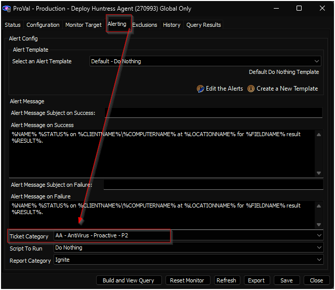

## Purpose

The solution aims to deploy and manage the Huntress Agent on both Windows and macOS machines.

## Associated Content 

#### Deployment 

| Content                                                                 | Type            | Function                                   |
|-------------------------------------------------------------------------|-----------------|--------------------------------------------|
| [Deploy Huntress Agent [Windows, Mac]](https://proval.itglue.com/DOC-5078775-16803042) | Script          | Install Huntress Agent.                   |
| [Deploy Huntress Agent](https://proval.itglue.com/DOC-5078775-16803099) | Internal Monitor | Detects the computers missing Huntress Agent. |
| △ Custom - Deploy Huntress Agent                                         | Alert Template   | Execute the script against the computer detected by the internal monitor. |

#### Management (Optional) 

| Content                                                                  | Type   | Function                                   |
|--------------------------------------------------------------------------|--------|--------------------------------------------|
| [Uninstall Huntress Agent [Windows, Mac]](https://proval.itglue.com/DOC-5078775-16803043) | Script | Uninstall Huntress Agent.                 |
| [Reinstall Huntress Agent [Windows]](https://proval.itglue.com/DOC-5078775-16803004) | Script | Reinstall Huntress Agent.                 |
| [Repair Huntress Agent [Windows]](https://proval.itglue.com/DOC-5078775-16803032) | Script | Repair Huntress Agent.                    |
| [Re-Register Huntress Agent [Windows]](https://proval.itglue.com/DOC-5078775-16803247) | Script | Re-Register Huntress Agent.               |

## Implementation 

### 1.
Import the following content using the ProSync Plugin:
- [Script - Deploy Huntress Agent [Windows, Mac]](https://proval.itglue.com/DOC-5078775-16803042) 
- [Internal Monitor - Deploy Huntress Agent](https://proval.itglue.com/DOC-5078775-16803099) 
- Alert Template - △ Custom - Deploy Huntress Agent

### 2.
Import the optional content using the ProSync Plugin if needed: 
- [Script - Uninstall Huntress Agent [Windows, Mac]](https://proval.itglue.com/DOC-5078775-16803043) 
- [Script - Reinstall Huntress Agent [Windows]](https://proval.itglue.com/DOC-5078775-16803004) 
- [Script - Repair Huntress Agent [Windows]](https://proval.itglue.com/DOC-5078775-16803032) 
- [Script - Re-Register Huntress Agent [Windows]](https://proval.itglue.com/DOC-5078775-16803247) 

### 3.
Execute the [Deploy Huntress Agent [Windows, Mac]](https://proval.itglue.com/DOC-5078775-16803042) script against any online machine with the `Set_Environment` parameter set to `1` to create the EDFs used by the solution.  

### 4.
Reload the system cache:  

### 5.
Configure the solution as outlined below:
- Navigate to Automation → Monitors within the CWA Control Center and setup the following:
  - [Internal Monitor - Deploy Huntress Agent](https://proval.itglue.com/DOC-5078775-16803099) 
    - `Alert Template - △ Custom - Deploy Huntress Agent`
    - Right-click and Run Now to start the monitor

### 6.
Confirm with the consultant before enabling ticketing by setting a ticket category for the [Deploy Huntress Agent](https://proval.itglue.com/DOC-5078775-16803099) internal monitor.  

