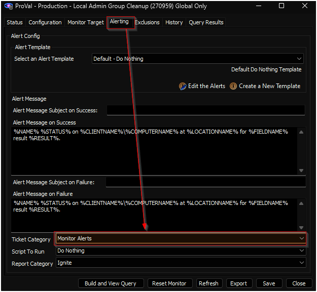

## Purpose

The purpose of the solution is to manage the members in the local admin group for the Windows machines.

## Update Notice: 27-September-2024

The solution's Extra Data Fields have been modified. Update the [Local Admin Group Cleanup - Add/Remove](https://proval.itglue.com/DOC-5078775-16783511) script from the `Prosync` plugin and run/debug against an online Windows machine with `Set_Environment` as `1` to implement the changes.

## Associated Content

| Content                                                                 | Type           | Function                                                                                                     |
|-------------------------------------------------------------------------|----------------|--------------------------------------------------------------------------------------------------------------|
| [Local Admin Group Cleanup - Add/Remove](https://proval.itglue.com/DOC-5078775-16783511) | Script         | Manage the addition and removal of members from the local admin group.                                      |
| [Local Admin Group Cleanup](https://proval.itglue.com/DOC-5078775-16783515)            | Internal Monitor | Detects Windows computers where the local admin group cleanup process is enabled, but the script has not been executed in the past 7 days. |
| △ Custom - Local Admin Group Cleanup                                     | Alert Template | Run the script against the computers detected by the internal monitor.                                      |

## Implementation

1. Import the following content using the ProSync Plugin:
   - [Script - Local Admin Group Cleanup - Add/Remove](https://proval.itglue.com/DOC-5078775-16783511)
   - [Internal Monitor - Local Admin Group Cleanup](https://proval.itglue.com/DOC-5078775-16783515)  
   - Alert Template - △ Custom - Local Admin Group Cleanup

2. Reload the system cache:  
   

3. **First Execution:** Run the script against any online Windows computer with the `Set_Environment` parameter set to `1` to create the system properties and the EDFs used by the solution.  
   

4. Configure the solution as outlined below:
   - Navigate to Automation → Monitors within the CWA Control Center and setup the following:
     - [Internal Monitor - Local Admin Group Cleanup](https://proval.itglue.com/DOC-5078775-16783515)  
       - `Alert Template: △ Custom - Local Admin Group Cleanup`
       - Right-click and Run Now to start the monitor

5. Confirm with the consultant before enabling ticketing by setting a ticket category for the [Local Admin Group Cleanup](https://proval.itglue.com/DOC-5078775-16783515) internal monitor.  
   

6. Set the appropriate values for the system properties and EDFs defined in the [script's](https://proval.itglue.com/DOC-5078775-16783511) document, which should be provided by the consultant.

