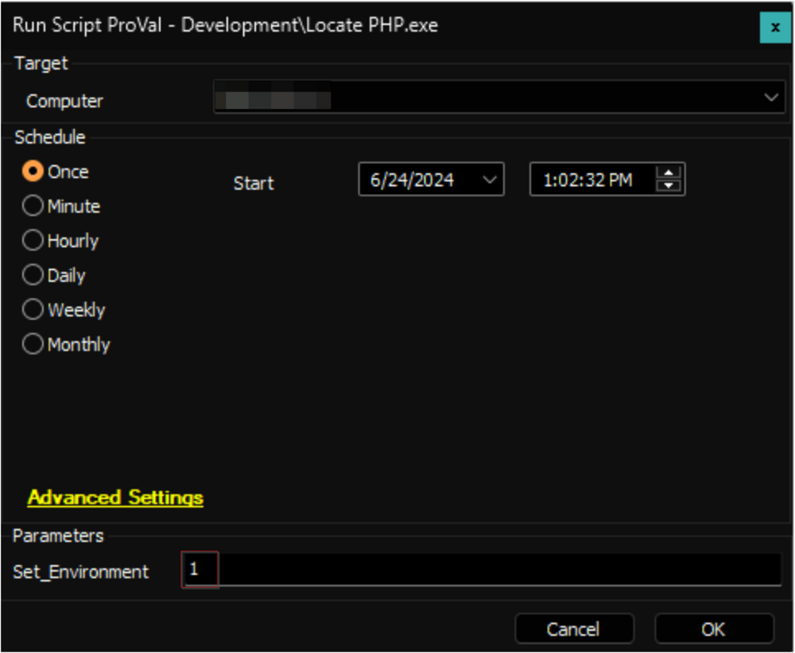
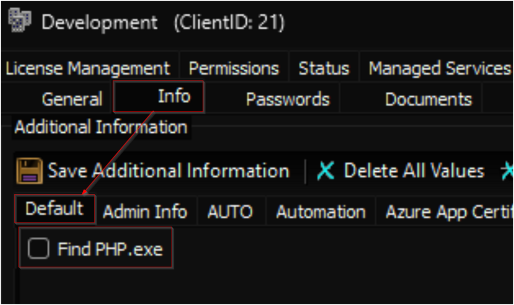

## Purpose

The goal of the solution is to identify the computers that have the PHP.exe file available.

## Associated Content

| Content                                                                 | Type           | Function        |
|-------------------------------------------------------------------------|----------------|-----------------|
| [Script - Locate PHP.exe](<../cwa/scripts/Locate PHP.exe.md>)   | Script         | Fetches data.   |
| [Custom Table - pvl_php_audit](<../cwa/tables/pvl_php_audit.md>) | Custom Table   | Stores data.    |
| [Dataview - PHP.exe File Location](<../cwa/dataviews/PHP.exe File Location.md>) | Dataview       | Displays data.  |
| [Internal Monitor - Execute Script - Locate PHP.exe](<../cwa/monitors/Execute Script - Locate PHP.exe.md>) | Internal Monitor | Detects computers. |
| △ Custom - Execute Script - Find PHP.exe                                  | Alert Template | Executes script. |

## Implementation

1. Import the following content using the ProSync Plugin:
   - [Script - Locate PHP.exe](<../cwa/scripts/Locate PHP.exe.md>)
   - [Custom Table - pvl_php_audit](<../cwa/tables/pvl_php_audit.md>)
   - [Dataview - PHP.exe File Location](<../cwa/dataviews/PHP.exe File Location.md>)
   - [Internal Monitor - Execute Script - Locate PHP.exe](<../cwa/monitors/Execute Script - Locate PHP.exe.md>)
   - Alert Template - △ Custom - Execute Script - Find PHP.exe

2. Reload the system cache:
   

3. Run the script with the `Set_Environment` parameter set to `1` after to create the [custom table](<../cwa/tables/pvl_php_audit.md>) and the EDF being used by the script.
   

4. Configure the solution as outlined below:
   - Navigate to Automation → Monitors within the CWA Control Center and setup the following:
     - [Internal Monitor - Execute Script - Locate PHP.exe](<../cwa/monitors/Execute Script - Locate PHP.exe.md>)
       - `△ Custom - Execute Script - Find PHP.exe`
       - Right-click and Run Now to start the monitor

5. Mark the `Find PHP.exe` EDF on the clients you would like to audit the information on.
   

