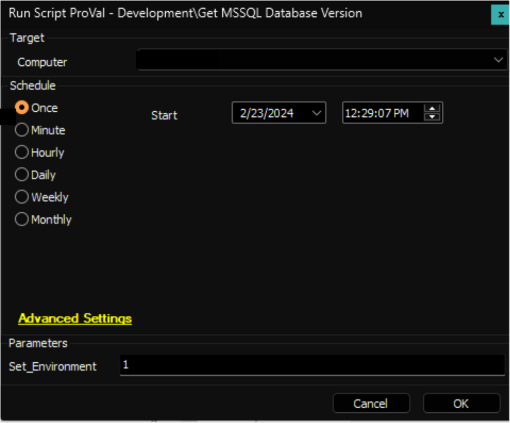

## Purpose

The objective of this solution is to centralize the retrieval of MSSQL server versions across the environment into a single location for auditing purposes.

## Associated Content

#### Auditing Content

| Content                                                                                                      | Type            | Function                                                                                                                                                                                                                             |
|--------------------------------------------------------------------------------------------------------------|-----------------|--------------------------------------------------------------------------------------------------------------------------------------------------------------------------------------------------------------------------------------|
| [Internal Monitor - Execute Script - Get MSSQL Database Version](<../cwa/monitors/Execute Script - Get MSSQL Database Version.md>) | Internal Monitor | The internal monitor detects the MSSQL servers where the [Script - Get MSSQL Database Version](<../cwa/scripts/Get MSSQL Database Version.md>) has not been executed within the last week.                                         |
| [Dataview - MSSQL Database Version](https://proval.itglue.com/DOC-5078775-15161865)                        | Dataview        | The data view showcases the version and patch level details of MSSQL Servers, acquired through the [Script - Get MSSQL Database Version](<../cwa/scripts/Get MSSQL Database Version.md>).                                       |
| [Script - Get MSSQL Database Version](<../cwa/scripts/Get MSSQL Database Version.md>)                      | Script          | The script collects the `Version` and `Patch Level` information of the MSSQL Server.                                                                                                                                              |
| △ Custom - Execute Script - Get MSSQL Database Version                                                      | Alert Template   | The Alert Template executes the [Script - Get MSSQL Database Version](<../cwa/scripts/Get MSSQL Database Version.md>) against the machines detected by the [Internal Monitor - Execute Script - Get MSSQL Database Version](<../cwa/monitors/Execute Script - Get MSSQL Database Version.md>). |

#### Other Content

| Content                                                                                                      | Type          | Function                                                                                                           |
|--------------------------------------------------------------------------------------------------------------|---------------|-------------------------------------------------------------------------------------------------------------------|
| [Custom Table - pvl_mssql_db_version](<../cwa/tables/pvl_mssql_db_version.md>)                     | Custom Table  | The custom table stores the data gathered by the [Script - Get MSSQL Database Version](<../cwa/scripts/Get MSSQL Database Version.md>). |

## Implementation

1. Import the following content using the ProSync Plugin:
   - [Script - Get MSSQL Database Version](<../cwa/scripts/Get MSSQL Database Version.md>)
   - [Dataview - MSSQL Database Version](https://proval.itglue.com/DOC-5078775-15161865)
   - [Internal Monitor - Execute Script - Get MSSQL Database](<../cwa/monitors/Execute Script - Get MSSQL Database Version.md>)
   - Alert Template - `△ Custom - Execute Script - Get MSSQL Database Version`

2. Reload the System Cache  
   

3. Execute the [Script - Get MSSQL Database Version](<../cwa/scripts/Get MSSQL Database Version.md>) against an online `Windows Machine` with the `Set_Environment` parameter set to `1`, to create the [Custom Table - pvl_mssql_db_version](<../cwa/tables/pvl_mssql_db_version.md>)  
   

4. Configure the solution as follows:  
   - Navigate to Automation → Monitors within the CWA Control Center and set up the following:
     - [Internal Monitor - Execute Script - Get MSSQL Database](<../cwa/monitors/Execute Script - Get MSSQL Database Version.md>)  
       - Configure with the alert template: `△ Custom - Execute Script - Get MSSQL Database Version`
       - Right-click and Run Now to start the monitor.

