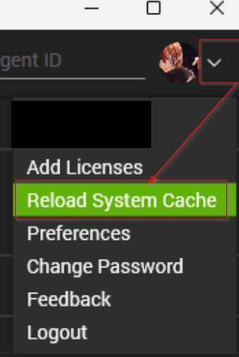

## Purpose

This solution is designed to retrieve the file path and size details of OST and PST files from all Windows Workstations and display the data in an Automate dataview. This can be used to spot abnormally large OST or PST files.

## Associated Content

#### Data Collection

| Content                                                                 | Type          | Function               |
|-------------------------------------------------------------------------|---------------|------------------------|
| [Script - Microsoft Outlook - OST/PST - Audit](<../cwa/scripts/Microsoft Outlook - OSTPST - Audit.md>)   | Script        | Fetch the data.        |
| [Dataview - Microsoft Outlook - OST/PST Audit](<../cwa/dataviews/Microsoft Outlook - OSTPST Audit.md>)   | Dataview      | Display the data.      |
| [Internal Monitor - Execute Script - Microsoft Outlook - OST/PST - Audit](<../cwa/monitors/Execute Script - Microsoft Outlook - OSTPST - Audit.md>) | Internal Monitor | Detects the machines.  |
| △ Custom - Execute Script - Microsoft Outlook - OST/PST - Audit       | Alert Template | Executes the script.   |

#### Other

| Content                                                                 | Type          | Function                       |
|-------------------------------------------------------------------------|---------------|--------------------------------|
| [Custom Table - pvl_outlook_pst_ost_audit](<../cwa/tables/pvl_outlook_pst_ost_audit.md>) | Custom Table  | Stores data gathered by the script. |

## Implementation

1. Import the following content from the `ProSync` plugin:
   - [Script - Microsoft Outlook - OST/PST - Audit](<../cwa/scripts/Microsoft Outlook - OSTPST - Audit.md>)
   - [Dataview - Microsoft Outlook - OST/PST Audit](<../cwa/dataviews/Microsoft Outlook - OSTPST Audit.md>)
   - [Internal Monitor - Execute Script - Microsoft Outlook - OST/PST - Audit](<../cwa/monitors/Execute Script - Microsoft Outlook - OSTPST - Audit.md>)
   - Alert Template - `△ Custom - Execute Script - Microsoft Outlook - OST/PST - Audit`

2. Reload System Cache:  
   

3. Configure the solution as follows:
   - [Internal Monitor - Execute Script - Microsoft Outlook - OST/PST - Audit](<../cwa/monitors/Execute Script - Microsoft Outlook - OSTPST - Audit.md>)
   - Configure with the alert template: `△ Custom - Execute Script - Microsoft Outlook - OST/PST - Audit`
   - Right-click and Run Now to start the monitor.

