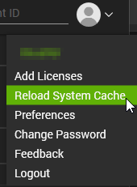
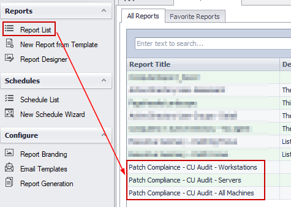
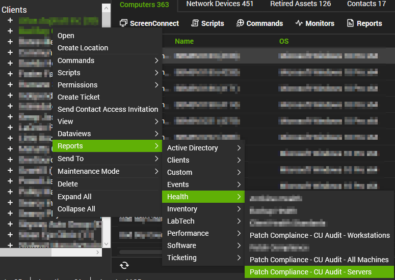
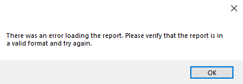

## Purpose

To provide clients with a professional looking Patch Management reports that they can confidently know the data is good. These reports go entirely off of the Cumulative Update solution and custom table.

## Example Reports

## Reports Included

| Content | Type | Function |
|---------|------|----------|
| [Report - Patch Compliance - CU Audit - All Machines](https://proval.itglue.com/DOC-5078775-17897871) | Report | Displays a comprehensive summary of all machines at a specific client and their perspective patch status. |
| [Report - Patch Compliance - CU Audit - Servers](https://proval.itglue.com/DOC-5078775-17897892) | Report | Displays a comprehensive summary of all servers at a specific client and their perspective patch status. |
| [Report - Patch Compliance - CU Audit - Workstations](https://proval.itglue.com/DOC-5078775-17897893) | Report | Displays a comprehensive summary of all workstations at a specific client and their perspective patch status. |

## Associated Content

### Automate Content

| Content | Type | Function |
|---------|------|----------|
| [Script - Create Views for Patch Compliance Report](https://proval.itglue.com/5078775/docs/17897696) | Script | This creates all the needed items in the Database to ensure the [Patch Compliance Reporting Solution](https://proval.itglue.com/5078775/docs/17889366) functions correctly. |

### Additional Content

| Content | Type | Function |
|---------|------|----------|
| [Patch Compliance Reporting SQL Import Attachment](https://proval.itglue.com/5078775/docs/17898232) | Document | Implementation instructions on how to import these patch compliance reports to a partner's environment. |

## Dependencies

These reports are dependent on the following items:
- Report Center being installed and configured
- [Script - Create Views for Patch Compliance Report](https://proval.itglue.com/5078775/docs/17897696)
- [Solution - Latest Installed Cumulative Update](https://proval.itglue.com/5078775/docs/12850104)

## Implementation

1. Ensure the [Solution - Latest Installed Cumulative Update](https://proval.itglue.com/5078775/docs/12850104) is imported and up to date in the environment. The audit script must be running regularly for this report to show accurate data.

2. Import the following script from the ProSync Plugin:
   - [Script - Create Views for Patch Compliance Report](https://proval.itglue.com/5078775/docs/17897696)

3. Run the [Script - Create Views for Patch Compliance Report](https://proval.itglue.com/5078775/docs/17897696) on any machine to create the views necessary for this solution. After running the script once, the script can be deleted from the environment.

4. Follow the instructions outlined in the [Patch Compliance Reporting SQL Import Attachment](https://proval.itglue.com/5078775/docs/17898232) document to import the reports into report center.

5. Reload the system cache:
   

6. After the reports have been imported, the reports can instantly be viewed by going into the Report Center --> Report List --> View the reports mentioned in this document:
   
   
   To view them from the Right-Click menu (Reports --> Health --> Patch Compliance - CU Audit - XXXX), the control center must be restarted before they become visible. If the partner does not need to access them right away, this is typically not an issue.
   

## FAQ

**Q: How is the data calculated on these reports?**  
A: Each machine is given a compliance score depending on how far out of date the machine is or if they are EOL. The criteria have been outlined below:
- Current (Up-to-date) machines: These are machines that have a cumulative update installed that is less than 45 days old. These are given a 100% compliance score
- Warning (Nearing out-of-date) machines: These are machines that have a cumulative update installed that is between 45–90 days old. These are given a 75% compliance score. 
- Error (Out-of-date) machines: These are machines that are between 90–120 days old. These are given a 25% compliance score.
- Error (Extremely Out-of-date) machines: These are machines that are greater than 120 days since the last cumulative update was installed. These are given a 10% compliance.
- EOL machines are given a 0% compliance score.  
At the end, all the machines are added up and averaged out to get the main percentage on the front page.

**Q: I am seeing one of my machines reporting a very high age since the last cumulative update has been installed. Where should I start troubleshooting?**  
A: I have outlined some steps that can be taken to troubleshoot why you may be seeing out of date machines:
1. Open the Computer Management screen of the affected device --> Navigate to the Patching screen --> Look for the latest month's cumulative update
   - If you cannot find the latest cumulative update, try running the [Script - Patch Manager - WUA Settings Validation](https://proval.itglue.com/DOC-5078775-9135620) and try scanning for patches again. If that does not work, then further troubleshooting will need to happen manually on the machine. 
2. If the latest cumulative update is visible, look for any failure messages on that main screen or when selecting the Patch Job tab.
   - If there are no job logs, there likely is a configuration issue with the assigned patch policy. That must be investigated.
   - If you see a failure during the maintenance window, investigate the mentioned error code.
3. If you still do not see any issue reported, open Patch Manager (Automation --> Patch Manager) --> Hit the monitor icon at the top left to access the device screen --> Find the machine in question and select on it --> You should see patch information populate at the bottom --> Select the Patch History Tab and look for any failures with the latest cumulative update.
   - Investigate any failures
4. You can also view the Groups tab to confirm the setup patch policy if you need to validate that.

**Q: I've tried everything and I can't get the latest cumulative update to install. Manual installation from the Microsoft Update Catalog does not work, repair scripts do nothing, Windows update consistently fails. What can I try next?**  
A: If this is a workstation, you can try to update to the latest feature update or even a preview build of a feature update. Typically, feature updates are consistent of a full OS reload but with saving data, so this can often fix these types of issues.  
- If all else fails, an OS upgrade from Windows 10 --> 11 may work, but if it is already on Windows 11 then you must perform a reload of the machine to get patching to function. 
- If this is a server, I do not have many additional things to try other than upgrading/reloading the server.

**Q: What does it mean when a machine has 'No Audit Information' provided?**  
A: The cumulative update data gets audited from the [Solution - Latest Installed Cumulative Update](https://proval.itglue.com/5078775/docs/12850104). The [Script - Get Lastest Installed Cumulative Update](https://proval.itglue.com/DOC-5078775-12849478) should be running against all agents every 7 days. If you are seeing machines in this list, they are most likely going to be offline frequently. If not, then you can try running the script manually against the machine and report any errors to ProVal Technologies to investigate further.

## Potential Problems

If you see the following error when opening one of the reports, it means at least one of the View's or the custom table is missing and is unable to reference it. If they are all there, verify you have full permissions to the table and Views.

