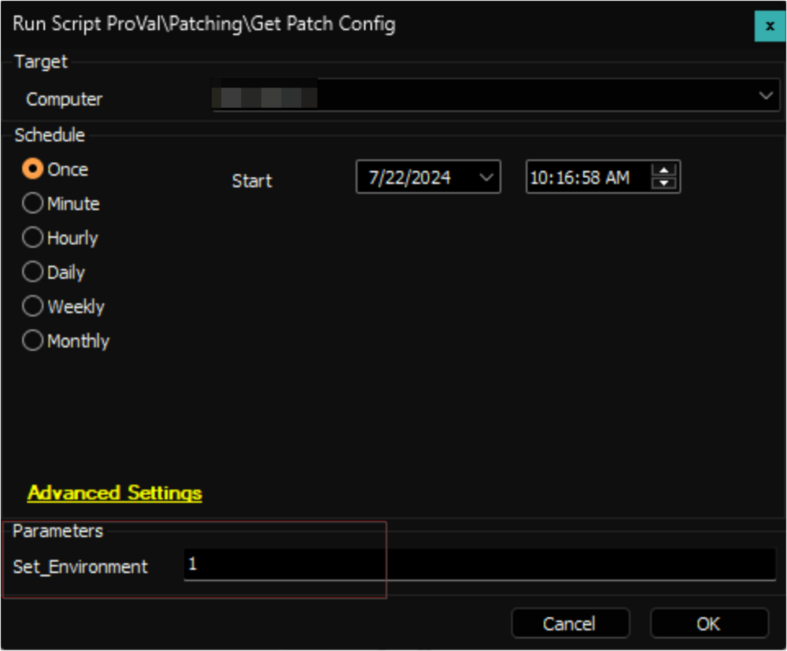

## Purpose

The purpose of this solution is to showcase the patch configuration of a Windows computer. It exhibits the configuration information altered by the [WUA Settings Validation](<../cwa/scripts/Patch Manager - WUA Settings Validation.md>) script.

## Upgrade Notice: 29-Oct-2024

The solution has been updated to indicate whether Windows upgrades or feature updates are restricted from the registry key for Windows 10 and 11.

Reference: [https://admx.help/?Category=Windows_10_2016&Policy=Microsoft.Policies.WindowsUpdate::TargetReleaseVersion](https://admx.help/?Category=Windows_10_2016&Policy=Microsoft.Policies.WindowsUpdate::TargetReleaseVersion)

Execute the [Get Patch Config](<../cwa/scripts/Get Patch Config.md>) script against any online Windows computer with the `Set_Environment` parameter set to `1`. This will add the newly introduced column `upgradeRestricted` to the [pvl_patch_config](<../cwa/tables/pvl_patch_config.md>) table, which is necessary for the solution.

## Associated Content

#### Auditing

| Content                                                                              | Type           | Function            |
|--------------------------------------------------------------------------------------|----------------|---------------------|
| [Get Patch Config](<../cwa/scripts/Get Patch Config.md>)                            | Script         | Gathers Data        |
| [pvl_patch_config](<../cwa/tables/pvl_patch_config.md>)                            | Custom Table   | Stores Data         |
| [Patch Config Audit](<../cwa/dataviews/Patch Config Audit.md>)               | Dataview       | Displays Data       |
| [Execute Script - Get Patch Config](<../cwa/monitors/Execute Script - Get Patch Config.md>) | Internal Monitor| Detects Windows Machines |
| △ Custom - Execute Script - Get Patch Config                                          | Alert Template  | Executes the Script  |

#### Automation

| Content                                                                                              | Type           | Function                                                        |
|------------------------------------------------------------------------------------------------------|----------------|-----------------------------------------------------------------|
| [Patch Manager - WUA Settings Validation](<../cwa/scripts/Patch Manager - WUA Settings Validation.md>) | Script         | Validate and set the appropriate values for the patching registries. |
| [Internal Monitor - Patch Config Mismatch](<../cwa/monitors/Patch Config Mismatch.md>)             | Internal Monitor| Detect computers with mismatched configurations.                |
| △ Custom - Patch Config Mismatch                                                                      | Alert Template  | Executes [Patch Manager - WUA Settings Validation](<../cwa/scripts/Patch Manager - WUA Settings Validation.md>) script. |

## Implementation

### 1.
Import the following auditing content using the ProSync Plugin:
- [Script - Get Patch Config](<../cwa/scripts/Get Patch Config.md>)
- [Dataview - Patch Config Audit](<../cwa/dataviews/Patch Config Audit.md>)
- [Internal Monitor - Execute Script - Get Patch Config](<../cwa/monitors/Execute Script - Get Patch Config.md>)
- Alert Template - △ Custom - Execute Script - Get Patch Config

### 2.
Import the following automation content using the ProSync Plugin:
- [Script - Patch Manager - WUA Settings Validation](<../cwa/scripts/Patch Manager - WUA Settings Validation.md>)
- [Internal Monitor - Patch Config Mismatch](<../cwa/monitors/Patch Config Mismatch.md>)
- Alert Template: △ Custom - Patch Config Mismatch

### 3.
Reload the system cache:  

### 4.
Execute the [Get Patch Config](<../cwa/scripts/Get Patch Config.md>) script against any online Windows computer with the `Set_Environment` parameter set to `1`. This will create the [pvl_patch_config](<../cwa/tables/pvl_patch_config.md>) table, which is necessary for the solution.  

### 5.
Configure the auditing solution as outlined below:
- Navigate to Automation → Monitors within the CWA Control Center and set up the following:
  - [Internal Monitor - Execute Script - Get Patch Config](<../cwa/monitors/Execute Script - Get Patch Config.md>)  
    - Set up with the `△ Custom - Execute Script - Get Patch Config` alert template
    - Right-click and Run Now to start the monitor

#### Only if Requested

### 6.
Configure the automation as outlined below:
- Navigate to Automation → Monitors within the CWA Control Center and set up the following:
  - [Internal Monitor - Patch Config Mismatch](<../cwa/monitors/Patch Config Mismatch.md>)  
    - Set up with the `△ Custom - Patch Config Mismatch` alert template
    - Right-click and Run Now to start the monitor

## FAQ

**Q:** Can this solution be used in environments without configuring the [WUA Settings Validation](<../cwa/scripts/Patch Manager - WUA Settings Validation.md>) script?  
**A:** The auditing section of the solution is independent of the [WUA Settings Validation](<../cwa/scripts/Patch Manager - WUA Settings Validation.md>) script.

