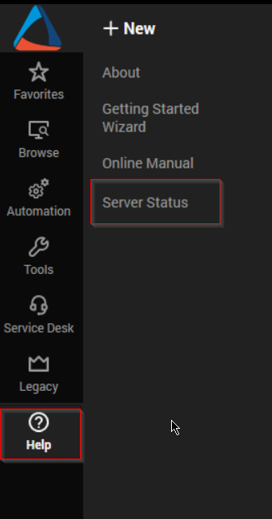
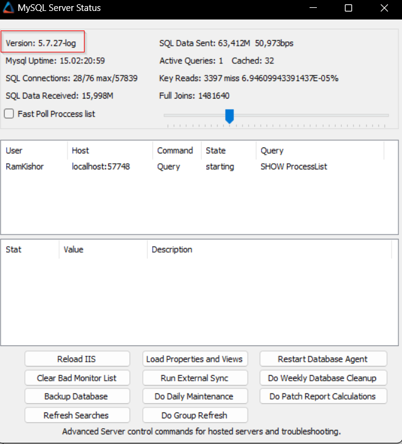

## Purpose

To granularly present the fundamental patching-related stats for the whole environment, clients, and computers scattered throughout the various patch approval ages.

Minimum Requirement: MySQL 5.7.7

## Associated Content

| Content                                                                                     | Type     | Function                                                              |
|---------------------------------------------------------------------------------------------|----------|-----------------------------------------------------------------------|
| [MYSQL - View - Create - Plugin_ProVal_v_Patching_Metrics_Overview*](https://proval.itglue.com/DOC-5078775-11915171) | Script   | Imports the [plugin_proval_v_patching_metrics_overview](https://proval.itglue.com/DOC-5078775-11915163) view. |
| [plugin_proval_v_patching_metrics_overview](https://proval.itglue.com/DOC-5078775-11915163) | View     | Baseline for the dataviews.                                         |
| [Patching Metrics Overview](https://proval.itglue.com/DOC-5078775-8023241)                | Dataview | Displays the consolidated stats for the whole environment.           |
| [Patching Metrics Overview - Client Filter](https://proval.itglue.com/DOC-5078775-11915225) | Dataview | Displays the stats for each client.                                  |
| [Patching Metrics Overview - Computer Filter](https://proval.itglue.com/DOC-5078775-11915195) | Dataview | Displays the stats for each computer.                                |

## Implementation

- Import the [MYSQL - View - Create - Plugin_ProVal_v_Patching_Metrics_Overview*](https://proval.itglue.com/DOC-5078775-11915171) script.
- Import the [Patching Metrics Overview](https://proval.itglue.com/DOC-5078775-8023241) dataview.
- Import the [Patching Metrics Overview - Client Filter](https://proval.itglue.com/DOC-5078775-11915225) dataview.
- Import the [Patching Metrics Overview - Computer Filter](https://proval.itglue.com/DOC-5078775-11915195) dataview.
- Debug the [MYSQL - View - Create - Plugin_ProVal_v_Patching_Metrics_Overview*](https://proval.itglue.com/DOC-5078775-11915171) script against any computer and ensure that the dataviews are populated with the data.

## FAQ

**Q:** [MYSQL - View - Create - Plugin_ProVal_v_Patching_Metrics_Overview*](https://proval.itglue.com/DOC-5078775-11915171) script is failing.  
**A:** Please ensure that the minimum requirement is met and the MySQL version is at least **5.7.7.**  

You can check the Database version from the `Server Status` in Control Center.  

  

