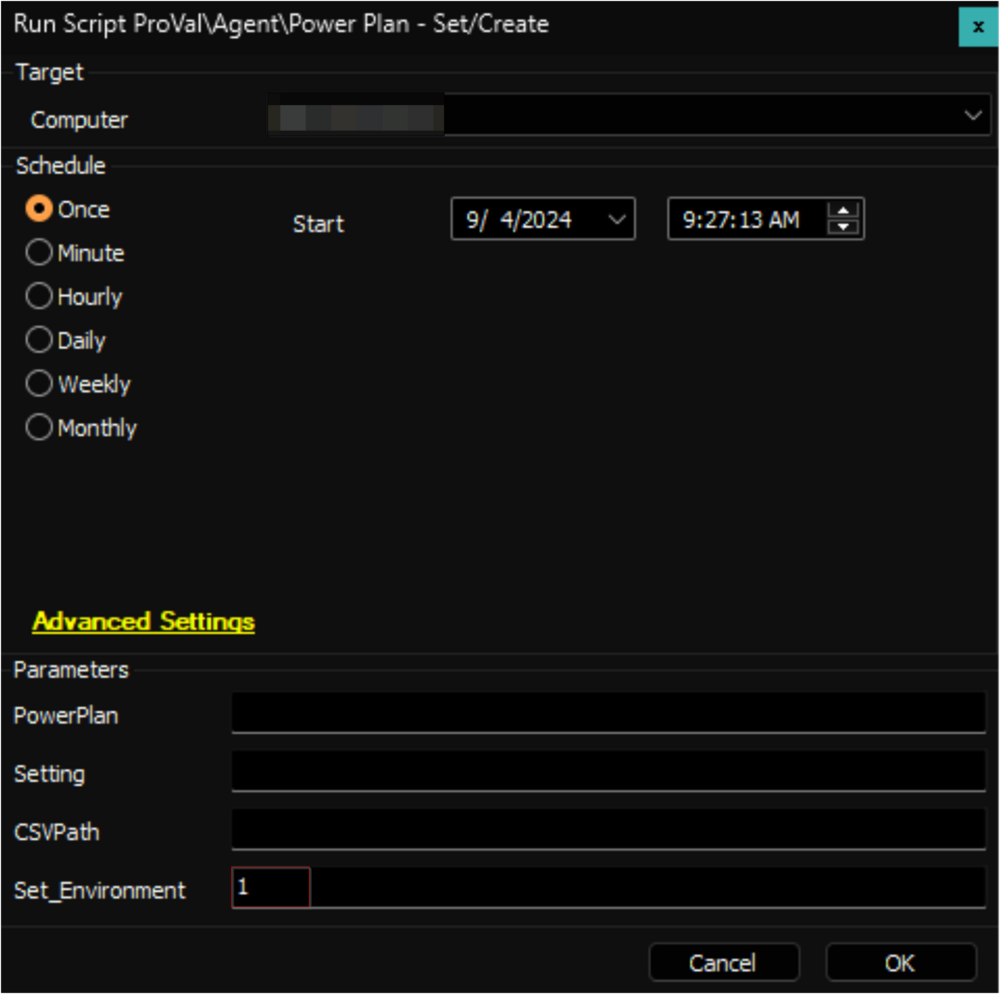
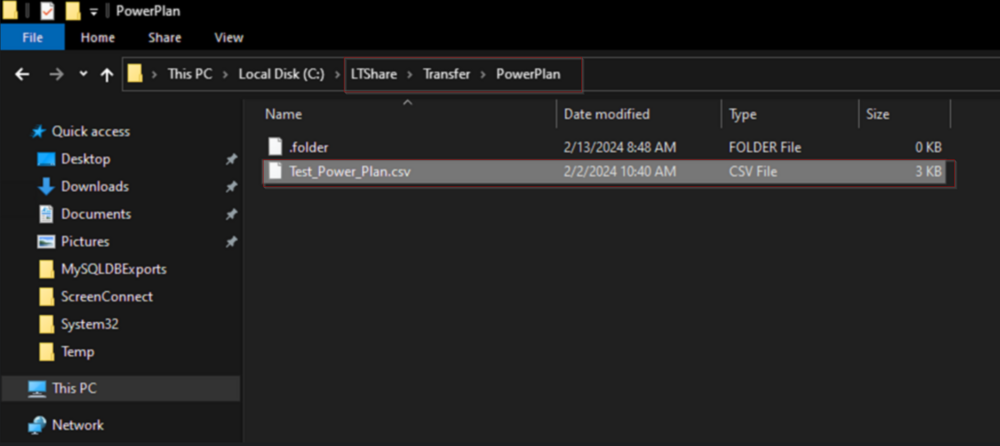
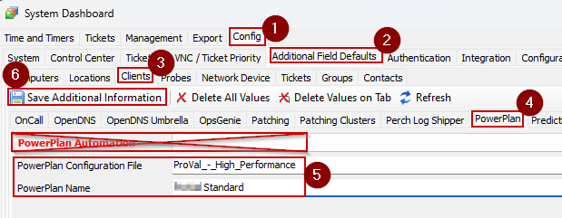
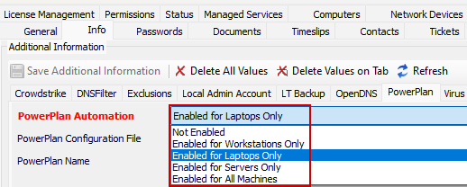

## Purpose

This solution automates the deployment of a standard power plan to Windows machines. Additionally, it can perform a comprehensive audit of power plans on each machine. However, auditing will generate a separate entry for each individual setting within every detected power plan. For example, a machine with five power plans could produce around 120 entries in the dataview.

## Files

| File Path                                                                 | File Hash (SHA256)                                                                                       | File Hash (MD5)          | Script                                                                                     |
|---------------------------------------------------------------------------|----------------------------------------------------------------------------------------------------------|---------------------------|--------------------------------------------------------------------------------------------|
| C:/ProgramData/_Automation/script/Get-PowerPlan/Manage-OverFlowedVariable.ps1 | 79B76E6780B61ED657C7FC07C5C0D9A0662165066D5BAD95D9D672513BADD674 | 12B41CDBC04010E638D3FFB8A4BDB1D6 | [Script - OverFlowedVariable - SQL Insert - Execute](<../cwa/scripts/OverFlowedVariable - SQL Insert - Execute.md>) |
| C:/ProgramData/_Automation/script/Get-PowerPlan/Get-PowerPlan.ps1         | DDE3ACC4A91AB8C7E8971A673AC07B8F4B3B34FA8DAD5849E156C5E6A80DFDF8 | AE0FAF82228693C611F4578564FE353C | [Script - Power Plan - Audit [DV]](<../cwa/scripts/Power Plan - Audit DV.md>) |
| C:/ProgramData/_Automation/script/Get-PowerPlan/Get-PowerPlanAI.ps1      | C7CD78CEAC21FF393A913B266CB5C0EC12CEA8E364FA0AD346C287C272463992 | 3AFF43D2532BA4AA1D6DB604F613C8EE | [Script - Power Plan - Audit [DV]](<../cwa/scripts/Power Plan - Audit DV.md>) |
| C:/ProgramData/_Automation/script/Set-PowerPlan/Set-PowerPlan.ps1        | 28C5503857406511327E72114784F559799CEBFE96A6D323FAA2A25F56F8488C | 7882C5890DCDFA7CE81DD62AB093A1F8 | [Script - Power Plan - Set/Create](<../cwa/scripts/Power Plan - SetCreate.md>) |
| C:/ProgramData/_Automation/script/Enable-PowerPlan/Enable-PowerPlan.ps1  | 13F38A3CB96BE9C19B38ED09A1175852B33713DE43368B84867A7999D202F6F3 | 59BB9E9FB16FD5E53EB657D0F02ED9A8 | [Script - Power Plan - Enable](<../cwa/scripts/Power Plan - Enable.md>) |
| C:/ProgramData/_Automation/script/Remove-PowerPlan/Remove-PowerPlan.ps1  | 5CA9E22892E872DE4020E41E6BB4840CD47BBDBBFB4002D6D622E7828D63E64F | D1A1BB2B61D2507BF59E10CB23D140E8 | [Script - Power Plan - Remove](<../cwa/scripts/Power Plan - Remove.md>) |

## Associated Content

### Scripts

| Content                                                                 | Type   | Function                                        |
|-------------------------------------------------------------------------|--------|------------------------------------------------|
| [Script - Power Plan - Audit [DV]](<../cwa/scripts/Power Plan - Audit DV.md>) | Script | Gather the information on available power plan(s). |
| [Script - Power Plan - Set/Create](<../cwa/scripts/Power Plan - SetCreate.md>) | Script | Create or modify a power plan.                  |
| [Script - Power Plan - Enable](<../cwa/scripts/Power Plan - Enable.md>) | Script | Enable or activate a power plan.                |
| [Script - Power Plan - Remove](<../cwa/scripts/Power Plan - Remove.md>) | Script | Remove a power plan.                            |

### Custom Table

| Content                                                                 | Type         | Function                                                                                      |
|-------------------------------------------------------------------------|--------------|-----------------------------------------------------------------------------------------------|
| [Custom Table - pvl_powerplan_audit](<../cwa/tables/pvl_powerplan_audit.md>) | Custom Table | Stores the information gathered by the [Script - Power Plan - Audit [DV]](<../cwa/scripts/Power Plan - Audit DV.md>). |

### Dataview

| Content                                                              | Type     | Function                                      |
|----------------------------------------------------------------------|----------|-----------------------------------------------|
| [Dataview - Power Plan - Audit [Script]](<../cwa/dataviews/Power Plan - Audit Script.md>) | Dataview | Displays the information on available power plans. |

### Internal Monitor

| Content                                                                 | Type            | Function                                                                                                                              |
|-------------------------------------------------------------------------|-----------------|---------------------------------------------------------------------------------------------------------------------------------------|
| [Internal Monitor - Execute Script - Power Plan - Audit](<../cwa/monitors/Execute Script - Power Plan - Audit.md>) | Internal Monitor | Detects the physical workstation where the [Script - Power Plan - Audit [DV]](<../cwa/scripts/Power Plan - Audit DV.md>) hasn't been run within the past 7 days. |
| [Internal Monitor - PowerPlan Automation](<../cwa/monitors/PowerPlan Automation.md>) | Internal Monitor | Detect machines where the Power Plan set in the Client-Level EDF "PowerPlan Name" EDF is not available, and Power Plan Automation is enabled. |

### Alert Template

| Content                                                  | Type         | Function                                                                                                                       |
|---------------------------------------------------------|--------------|-------------------------------------------------------------------------------------------------------------------------------|
| △ Custom - Execute Script - Power Plan - Audit          | Alert Template | Execute the [Script - Power Plan - Audit [DV]](<../cwa/scripts/Power Plan - Audit DV.md>) on the machines detected by the [Internal Monitor - Execute Script - Power Plan - Audit](<../cwa/monitors/Execute Script - Power Plan - Audit.md>). |
| △ Custom - PowerPlan Automation                          | Alert Template | Execute the [Script - Power Plan - Set/Create](<../cwa/scripts/Power Plan - SetCreate.md>) on the machines detected by the [Internal Monitor - PowerPlan Automation](<../cwa/monitors/PowerPlan Automation.md>). |

## Implementation

### Automation Prep

1. Import the following content from the Prosync plugin:
   - [Script - Power Plan - Set/Create](<../cwa/scripts/Power Plan - SetCreate.md>)
   - [Script - Power Plan - Enable](<../cwa/scripts/Power Plan - Enable.md>)
   - [Script - Power Plan - Remove](<../cwa/scripts/Power Plan - Remove.md>)
   - [Internal Monitor - PowerPlan Automation](<../cwa/monitors/PowerPlan Automation.md>)
   - `△ Custom - PowerPlan Automation`

2. Reload the System Cache  
   

3. Run the [Script - Power Plan - Set/Create](<../cwa/scripts/Power Plan - SetCreate.md>) with the `Set_Environment` parameter set to `1` to create the EDFs used by the script and [PowerPlan Automation](<../cwa/monitors/PowerPlan Automation.md>) internal monitor.  
   

4. Configure the solution as follows:  
   - Navigate to Automation → Monitors within the CWA Control Center and set up the following:
     - [EPM - Windows Configuration - Internal Monitor - PowerPlan Automation](<../cwa/monitors/PowerPlan Automation.md>)
       - Configure with the alert template: `△ Custom - PowerPlan Automation`
       - **Validate that there are no results reporting in the monitor** and right-click and run now to start the monitor.

#### Standardize

1. **Follow these steps only if instructed to do so**: More details are provided in the **`Automation`** section of the [Power Plan - Set/Create](<../cwa/scripts/Power Plan - SetCreate.md>) script's document.  
   You can start by downloading the `ProVal_-_High_Performance.csv` found in the linked document above and placing it on the LTShare under the folder `//LTShare//Transfer//PowerPlan`.  
   

2. Next, navigate to System Dashboard → Config → Additional Field Defaults → Clients → PowerPlan
   - Fill out the PowerPlan Configuration File to show 'ProVal_-_High_Performance'
   - Enter the PowerPlan Name specified by the consultant (**If it has not been specified, stop and reach out to them and ask**) - This is the display name that the power plan will show up as within Windows and what the client will see. This will likely be `\\<Client Abbreviation> Standard`. Like 'ProVal Standard' for example.
   - **IMPORTANT** **Do NOT fill out the PowerPlan Automation EDF**. That will need to be filled out by the partner on a per-client basis.  
   

3. Reach out to the consultant to let them know the standardization steps have been followed and the client can issue the PowerPlan automation by selecting the following EDF:  
   

### Optional Auditing

1. **NOTE** The auditing on this solution is optional since it imports a very large amount of data into the custom table, but it should not take up much space in the end.  
   Import the following content from the Prosync plugin:
   - [Script - Power Plan - Audit [DV]](<../cwa/scripts/Power Plan - Audit DV.md>)
   - [Dataview - Power Plan - Audit [Script]](<../cwa/dataviews/Power Plan - Audit Script.md>)
   - [Internal Monitor - Execute Script - Power Plan - Audit](<../cwa/monitors/Execute Script - Power Plan - Audit.md>)
   - `△ Custom - Execute Script - Power Plan - Audit`

2. Execute this script against an online Windows workstation to create the [EPM - Data Collection - Custom Table - pvl_powerplan_audit](<../cwa/tables/pvl_powerplan_audit.md>) custom table:  
   - [Script - Power Plan - Audit [DV]](<../cwa/scripts/Power Plan - Audit DV.md>)

3. Run this script against any client in the environment to provide permission of the newly created custom table to all users:  
   - [Script - MySQL - Permission - Set Custom Table Permissions](<../cwa/scripts/MySQL - Permission - Set Custom Table Permissions.md>)

4. Configure the solution as follows:  
   - Navigate to Automation → Monitors within the CWA Control Center and set up the following:
     - [Internal Monitor - Execute Script - Power Plan - Audit](<../cwa/monitors/Execute Script - Power Plan - Audit.md>)
       - Configure with the alert template: `△ Custom - Execute Script - Power Plan - Audit`
       - Right-click and run now to start the monitor.

## Additional Notes

Refer to the documentation accompanying the respective script for detailed instructions on its usage, including guidance on utilizing the script's parameters.

