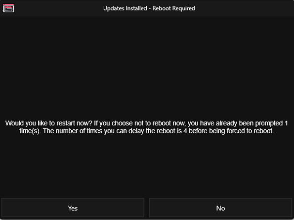
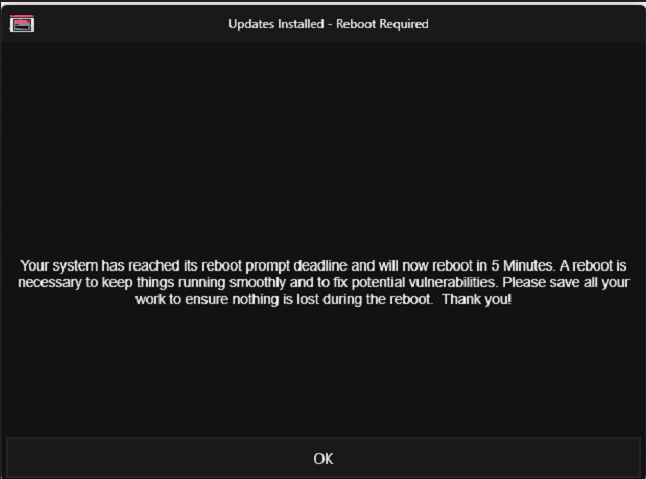

## Purpose

This solution is designed to send a reboot prompt popup to the user's screen on workstations and enforce a forceful reboot after several attempts, as specified in the custom field, to maintain OS patching stability. It includes both automatic and manual reboot features, as well as a functionality to generate tickets for servers where a reboot is pending.

## Associated Content

| Content                                                                                       | Type          | Function                                                                                                                                                                                                                                            |
|-----------------------------------------------------------------------------------------------|---------------|-----------------------------------------------------------------------------------------------------------------------------------------------------------------------------------------------------------------------------------------------------|
| [Task - Reboot Prompter](https://proval.itglue.com/DOC-5078775-15298948)                   | Task          | The script prompts the user to reboot with a simple yes or no prompt. It also forces a reboot after the `PromptRebootCount` is exceeded.                                                                                                           |
| [Task - Reboot Pending Check Automation](<../cwrmm/tasks/Reboot Pending Check Automation.md>)    | Task          | This task is designed to automatically detect reboot pending status on endpoints and check the custom field `Auto_RebootPendingCheck`, so that the agent is added to the dynamic group [CW RMM - Dynamic Group - Reboot Prompter Deployment - Auto](<../cwrmm/groups/Reboot Prompter Deployment - Auto.md>). |
| [Custom Fields - Reboot Prompter](https://proval.itglue.com/DOC-5078775-15298950)           | Custom Fields | This document contains details of all custom fields that have task and deployment dependencies.                                                                                                                                                                 |
| [Dynamic Group - Reboot Prompter Deployment - Manual](<../cwrmm/groups/Reboot Prompter Deployment - Manual.md>) | Dynamic Group | This dynamic group depends on the endpoint custom field `Prompter_RebootPending` being checked, and the agent should be available to check into the group.                                                                                 |
| [Dynamic Group - Reboot Prompter Deployment - Auto](<../cwrmm/groups/Reboot Prompter Deployment - Auto.md>) | Dynamic Group | This dynamic group depends on the endpoint custom field `Auto_RebootPendingCheck` being checked, and the agent should be available to check into the group.                                                                                 |
| [Dynamic Group - Automatic Reboot Pending Check](<../cwrmm/groups/Automatic Reboot Pending Check.md>) | Dynamic Group | This group is designed to schedule the task `Automatic Reboot Pending Check` to set the auto reboot pending automation by checking the custom field `Auto_RebootPendingCheck`.                                                                         |
| [Dynamic Group - Reboot Pending Servers](<../cwrmm/groups/Reboot Pending Servers.md>)    | Dynamic Group | This group contains server endpoints where a reboot is pending. It detects only supported Windows servers (i.e., 2016, 2019, and 2022) and works only when the Reboot Prompter Solution is activated.                                          |
| [Monitor - Reboot Pending - Servers](<../cwrmm/monitors/Reboot Pending - Servers.md>)        | Monitor       | This monitor creates a ticket on servers where a reboot is pending. It detects only supported Windows servers (i.e., 2016, 2019, and 2022) and works only when the Reboot Prompter Solution is activated.                                          |

## Implementation

- Create the [Custom Fields - Reboot Prompter](https://proval.itglue.com/DOC-5078775-15298950)
- Create the [Task - Reboot Prompter](https://proval.itglue.com/DOC-5078775-15298948)
- Create the [Task - Reboot Pending Check Automation](<../cwrmm/tasks/Reboot Pending Check Automation.md>)
- Create the [Dynamic Group - Reboot Prompter Deployment - Manual](<../cwrmm/groups/Reboot Prompter Deployment - Manual.md>)
- Create the [Dynamic Group - Reboot Prompter Deployment - Auto](<../cwrmm/groups/Reboot Prompter Deployment - Auto.md>)
- Create the [Dynamic Group - Automatic Reboot Pending Check](<../cwrmm/groups/Automatic Reboot Pending Check.md>)
- Create the [Dynamic Group - Reboot Pending Servers](<../cwrmm/groups/Reboot Pending Servers.md>)
- Create the [Monitor - Reboot Pending - Servers](<../cwrmm/monitors/Reboot Pending - Servers.md>)
- Schedule the [Task - Reboot Pending Check Automation](<../cwrmm/tasks/Reboot Pending Check Automation.md>) at the [Dynamic Group - Automatic Reboot Pending Check](<../cwrmm/groups/Automatic Reboot Pending Check.md>) every 2 hours.
  - Follow the deployment instructions in the [Task - Reboot Pending Check Automation](<../cwrmm/tasks/Reboot Pending Check Automation.md>).
- Schedule the [Task - Reboot Prompter](https://proval.itglue.com/DOC-5078775-15298948) at the [Dynamic Group - Reboot Prompter Deployment - Manual](<../cwrmm/groups/Reboot Prompter Deployment - Manual.md>) and the [Dynamic Group - Reboot Prompter Deployment - Auto](<../cwrmm/groups/Reboot Prompter Deployment - Auto.md>) according to client requirements to send prompts at the specified intervals.
  - Follow the deployment instructions in the task [CW RMM - Task - Reboot Prompter](https://proval.itglue.com/DOC-5078775-15298948).
- Schedule the monitor [Monitor - Reboot Pending - Servers](<../cwrmm/monitors/Reboot Pending - Servers.md>) to target the group [Dynamic Group - Reboot Pending Servers](<../cwrmm/groups/Reboot Pending Servers.md>) to create a ticket for the reboot pending on the servers.

## FAQ

The script popup screenshot:

Send Yes/No prompt option for attempts equal to [RebootPromptCount](http://RebootPromptCount).  
Note: The time (in seconds) depends on the count it prompted the user, and "4" before being forced to reboot depends on the threshold set at the site-level custom field "RebootPromptCount".

Afterward, it sends a force reboot prompt as shown below:  
Note: The 5 minutes depends on the value provided in the custom field 'RebootForceTimeDelayMinutes'.

