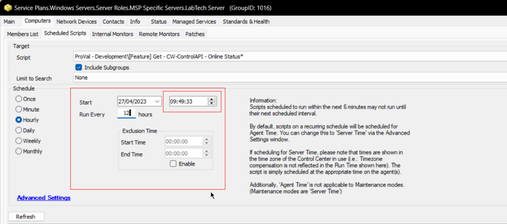
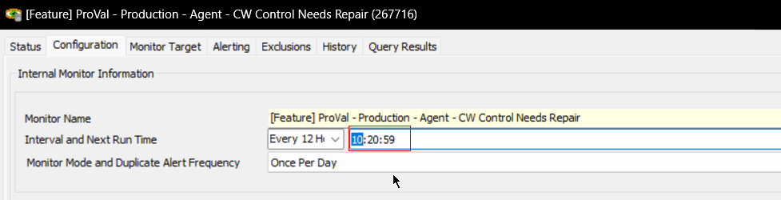

## Purpose

This solution built for the ConnectWise platform aims to identify all offline computers in the ConnectWise Automate application that are online or missing from the ConnectWise Control application, and subsequently install or repair the Automate Agent on those machines. To achieve this, a ConnectWise Automate script called [EPM - Data Collection - Script - Get - CW-ControlAPI - Online Status*](https://proval.itglue.com/DOC-5078775-9912233) is used, which fetches the online status of all machines from CW Control on a periodic basis.

Following this, the solution uses a ConnectWise Automate internal monitor named [CWM - Control - Monitor - Agent - CW Control Needs Repair](https://proval.itglue.com/DOC-5078775-7936293) to detect the offline machines that are online in Automate but not in Control, based on the EPM - Data Collection - Script - Get - CW-ControlAPI - Online Status* script result. This monitor is then assigned a ConnectWise Automate alert template named △ CUSTOM - Autofix Action - Repair CW Control, which is configured to run the autofix script named [CWM - Control - Script - CW Control - Repair [RMM+, Autofix, Globals]](https://proval.itglue.com/DOC-5078775-8216334) on the machines identified by the internal monitor.

The ConnectWise Automate autofix script, CWM - Control - Script - CW Control - Repair [RMM+, Autofix, Globals], attempts to repair the issue with the installed CW Control instance and can generate a ticket if the fix fails. By using this solution, all offline machines can be identified, and the connectivity issues with the CW Control instance can be resolved effectively.

## Associated Content

| Content                                                                                          | Type            | Function                                                                                                                                                                   |
|--------------------------------------------------------------------------------------------------|-----------------|---------------------------------------------------------------------------------------------------------------------------------------------------------------------------|
| [EPM - Data Collection - Script - Get - CW-ControlAPI - Online Status*](https://proval.itglue.com/DOC-5078775-9912233) | Script          | The script EPM - Data Collection - Script - Get - CW-ControlAPI - Online Status* fetches online status of all machines in ConnectWise Control and inserts those states to a custom table for the solution to identify offline computers. |
| [CWM - Control - Monitor - Agent - CW Control Needs Repair](https://proval.itglue.com/DOC-5078775-7936293) | Internal Monitor | The monitor set detects the machine that is offline according to the [EPM - Data Collection - Script - Get - CW-ControlAPI - Online Status*](https://proval.itglue.com/DOC-5078775-9912233) script result but are online in Automate. |
| △ CUSTOM - Autofix Action - Repair CW Control                                                   | Alert Template   | To run the autofix script on the machines detected by the internal monitor.                                                                                             |
| [CWM - Control - Script - CW Control - Repair [RMM+, Autofix, Globals]](https://proval.itglue.com/DOC-5078775-8216334) | Autofix Script   | This script attempts to repair the problem with the installed CW Control instance and can create ticket on failures.                                                      |

## Implementation

- Import [EPM - Data Collection - Script - Get - CW-ControlAPI - Online Status*](https://proval.itglue.com/DOC-5078775-9912233) script.
- Execute the script against any machine to create [EPM - Data Collection - Custom Table - plugin_proval_control_session_status](https://proval.itglue.com/DOC-5078775-9912293) table.
- Import the [CWM - Control - Monitor - Agent - CW Control Needs Repair](https://proval.itglue.com/DOC-5078775-7936293) monitor set.
- Import [CWM - Control - Script - CW Control - Repair [RMM+, Autofix, Globals]](https://proval.itglue.com/DOC-5078775-8216334) script.
- Import/create the `△ CUSTOM - Autofix Action - Repair CW Control` alert template.
- Schedule the [EPM - Data Collection - Script - Get - CW-ControlAPI - Online Status*](https://proval.itglue.com/DOC-5078775-9912233) script to run twice per day, suggested is Labtech Server group for on-prem partners and against the Domain Controller of the primary client for hosted partners.  
    
- Update the run time of the [CWM - Control - Monitor - Agent - CW Control Needs Repair](https://proval.itglue.com/DOC-5078775-7936293) monitor set to run after 20-30 minutes of the scheduled script run.  
    

