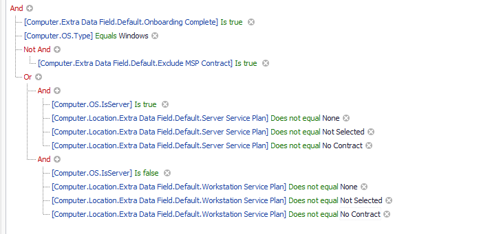
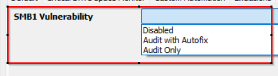

## Purpose

This solution contains the SMBv1 audit and autofix based on the EDF.

## Associated Content

| Content                                                                                                               | Type         | Function                                                                                                                                                                                                                                                                                                                                                                                                                                                                                                                                                                                                                                                                                                                                                         |
|-----------------------------------------------------------------------------------------------------------------------|--------------|------------------------------------------------------------------------------------------------------------------------------------------------------------------------------------------------------------------------------------------------------------------------------------------------------------------------------------------------------------------------------------------------------------------------------------------------------------------------------------------------------------------------------------------------------------------------------------------------------------------------------------------------------------------------------------------------------------------------------------------------------------------|
| [Script - SMBv1 Status Audit/Autofix [DV,Param]](<../cwa/scripts/SMBv1 Status AuditAutofix DV,Param.md>)                   | Script       | This script is created to run the detection/remediation for SMBv1 Enabled based on EDF. It will act only if the dropdown EDF "SMB1 Vulnerability" is set to 'Audit Only' or 'Audit With Autofix' at any client, location, or computer level.                                                                                                                                                                                                                                                                                                                                                                                                                                                                                                                      |
| [Script - SMBv1 Enable Detection Ticketing - Per Client](<../cwa/scripts/SMBv1 Enable Detection Ticketing - Per Client.md>)           | Client Script| This client script creates a ticket for each client with the computer count where remediation is required.                                                                                                                                                                                                                                                                                                                                                                                                                                                                                                                                                                                                                                                                                                                   |
| [Script - SMB1 Traffic Detection Monitor Creation](<../cwa/scripts/SMB1 Traffic Detection Monitor Creation.md>)                  | Client Script| Remote monitors "ProVal - Production - SMB1 Traffic Detection" will be set up on computers where the [SMB1 Detection](<../cwa/monitors/SMB1 Detection.md>) remote monitor identifies the SMB1 Server Status as `Enabled`. In the [Dataview - SMBv1 Status Audit](<../cwa/dataviews/SMBv1 Status Audit.md>), the `SMB1 Server Status` column will display `Enabled` for these machines. [Dataview - SMBv1 Status Audit](<../cwa/dataviews/SMBv1 Status Audit.md>) gathers the state of the monitor failure to show the machines where the SMB1 is used.                                                                                                                                                                                                                                                 |
| [Dataview - SMBv1 Status Audit](<../cwa/dataviews/SMBv1 Status Audit.md>)                                    | Dataview     | This dataview gathers the data from the script [CWA Script - SMBv1 Enabled Detection & Remediation](<../cwa/scripts/SMBv1 Status AuditAutofix DV,Param.md>) and depicts the status of SMB Enabled on the agent where it is deployed.                                                                                                                                                                                                                                                                                                                                                                                                                                                                                                                                                                                        |
| [Remote Monitor - SMB1 Detection](<../cwa/monitors/CWA - Remote Monitor - SMB1 Detection.md>)                                   | Remote Monitor| Check whether the SMB1 is enabled on the end machine or not. It runs the OS version [compatible command](https://learn.microsoft.com/en-us/windows-server/storage/file-server/troubleshoot/detect-enable-and-disable-smbv1-v2-v3?tabs=server#how-to-detect-status-enable-and-disable-smb-protocols) to fetch the data.                                                                                                                                                                                                                                                                                                                                                                                                                                                                                          |
| [Internal Monitor - SMB1 Autofix](<../cwa/monitors/SMB1 Autofix.md>)                                   | Internal Monitor| This internal monitor detects online Windows agents and performs autofix on computers where the "Audit with Autofix" is set via client, location, or computer level EDF "SMB1 Vulnerability". The [Remote Monitor - SMB1 Detection](<../cwa/monitors/CWA - Remote Monitor - SMB1 Detection.md>) shows failure, and the autofix [Script - SMBv1 Status Audit/Autofix [DV, Param]](<../cwa/scripts/SMBv1 Status AuditAutofix DV,Param.md>) has not run in the past week.                                                                                                                                                                                                                                                                                                                                                                                                                                                                                          |
| **△ Custom - Execute Script - SMB1 Audit/Autofix**                                                                   | Alert Template| This needed to be scheduled with the [Remote Monitor - SMB1 Detection](<../cwa/monitors/CWA - Remote Monitor - SMB1 Detection.md>) and the [Internal Monitor - SMB1 Autofix](<../cwa/monitors/SMB1 Autofix.md>) to perform the Audit and Autofix based on EDF selection at the client, location, or computer level.                                                                                                                                                                                                                                                                                                                                                                                                                                                                                      |

## Implementation

### Remove Old Solution

If this solution is approved please get rid of the below DV and Remote monitor

- [EPM - Windows Configuration - Dataview - SMB1 Status [Remote Monitor]](<../cwa/dataviews/SMB1 Status Remote Monitor.md>)  
- [EPM - Windows Configuration - Remote Monitor - SMB1 Detection](<../cwa/monitors/SMB1 Detection.md>)  

To remove them please run the below query:

```
DELETE FROM groupagents WHERE NAME = 'ProVal - Production - SMB1 Detection';
DELETE FROM agents WHERE NAME = 'ProVal - Production - SMB1 Detection' AND computerid > 0; 
DELETE FROM dataviews where name = 'SMB1 Status [Remote Monitor]';
```

### Import New Solution

1. Import the following content using the ProSync Plugin:
   - [Script - SMBv1 Status Audit/Autofix [DV,Param]](<../cwa/scripts/SMBv1 Status AuditAutofix DV,Param.md>)  
   - [Script - SMBv1 Enable Detection Ticketing - Per Client](<../cwa/scripts/SMBv1 Enable Detection Ticketing - Per Client.md>)  
   - [Script - SMB1 Traffic Detection Monitor Creation](<../cwa/scripts/SMB1 Traffic Detection Monitor Creation.md>)  
   - [Dataview - SMBv1 Status Audit](<../cwa/dataviews/SMBv1 Status Audit.md>)  
   - [Internal Monitor - SMB1 Autofix](<../cwa/monitors/SMB1 Autofix.md>)  
   - Alert Template - `△ Custom - Execute Script - SMB1 Audit/Autofix`

   Import the EDFs, Searches, Groups, and Remote monitor following the below document:

   - [Import - Remote Monitor - SMB1 Detection Query](<../cwa/monitors/SMB1 Detection Query.md>)  

2. Reload the system cache:

   

3. Configure the solution as outlined below:
   - Navigate to Browse → Groups (△ System Monitoring→△ Vulnerability Management) → Computers→ Remote monitors within the CWA Control Center and set the following:
     - [Remote Monitor - SMB1 Detection](<../cwa/monitors/CWA - Remote Monitor - SMB1 Detection.md>)  
       - Validate that the monitor is configured with the alert template "**`Default - Do Nothing`**" and if it is not, assign the alert template manually to perform the status audit and autofix based on the EDF selection.
   - Navigate to Automation → Monitors within the CWA Control Center and set up the following:
     - [Internal Monitor - SMB1 Autofix](<../cwa/monitors/SMB1 Autofix.md>)  
       - Setup with `△ Custom - Execute Script - SMB1 Audit/Autofix` Alert Template
       - Right-click and Run Now to start the monitor
   - Schedule the client script "[Script - SMB1 Traffic Detection Monitor Creation](<../cwa/scripts/SMB1 Traffic Detection Monitor Creation.md>)" to gather the SMB1 live used state from the machines based on the event ID detection.
     - This client script will deploy the remote monitor to all the computers where "[Remote Monitor - SMB1 Detection](<../cwa/monitors/CWA - Remote Monitor - SMB1 Detection.md>)" has detected SMB1 enabled.
     - The [Dataview - SMBv1 Status Audit](<../cwa/dataviews/SMBv1 Status Audit.md>) gathers the state of the monitor "ProVal - Production - SMB1 Traffic Detection" and shows data as "Yes" or "No" if used or not used respectively.

   ```
   Note: Group "△ Vulnerability Management" under "△ System Monitoring" is created as a standard group to maintain a record of all monitors being developed in the future to be applied from it.
   

   It contains all Windows Servers and Workstations whose onboarding is completed and service plans are under contract.
   So, it is mandatory to validate that the monitors applied to this group have their Limit applied based on the Audit or Audit with Autofix selection otherwise it will be applied to all Windows machines.
   ```

4. **NOTE** WE SHOULD ONLY BE PERFORMING THESE STEPS IF ASKED BY THE CONSULTANT

   To enable the solution, please make sure to select any one Audit option from the drop-down EDFs "SMB1 Vulnerability" at the computer, location, or client level. The 'Additional Field Default' value can also be selected here to enable the solution globally.

   

   - Audit with Autofix → If this is selected, then the SMB1 will be automatically disabled if found enabled on any device.
     - The SMB1 client and SMB1 server both will be disabled.
   - Audit Only → If this is selected, then the SMB1 status will be audited only and not automatically disabled if found to be enabled.

   Note: The computer-level EDF "SMB1 Vulnerability" has the highest priority, if it is set to disabled then it will be excluded.
   The location level EDF "SMB1 Vulnerability" has the second-highest priority, if it is set to disabled then all the endpoints at the location level will be excluded.

## Optional Solutions

### Traffic Detection Ticketing

Optionally, if the client wants, we can enable ticketing to monitor the SMB1 traffic live detection cases separately for each machine by setting up the system properties:


Note: This should only be implemented if the consultant approves it.


