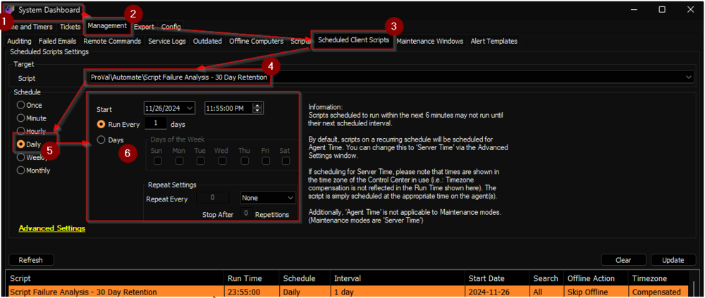

## Purpose

The purpose of this solution is to present a detailed analysis of script failures over the past 30 days. The solution is created to overcome the limitation of the [Script Failure Assessment](https://proval.itglue.com/DOC-5078775-16132491) dataview.

## Update Notice: 29-November-2024

**Changes:**
- The script is renamed from `Weekly Script Failure Analysis - 30 Day Retention` to `Script Failure Analysis - 30 Day Retention`.
- The logic is converted from weekly to daily data updates for better accuracy.
- This update will remove the existing data and start from new.

**Update Instructions:**
- Update/import the [Script - Script Failure Analysis - 30 Day Retention](https://proval.itglue.com/DOC-5078775-16804995) from the `Prosync` plugin.
- Update/import the [Dataview - Script Failure Assessment - Last 30 Days](https://proval.itglue.com/DOC-5078775-16804876) from the `Prosync` plugin.
- Navigate to `System` > `Configuration` > `Dashboard` > `Management` > `Scheduled Client Script`.
- Remove the schedule of the old script if it is scheduled (It may be named the same since it was just updated, but the interval needs to get updated).
- Schedule the `Script Failure Analysis - 30 Day Retention` to run once per day, sometimes around midnight.  
  

## Associated Content

### Auditing

| Content                                                                                       | Type    | Function                                                                                                         |
|-----------------------------------------------------------------------------------------------|---------|------------------------------------------------------------------------------------------------------------------|
| [Script - Script Failure Analysis - 30 Day Retention](https://proval.itglue.com/DOC-5078775-16804995) | Script  | Create [pvl_Script_Assesment](https://proval.itglue.com/DOC-5078775-16804952) table. Populate data into it and remove any data older than 30 days from the table |
| [Dataview - Script Failure Assessment - Last 30 Days](https://proval.itglue.com/DOC-5078775-16804876) | Dataview | Displays the detailed analysis of script failures over the past 30 days                                         |

### Dependencies

| Content                                                                                          | Type         | Function                                                                      |
|--------------------------------------------------------------------------------------------------|--------------|-------------------------------------------------------------------------------|
| [Custom Table - pvl_Script_Assesment](https://proval.itglue.com/DOC-5078775-16804952)          | Custom Table | Holds the detailed analysis of script failures over the past 30 days         |

## Implementation

1. Import the following content from the `ProSync` plugin
   - [Script - Script Failure Analysis - 30 Day Retention](https://proval.itglue.com/DOC-5078775-16804995)
   - [Dataview - Script Failure Assessment - Last 30 Days](https://proval.itglue.com/DOC-5078775-16804876)

2. Reload the system cache:  
   

3. Execute the [Script - Script Failure Analysis - 30 Day Retention](https://proval.itglue.com/DOC-5078775-16804995) against any client to create the [pvl_Script_Assesment](https://proval.itglue.com/DOC-5078775-16804952) custom Table. This script will automatically provide the necessary table permissions.

4. Validate the presence of data in the [Script Failure Assessment - Last 30 Days](https://proval.itglue.com/DOC-5078775-16804876) dataview.

5. Schedule the [Script Failure Analysis - 30 Day Retention](https://proval.itglue.com/DOC-5078775-16804995) to run daily:
   1. Go to System > Configuration > Dashboard > Management > Scheduled Client Script.
   2. Navigate to `System` > `Configuration` > `Dashboard` > `Management` > `Scheduled Client Script`.
   3. Schedule the [Script Failure Analysis - 30 Day Retention](https://proval.itglue.com/5078775/docs/16804995) to run once per day, sometimes around midnight, as demonstrated in the `Sample Run` section of the document.  
      

